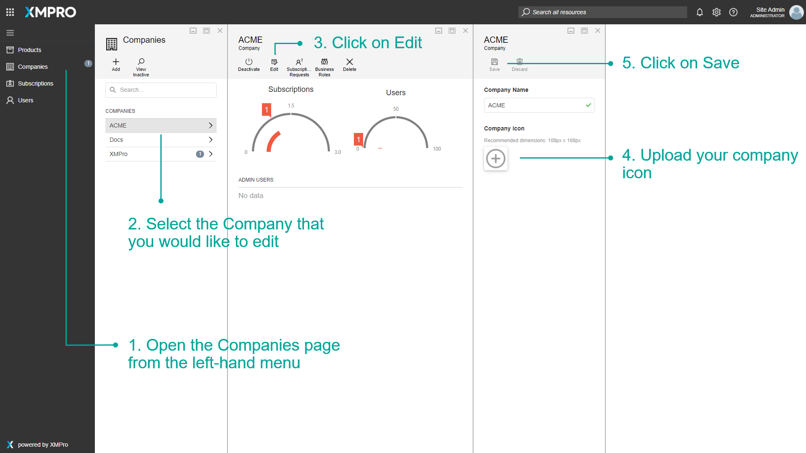

# Manage a Company


Please note that this section is intended for Global Administrative users. No other type of user is allowed to manage data about companies and their Subscriptions.


## Approve/Activate Access

Global Administrators may need to grant or modify access for new or existing companies from time to time, for example, when a new company signs up to use Subscription Manager. In this section, we will look at how to approve access for newly registered companies and companies requesting access to certain products.

### Approving Access for New Companies

When a user signs up via the Register page and marks his company as being a new company, the new company will be created, but will not have access to Subscription Manager automatically. Subscription access needs to be approved by a Global Administrator, after which the new user will receive an email and be able to log in to the system as an administrator of his/her company.

To approve such a request, please follow the steps below.

1. Open the Company page from the menu.
2. Click on the Company.
3. Click on _Subscription Requests._
4. Click on the Request.
5. Click _Save._

.png>)

## **Editing Companies**

To edit the information of a Company, please follow the steps below.

1. Open the Company's page from the left-hand menu.
2. Select the Company that you would like to edit.
3. Click on _Edit._
4. Change the Company information, as required. To change the Company logo, click on the plus-image button and select a new image.
5. Click on _Save_


Please note that the Company's icon will replace the XMPro logo in the top-left corner (Whitelabel).


.png>)

## **Upload a Company Logo**

Company Logos can be uploaded when managing a company. To upload a Company Logo, follow the steps below:

1. Open the Company's page from the left-hand menu.
2. Select the Company that you would like to edit.
3. Click on Edit.
4. Upload your company icon.
5. Click on Save.


Any user that logs into that company will be able to see the icon in the top-left corner of App Designer.


.png>)

## **Active vs Inactive Companies**

Companies in Subscription Manager can be listed as being either active or inactive. A Company can be deactivated by a Global Administrator if, for example, the Company decided not to use XMPro anymore. If a Company is deactivated, users in that Company will lose their ability to access the system.

Inactive Companies can be found by pressing the _View Inactive_ command in the Companies list.
