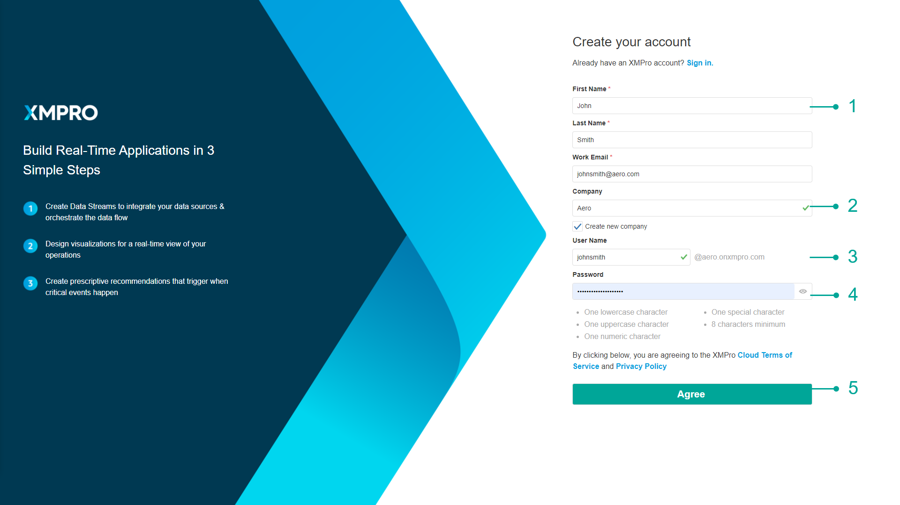

# Register a Company

## Register a Company

Click on the _Sign-Up_ button on the login page. Follow the steps below:

1. Fill in your first name, last name, and email address.
2. If this is the first time you or someone in your company is signing up to use Subscription Manager, fill in the company name and check the “_Create a new company?_” checkbox. By checking this box, your company will be registered in the system when your account is created. This check box will automatically become visible after you have filled in your company name and click anywhere else on the form.
3. Choose a unique username, for example, “_keith.miller_“. Do not include your company name in your username.
4. Choose a password and confirm your password.
5. Click “_Agree_“.
6. Wait for an email, confirming that your company has been registered and that you have been granted access to Subscription Manager. You will only be allowed to use the system after being granted access.

