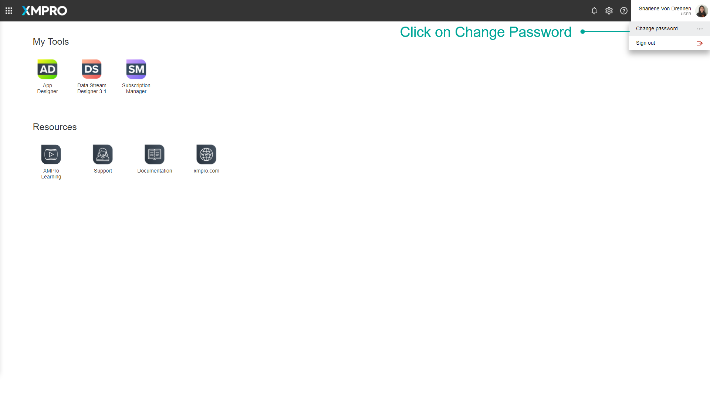
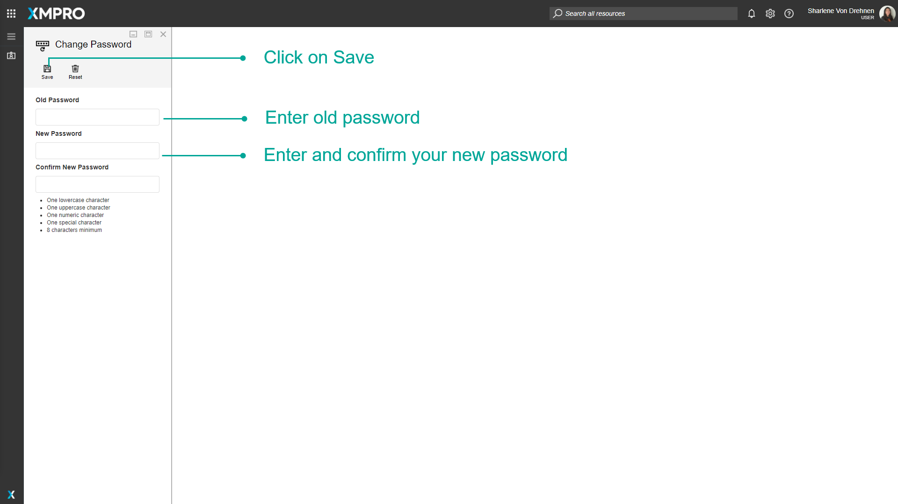

# Change Password

Any user is able to change their password by hovering over the profile icon and clicking the _Change Password_ item in the dropdown.

If you are on the App Designer or Data Stream Designer, clicking on _Change Password_ will open up the Subscription Manager. This is where you will be able to change your password.

You are required to enter both your current password and your new password. You will need to enter your new password twice in order to confirm it. Finally, click on _Save_.

