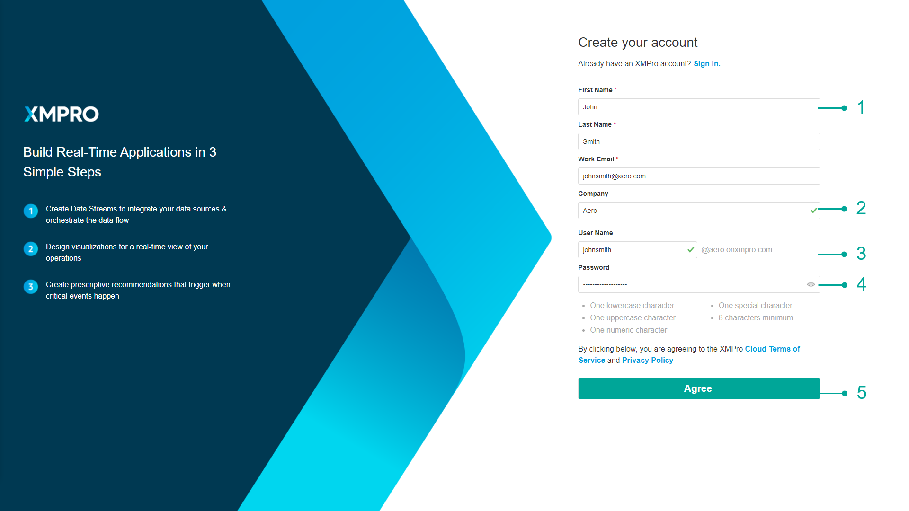

# Register an Account

## Register an Account

Registering on Subscription Manager can be done in different ways, depending on if you have been invited to register, whether someone in your company has registered before or not, and if you are registering for a trial or not.

If you received an email, inviting you to sign up, click on the link in the email to open the registration page.&#x20;

.png>)

Otherwise, click on the _Sign-Up_ button on the login page. Follow the steps below:

1. Fill in your first name, last name, and email address.
2. Enter the name of your company. If you have been invited to sign up and opened the page by clicking on the link in the email you received, you can skip this step, as we would have already received the company name. If you are registering your account through the _Sign Up_ button, you will need to enter your company name. If your admin has set up a company, use the same name they have used. Otherwise, [refer to the Register a Company page](../companies/register-a-company.md) to follow the steps on how to Register a new company.
3. Choose a unique username, for example, “_keith.miller_“. Do not include your company name in your username.
4. Choose a password and confirm your password
5. Click “_Agree_“.
6. Wait for an email, confirming that you have been granted access to Subscription Manager. You will only be allowed to use the system after being granted access.

If Auto approval is set up, the account will automatically be approved for that company, otherwise, you will need to wait for your company admin to approve your account.&#x20;
