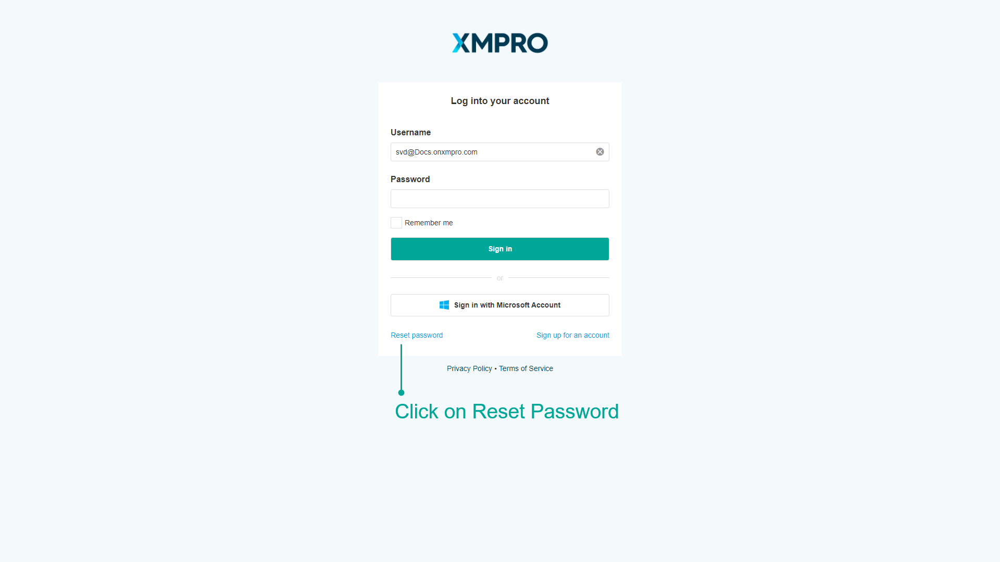

# Reset Password

If you have forgotten your password, you will be able to reset it using a password recovery link. This can be done from the login screen by clicking on _Reset password._&#x20;

Enter both your username and email address. The email address you enter will be the email address used to send you the recovery link. Finally, click on _Send recovery link_.

You will receive an email with a link that will allow you to change your password. You can then re-attempt to log in with the new password you have set.

.png>)
