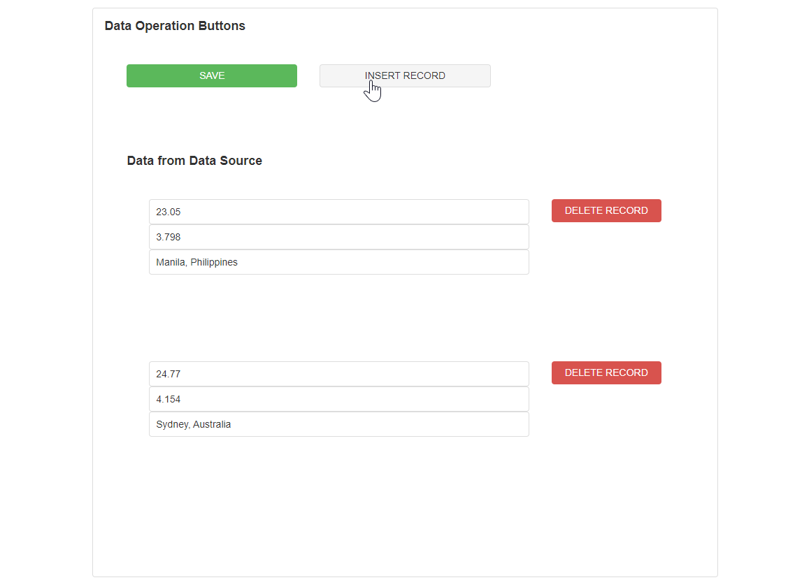
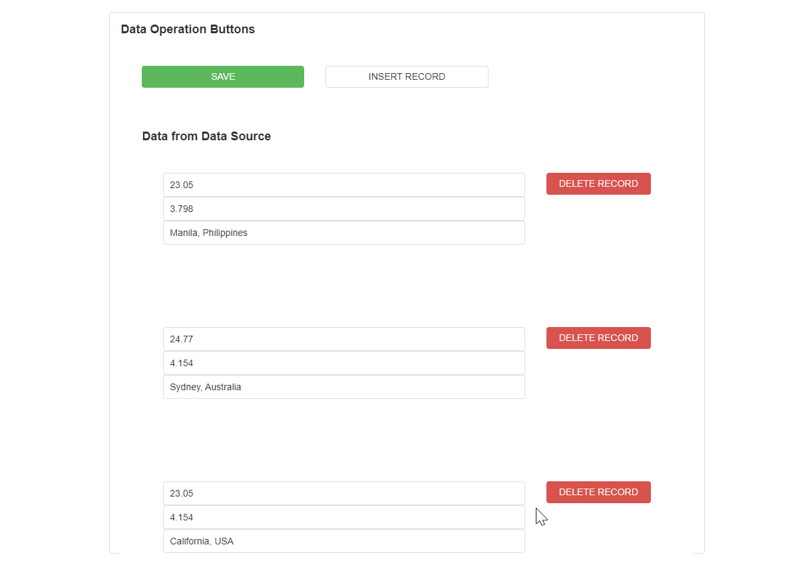

# Data Operations

A Data Operation Block is a button with additional functionality that allows you to Insert or Delete records from a [Data Repeater Block ](../layout/box-and-data-repeater-box.md)that is bound to a Data Source.&#x20;

## Data Operation Properties

### Appearance

#### Common Properties

Properties that are common to most Blocks include _Visibility, Styling Mode, Tooltip, and Icon._ The _Styling Mode, Tooltip, and Icon_ properties are only available for the Data Operations Block if the _Display Mode_ property is set to 'Button';

[See the Common Properties article for more details on common appearance properties.](../common-properties.md#appearance)

#### Text

The text that shows on top of the Button.&#x20;

If the Display Mode is set to 'Hyperlink', the default text will either be 'Add' or 'Delete', depending on what Mode is selected under Behaviors.

#### Display Mode

The Display Mode of a Data Operations Block can either be a Button or a Hyperlink.&#x20;

.PNG>)

By default, the Block is configured with either an 'Add' or 'Delete' icon if the 'Button' Display Mode is selected.&#x20;

#### Type

The type of the button can be changed depending on its purpose. Options include Danger, Normal, Success, and Default. This is only available if the Display Mode property is set to 'Button'.

.png>)

### Behavior

#### Common Properties&#x20;

The _Disabled_ property is common to most Blocks. The _Disabled_ property is only available for the Data Operations Block if the _Display Mode_ property is set to 'Button';

[See the Common Properties article for more details on common behavior properties.](../common-properties.md#behavior)

#### Mode

There are two modes that you can choose from: Insert and Delete. The Mode determines what operation will be performed on the Data Source and records.&#x20;

'Insert' will add a new row to the list:

'Delete' will delete a record from the list:


When a record is inserted or deleted, it does not immediately update the Data Source. To do this, you will need to add a regular Button with 'Update Data Sources' selected.&#x20;

[See the Common Properties article for more details on common action properties.](../common-properties.md#action)


#### Data Source

The Data Source that you would like to add a new record to. This is only available if the Mode property is set to 'Insert'.

If the Mode property is set to 'Insert', the Data Source property is required for the Data Operations Block.

#### Enable Focus

This determines if the user can navigate to the Button by using the keyboard. This includes using the tab button to switch between text boxes on a form, and then clicking the tab button at the end to highlight and select the Button. Buttons will also be focused on when you click on them. If a Button is clicked, and no action occurs, the Button will also remain in focus.

This is only available if the Display Mode property is set to 'Button'.

#### Show Confirmation Dialog

This can either be set to 'True' or 'False'. If True, a dialog box will appear asking the user if they are sure they want to delete that particular record.

This is only available if the Mode property is set to 'Delete'.&#x20;

.png>)

