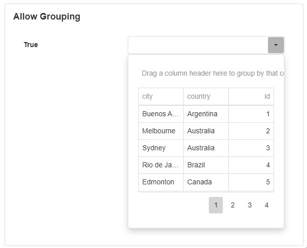

# Dropdown Grid

A Dropdown Grid is a dropdown that displays a grid of data to the user. The Data Grid can be connected to a Data Source to retrieve and display specific values. This is useful for dynamically creating the dropdown from items that already exist and may change over time.

.png>)

## Dropdown Grid Properties

### Appearance

#### Common Properties

You can change the _visibility, styling mode, placeholder, tooltip,_ and the _visibility of the clear button_;

[See the Common Properties article for more details on common appearance properties.](../common-properties.md#appearance)

#### Grid

The visibility of the borders, column lines, row lines, and headers of the grid can be specified. By default, the borders, column lines, row lines, and headers are set to true.

.png>)

Options for the grid include showing or hiding the borders, headers, column lines, or column rows.&#x20;

[For details on these common grid properties, see the Data Grid article. ](data-grid.md#common-properties)

### Behavior

#### Common Properties

The Dropdown Grid behavior includes changing the _read-only, disabled_.&#x20;

[See the Common Properties article for more details on common behavior properties.](../common-properties.md#behavior)

#### Allow Paging

This specifies whether the content on the grid is separated into pages.

.png>)

.png>)

#### Enable Column Filtering

Allows the user to filter for a specific column in the list.

.png>)

#### Enable Row Filtering

Allows the user to filter for a specific row in the list.

.png>)

#### Page Size

Specifies the number of records that are displayed to the user for each page. This will only work if _allow paging_ is set to true.

.png>)

#### Allow Grouping&#x20;

This option gives the user the ability to group records together.

#### **Store User Selection**

When enabled, your selection at runtime is saved in your browser's local data, so that it is remembered when the page reloads. This includes re-opening the App and returning from a drill-down.

### Value

#### Common Properties

The _value_ property is common to most Blocks;

[See the Common Properties article for more details on common value properties.](../common-properties.md#behavior-1)

### Data Source

#### Common Properties

Properties that are common to most Blocks include: _filter, sort, show # of results,_ and _skip # of results_;

[See the Common Properties article for more details on common Data Source properties.](../common-properties.md#data-source)

The Data Source property is required for the Dropdown Grid.

### Data

#### Display Expression&#x20;

The expression is a user-friendly name for what the user can see. For example, the text that is showing in one of the rows of the dropdown.

The Display Expression property is required for the Dropdown Grid.

#### Value Expression

This is the actual value stored in the background of the application in the code. For example, instead of true or false, it would be 0 or 1.

The Value Expression property is required for the Dropdown Grid.

### Columns

#### Order

The order allows you to specify the format for the columns. This includes the visibility of the columns, the alignment, the captions, or the width.

.png>)

### Action

#### Common Properties

Properties that are common to most Blocks include: _Navigate To and Show Confirmation Dialog;_

[See the Common Properties article for more details on common action properties.](../common-properties.md#action)
