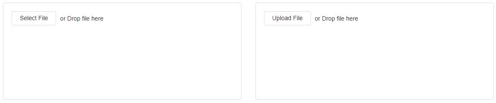

# File Uploader

&#x20;A File uploader is a Block that allows the user to upload files in an application. The File can be uploaded, downloaded, or deleted. This can be useful if you want to share certain files with users who have access to your App.&#x20;

## File Uploader Properties

### Appearance

#### Common Properties

Properties that are common to most Blocks include _visibility, styling mode_, _tooltip_, and _icon;_

[See the Common Properties article for more details on common appearance properties.](../common-properties.md#appearance)

#### Label

The text that shows up next to the button.

.png>)

#### Select Button Text

The text that shows on top of the Button.

#### Upload Failed Message

The text of the message that is shown to the user when a file upload fails.&#x20;

### Behaviour

#### Common Properties

The _disabled_ property is common to most Blocks;

[See the Common Properties article for more details on common behavior properties.](../common-properties.md#behavior)

#### Allowed File Extensions

This allows you to specify the types of files that are allowed to be uploaded. If left blank, any file type can be uploaded. If a file extension is listed, (for example, a .png file), the File Uploader will not allow you to upload any other file except those with a .png extension.

.png>)

You can add file type extensions in the following way:

.gif>)

#### Max File Size (MB)

This determines the maximum file size that can be uploaded. If you attempt to upload a file that exceeds the max size, it will not be uploaded.&#x20;

#### Multiple Upload

This allows you to upload multiple files. All selected files are zipped and then uploaded to the application.&#x20;

.png>)

#### File Name Prefix

This option is available when Multiple Upload is enabled. It allows you to add a prefix to the zip file created by Multiple Upload.

.png>)

#### Allow Delete

This allows the user to delete the uploaded file.&#x20;

.png>)

### Value

#### Common Properties

The _value_ property is common to most Blocks;

[See the Common Properties article for more details on common value properties.](../common-properties.md#behavior-1)

### Validation

#### Common Properties

Properties that are common to most Blocks include: _groups to validate_;

[See the Common Properties article for more details on common validation properties.](../common-properties.md#validation)

### Action

#### Common Properties

Properties that are common to most Blocks include: _navigate to_ and _show confirmation dialog_;

[See the Common Properties article for more details on common action properties.](../common-properties.md#action)
