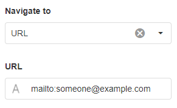

# Common Properties

## Appearance

This determines how the control looks. For example, this may include colors, text, or the visibility of certain aspects of the control.

#### Visible

This determines if the Block can be seen or if it is hidden.

.png>)

#### Styling Mode

This specifies the style of the control, including if it is underlined, highlighted, or outlined.

.png>)

#### Placeholder

This will show a temporary hint or description inside the field to help the user know what information is required. It disappears when the user enters a value.&#x20;

.png>)

#### Tooltip

This displays extra information about the field when the user hovers their mouse over it. &#x20;

.png>)

#### Show Clear Button

This determines if a clear button shows next to the value that the user entered. The clear button will clear the entered value if it is clicked.

.png>)

#### Icon

The mode of the icon refers to the different ways the icon can be uploaded or added onto the control. This includes adding a pre-built icon from the library, uploading your own icon, or using the URL of an icon that exists on the web.&#x20;

.png>)

#### Format

The format refers to the type or way that data is presented. Options for these include currency, decimal, exponential, fixed point, large number, percent, thousands, millions, billions, trillions, milliseconds, seconds, minutes, or hours.

.png>)

.png>)

## Behavior

This describes the behavior of a control. For example, read-only or disabled prevents the user from modifying the control.

#### Read Only

.png>)

#### Disabled

.png>)

## Value 

The value is the value that is taken from the control such as the user input, or the default value of the control that you predefine.&#x20;

.png>)

## Data Source

Data Sources can be created for a page in the application and can be used to display contextual or real-time data to the user. Data sources can include databases or data streams and can be bound to controls on the page.&#x20;


It is recommended that you read the article listed below to improve your understanding of Data Sources.

* [How to Create and Manage Data Sources](../how-to-guides/apps/manage-data-sources.md)


#### Filter

This allows you to filter the records to only display certain results that meet a condition. For example, displaying all records last modified in 2021.

.png>)

#### Sort

This allows you to sort records in increasing or decreasing order.

.png>)

#### Show # of Results

Shows a limited number of results.&#x20;

.png>)

#### Skip # of Results

This will skip a number of records in the list.

.png>)

#### Show Default Row

This will determine if the default row is always shown, only shown when empty, or never shown.

## Validation

Validation involves making sure the user enters the correct information on controls such as a form. Fields or Fieldsets (a group of fields) can be added to the page with a corresponding confirm button for the form. If the button and fields are configured to have validation and the user clicks on the confirm button, the fields in the form will be validated.&#x20;

### Field

#### Validation Group

The validation group is able to group multiple forms on a page, each with its own action button. For example, if the user clicks on the confirm button for validation group 1, only the fields under that validation group will be validated.

.png>)

#### Required

If the field is blank, the form will not be submitted and an error will show.

.png>)

#### Pattern

If the user enters a value that does not match a specific pattern (for example, the input must contain at least two words), the form will not be submitted and an error will show.

.png>)

Validation patterns use Regular Expressions (regex) to pattern search the value and determine validity.


For more information on Regular Expressions, see the [JavaScript RegExp Reference article](https://www.w3schools.com/jsref/jsref\_obj\_regexp.asp) on w3schools.


#### Message

This is the text that displays to the user when the user did not enter the value correctly.

### Action

#### Groups to Validate

This is an option for buttons that allows you to choose the validation group the button should validate.

## Action

The action refers to any event that may be triggered when the user clicks on a Block or part of a Block. For example, the page may redirect to another page or website, a data source may be updated, or a confirmation dialog may appear.

#### Navigate To

This configures the page or website that the webpage will navigate to when the user clicks on a control. The options are:

* Landing Page takes you to the current App's landing page
* Page takes you to the specified page of the current App
* Previous Page takes you to the previous page of the browser
* URL takes you to the specified URL (any website), optionally in a new tab/window

#### Page

The page to which the user is redirected, which is applicable when [Navigate To](common-properties.md#navigate-to) is set to 'Page'.

<figure><figcaption></figcaption></figure>

See the [Navigate Between Pages article ](../how-to-guides/apps/navigate-between-pages.md)for more information about navigating between pages.

#### URL

The URL to which the user is redirected, which is applicable when [Navigate To](common-properties.md#navigate-to) is set to 'URL'.


You can use a [mailto](https://www.w3schools.com/tags/tryit.asp?filename=tryhtml\_link\_mailto) link with the URL navigation to open a default mail program (for example, Microsoft Outlook) with an email address already added into the receiver field.


See the [Navigating Using Back URL article](../how-to-guides/apps/navigate-between-pages.md#navigating-using-back-url) for more information about appending a back URL so that the user can return to the page.

#### Open in New Tab/Window

Tick for the URL to open in a new tab/window, instead of redirecting the current tab. This applies when [Navigate To](common-properties.md#navigate-to) is set to 'URL'.

<figure><figcaption></figcaption></figure>

#### Pass Page Parameters

You can use parameters if you want to send particular values to another page. For example, you may want to send the value of a control to another page as the user is navigating to it, in order to change the data on that page dynamically. &#x20;

See the [Pass Parameters between Pages article](../how-to-guides/apps/pass-parameters-between-pages.md) for more information about how to pass parameters between pages.

#### Update Page Data

You can configure what and how the data should be updated on the current page. See the [Page Data article](../how-to-guides/apps/page-data.md) for more information.

#### Update Data Sources

Operations include inserting records, updating, deleting, or refreshing a data source. For example, if the user clicks on a button, the details they entered can then be inserted as a record in the database. If multiple operations are required, the order that these actions are executed can be changed. For example, you may want to update the database first before deleting a record.&#x20;

If the execution condition option is set to true, you will then be able to add a condition that will be checked before operations are executed. You also have the option to override the fields that are in the data source.


If you're enabling an operation on a Block that does not populate or visualize from a Data Source, such as a Button, first bind a [Data Source](common-properties.md#data-source) to either the Block or its parent.&#x20;


#### Confirmation Dialog

If the confirmation dialog option is enabled, a confirmation message dialog box will appear when the user clicks on the button.&#x20;

The title and message of the dialog box can be configured as well as the text on the continue and cancel buttons.

.png>)
