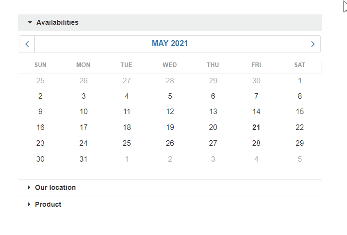
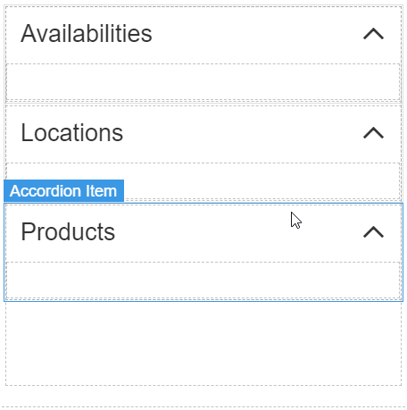
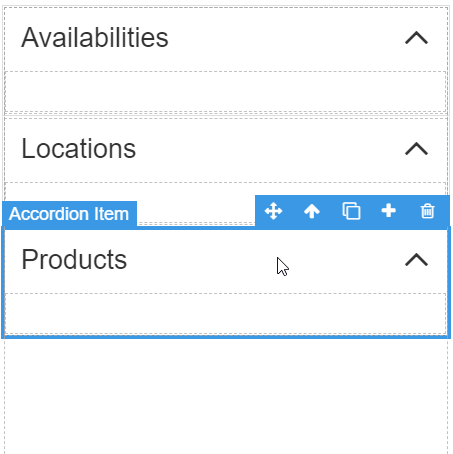
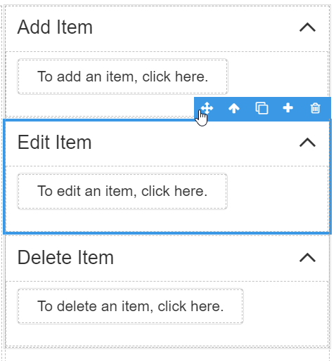
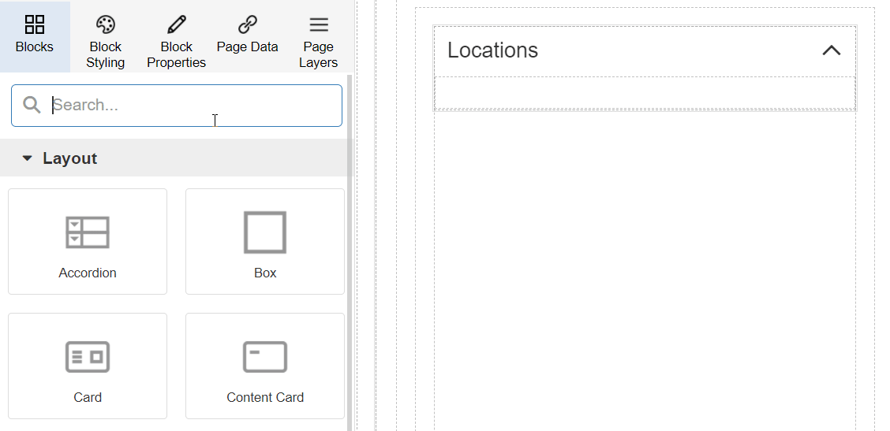
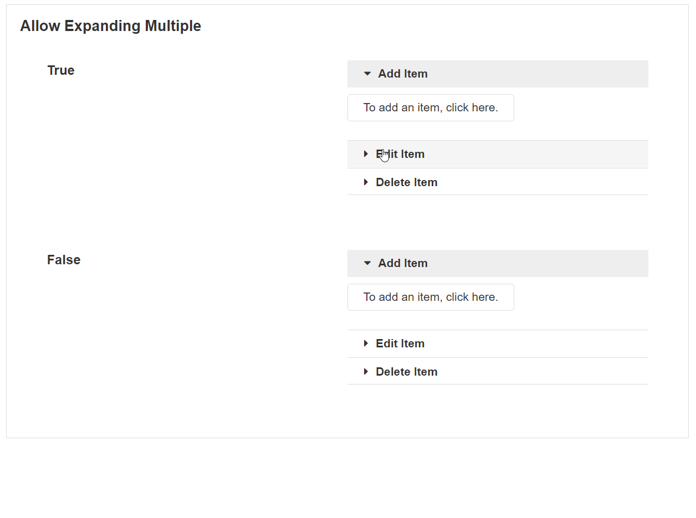
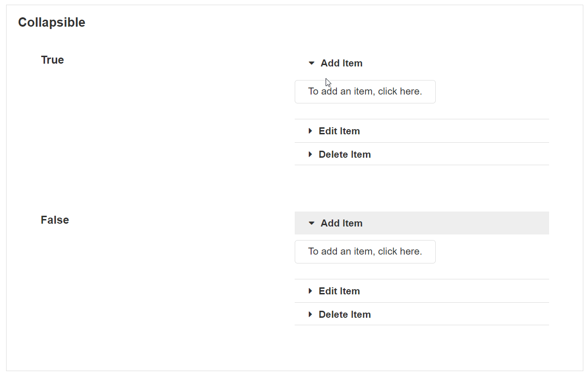

# Accordion

An Accordion is a group of Accordion Items that shows other Blocks and content within them. An Accordion Item can be expanded or collapsed and is therefore useful for grouping content together. They are also useful for hiding content into collapsed sections when there is a lot of content on the page.

## Adding a new Accordion Item

To add a new Accordion Item, you can either click on an Accordion Item or the Accordion itself and click the plus button in the toolbar.


[See the Canvas article for more details on these controls. ](../../concepts/application/canvas.md#block-toolbar)


## Cloning Accordions or Accordion Items

You can clone both Accordion Items and the whole Accordion itself. To clone an Accordion Item, select an Accordion Item and click on the clone symbol in the top right-hand Block toolbar. This will create a copy of an existing Accordion Item inside the Accordion.&#x20;


[See the Canvas article for more details on these controls. ](../../concepts/application/canvas.md#block-toolbar)


When the whole Accordion is cloned, two separate Accordions will be created. It will not create an Accordion inside the existing Accordion.

## Reordering Accordion Items

Accordion Items can be reordered within the Accordion. To reorder an Accordion Item, click and drag the move button in the toolbar to place the Accordion Item somewhere else. Accordion Items cannot be dragged outside of the Accordion itself. However, Accordion Items can be dragged into other Accordions.


[See the Canvas article for more details on these controls. ](../../concepts/application/canvas.md#block-toolbar)


## Adding Blocks to an Accordion Item

To add Blocks inside the Accordion Items, Drag and drop other Blocks into the Accordion from the canvas toolbar or elsewhere in the canvas.


The height and width of the Accordion will be determined by the Blocks contained in it. To guarantee consistent behavior, items inside the Accordion must have a set pixel height and width in the [style manager](../../concepts/application/block-styling.md#dimension), not a percent or auto.


## Accordion Item Properties

### Appearance

#### Common Properties

The accordion has properties that are common to most Blocks: _visibility_ and _icon;_

[See the Common Properties article for more details on common appearance properties.](../common-properties.md#appearance)

#### Title

This is the title that shows at the top of the Accordion Item.

.png>)

### Behavior

#### Common Properties

The _disabled_ property is common to most Blocks;

[See the Common Properties article for more details on common behavior properties.](../common-properties.md#behavior)

## Accordion Properties

### Appearance

#### Common Properties

The Accordion has properties that are common to most Blocks: _visibility_ and _tooltip_.

[See the Common Properties article for more details on common appearance properties.](../common-properties.md#appearance)

### Behavior

#### Common Properties

The _disabled_ property is common to most Blocks;

[See the Common Properties article for more details on common behavior properties.](../common-properties.md#behavior)

#### Allow Expanding Multiple

This determines if it is possible to expand multiple Accordion items at once.&#x20;

#### Collapsible

By default, all Accordion Items can be collapsed except for one which must remain open. If the collapsible option is set to true, the user can collapse all Accordion Items.

#### Selected Index

This specifies which Accordion Item is open by default. The starting index is 0, which refers to the first item on the list.

.png>)

### Data Source

#### Common Properties

The Accordion has properties that are common to most Blocks: _filter_, _sort_, _show # of results_, _skip # of results,_ and _show default row._

[See the Common Properties article for more details on common Data Source properties.](../common-properties.md#data-source)
