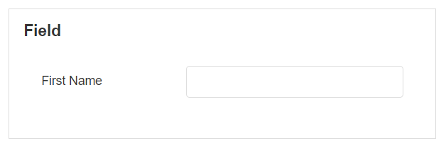

# Field & Fieldset

A Field is a Block where the user can enter details and is useful for collecting information on a Form. Fieldsets are Blocks that already contain Fields and can be used to group Fields within a larger Form. Fields or groups of Fields can be validated to ensure the user has entered the correct input.

.PNG>)

## Fieldset Properties

### Appearance

#### Common Properties&#x20;

The _visibility_ property is common to most Blocks;

[See the Common Properties article for more details on common appearance properties.](../common-properties.md#appearance)

### Data Source

#### Common Properties&#x20;

The fieldset has properties that are common to most Blocks: _data source, filter, sort, show # of results, skip # of results,_ and _show default row_;

[See the Common Properties article for more details on common Data Source properties.](../common-properties.md#data-source)

## Field Label Properties

### Appearance

#### Common Properties

The _tooltip_ property is common to most Blocks;

[See the Common Properties article for more details on common appearance properties.](../common-properties.md#appearance)

#### Label

The text of the field label can be specified.

