# Azure Digital Twin Hierarchy

The Azure Digital Twin Hierarchy is an interactive UI component that visualizes a large amount of time-oriented data. It allows the user to compare data at run-time based on asset ID by dropping markers on the chart, as well as panning and zooming, and can show or hide specific assets or parameters via the hierarchy panel.&#x20;

Azure Digital Twin Hierarchy connects directly to Azure through its Azure Digital Twin, Azure Data Explorer, Tenant Id, Client Id, and Client Secret.

## Azure Digital Twin Hierarchy Properties

### Appearance

#### Common Properties

The _visibility_ property is common to most Blocks;

[See the Common Properties article for more details on common appearance properties.](../common-properties.md#appearance)

#### X Axis Label Format

Determines how the date is formatted on the x-axis of the chart and pan & zoom panel.

| Label Format            |                           Image                          |
| ----------------------- | :------------------------------------------------------: |
| 12-Hour Clock (2 Lines) | .png>) |
| 12-Hour Clock (1 Line)  |  .png>) |
| 24-Hour Clock (2 Lines) | .png>) |
| 24-Hour Clock (1 Line)  |  .png>) |

#### Enable Display Grid

This determines whether the ellipsis menu contains the Display Grid option, which shows the selected data in a grid.

#### Enable Download as CSV

This determines whether the ellipsis menu contains the Download as CSV option, which allows you to download the selected data as a CSV file.

#### Pan & Zoom Mode

Decide how the Pan & Zoom panel is displayed: "Hidden" removes the panel entirely, "Compact" is a single-line component, and "Full" displays a Pan & Zoom with secondary panning and zooming for fine-tuning the selection.

| Pan & Zoom Mode |                        Image                        |
| --------------- | :-------------------------------------------------: |
| Full            |     |
| Compact         |  |
| Hidden          |   |

#### Pan & Zoom Color

The color of the Pan & Zoom component.

#### Interval Size

The default value for the Interval Size slider, which allows you to fine-tune the granularity of the displayed data. The displayed line chart data will be averaged over this interval.

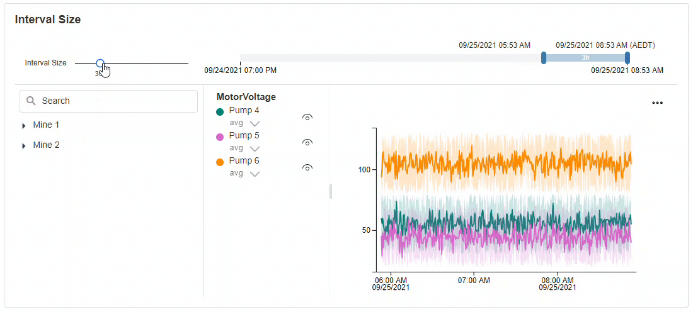

#### Range

This determines the starting date for the Pan & Zoom. The end date of the Azure Digital Twin Hierarchy is determined by the time when the block is loaded. The Pan & Zoom range will update automatically with live data.

#### Initial Selection

This determines the time interval that is initially selected in the Pan & Zoom component and, correspondingly, the line chart. The selection will always start at the right side of the Pan & Zoom component.

#### Display Avg, Min, Max, and Envelope

This determines whether the line chart will display only the average values as a plain line, or the minimum, maximum, and envelope over the selected Interval Size.

#### Show Tooltip On Hover

This determines whether a tooltip will appear when the cursor hovers over a line. The tooltip will display the values of the hovered point on the line.

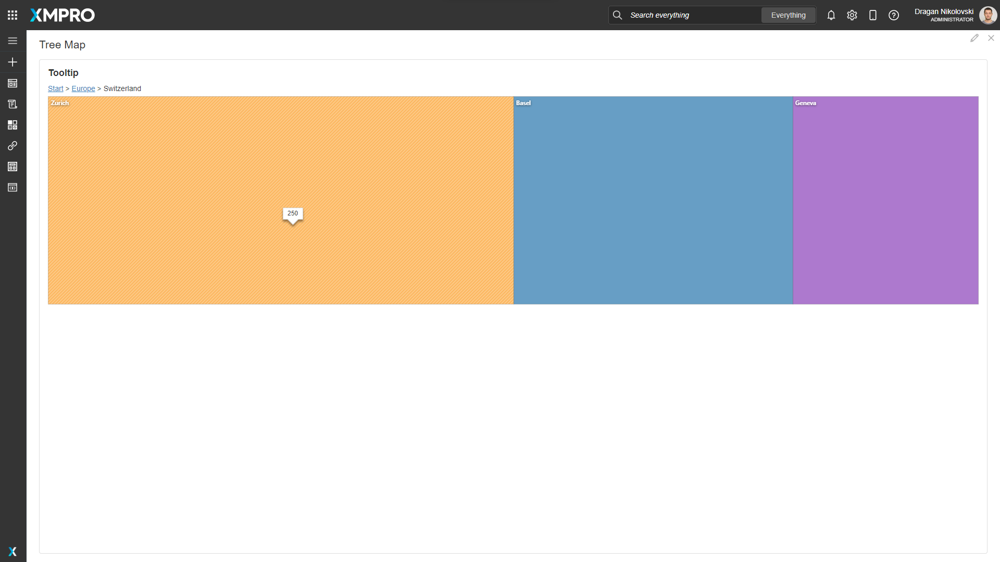

#### Enable Zoom

This determines whether you can click and select on the chart to zoom into the selection.

#### Show X Axis

This determines whether the x-axis line and labels for the line chart are shown.

#### Show Y Axis

This determines whether the y-axis line and labels for the line chart are shown.

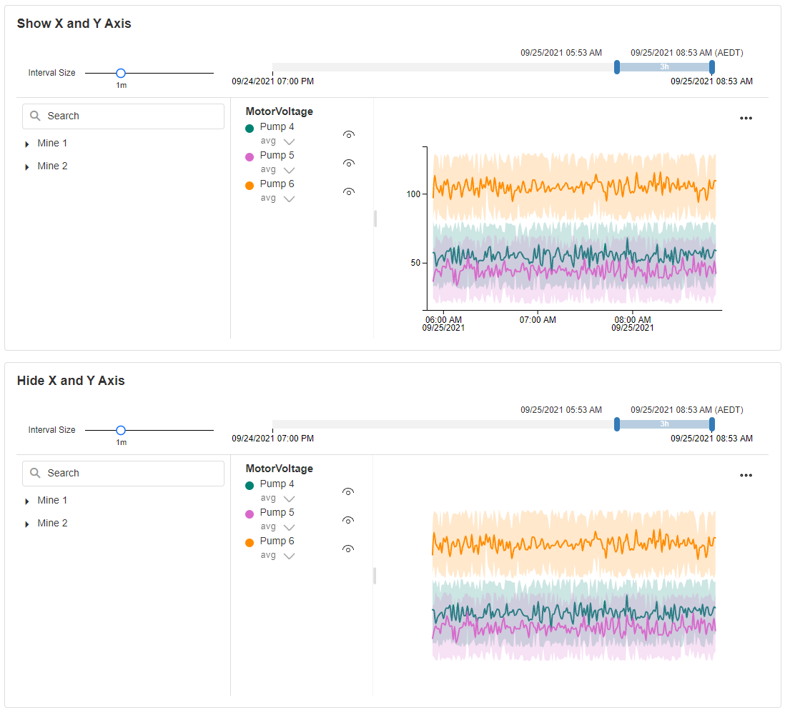

#### Default Y Axis Type

This determines the default Y Axis type, which can be changed at run-time using the button at the top-left corner of the line chart. The options are:

* Stacked: the selected parameters are separated into different panes stacked vertically.
* Shared: the selected parameters share a single pane with a single y-axis from the lowest to highest values in any line.&#x20;
* Overlap: the selected parameters share a single pane with multiple y-axes, with the lowest and highest value of each line chart displayed on the axis at the bottom and top.

#### Show Dots

This determines whether the points on the lines will display as dots.

#### Interpolation Function

This property allows you to define how the lines behave in the line charts.

| Function    |                    Line                    |
| ----------- | :----------------------------------------: |
| Monotone X  |  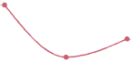  |
| Linear      |    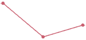   |
| Step        |     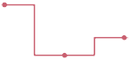    |
| Step Before |  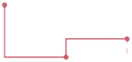 |
| Step After  |  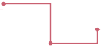  |
| Basis       |    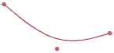    |
| Cardinal    |   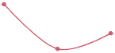  |
| Catmull-Rom | 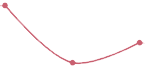 |

#### Palette

You can override the default colors by adding custom colors.

The colors are used for each parameter in the line chart. If the number of parameters is greater than the number of colors specified, the colors will repeat.

### Behavior

#### Default Selection

It shows the hierarchy tree view and it allows the user to pre-select the assets.&#x20;


The [Data Source](azure-digital-twin-hierarchy.md#data-source) section needs to be filled out and authenticated before selecting.&#x20;


#### Recommendations

The Alerts for selected Recommendations will be displayed at run-time as markers on the chart: the Alert's created time is used as the timestamp and its title as the text.


Known limitations:

* The marker title space is limited and the Alert title may be truncated.
* Some HTML special characters (e.g.`<`) used in the Alert title will be encoded.


#### Show Alerts For Visible Assets Only

Tick to apply the selected Assets as a filter on the Recommendation Alerts.

### Data Source

#### Use Variables

This allows you to choose between manually entering the Endpoints, Tenant Id, Client Id, and Secret, or selecting them from static variables.

#### Azure Data Explorer Endpoint

Requires the URL to the Azure Data Explorer site.

#### Azure Digital Twin Endpoint

Requires the URL to the Azure Digital Twin models.

#### Tenant Id

Requires the Azure Active Directory Tenant Id.

#### Client Id

Requires the Azure Application Client Id.

#### Client Secret

Requires the Azure Application Client Secret.

#### Database

After the above details are verified and authenticated, a Database must be selected. This Azure Data Explorer database will be used to pull the data.

### Data

#### Mapping

The mapping is required so the Azure Digital Twin Hierarchy block knows how to bind the Digital Twin models selection with the Azure Data Explorer data.


The [Data Source](azure-digital-twin-hierarchy.md#data-source) section needs to be filled out and authenticated before mapping.


#### Select New Root

Select a new default root for the hierarchy.


The [Data Source](azure-digital-twin-hierarchy.md#data-source) section needs to be filled out and authenticated before selecting the new root.


#### Auto Refresh

This determines whether the Azure Digital Twin Hierarchy will automatically poll data from Azure Data Explorer - or the user must manually refresh the page.

#### Refresh Rate

The rate at which the Azure Digital Twin Hierarchy will poll for updated data.
