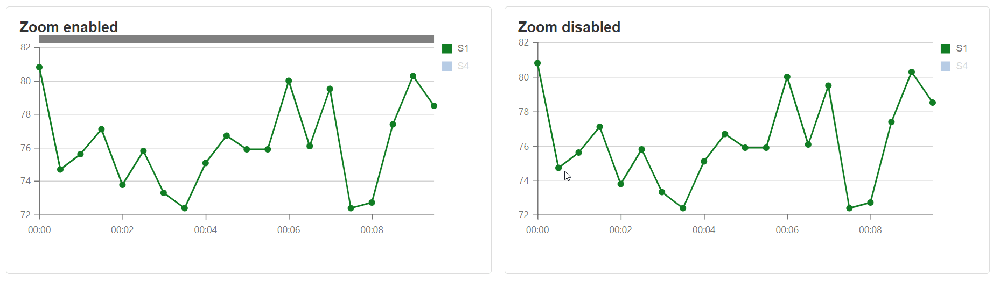
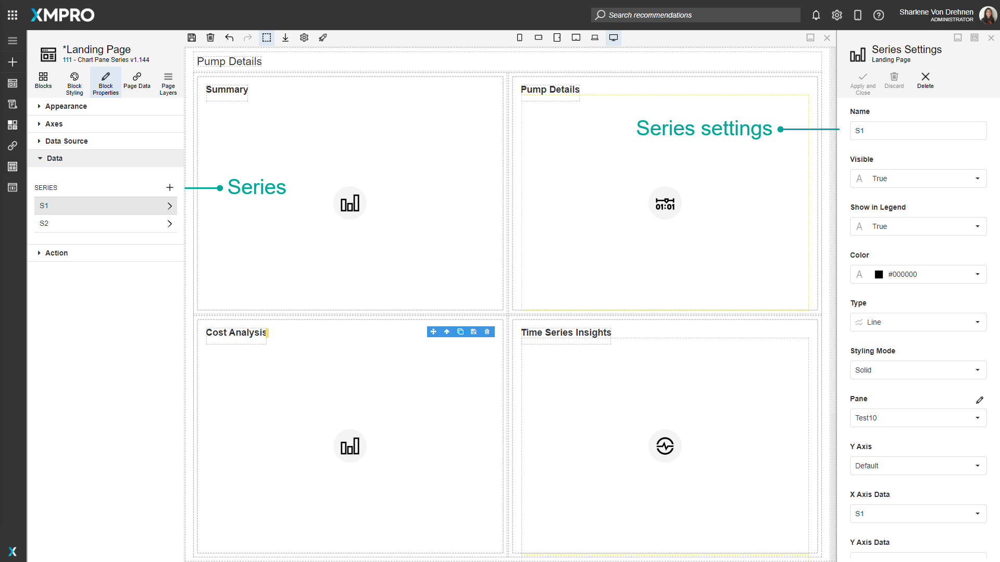
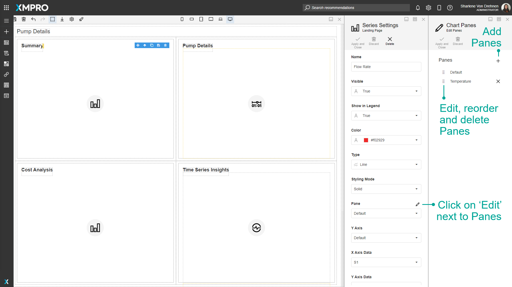

# Chart

The Chart is an interactive UI component that visualizes data from local or remote storage using a great variety of [series types](chart.md#data-series), including Line, Spline, Area, Spline Area, Bar, Scatter, Bubble, and Range. The Chart allows multiple panes and axes, as well as panning and zooming, and can show and hide specific series by clicking the label.

## Chart Properties

### Appearance

#### Common Properties

The _visibility_ property is common to most Blocks;

[See the Common Properties article for more details on common appearance properties.](../common-properties.md#appearance)

#### Orientation

This determines the direction that the data is presented on the graph. If set to horizontal, the data will be presented from bottom to top. If set to vertical, the data will be presented from left to right.

.png>)

#### Legend Visibility

This determines if the legend can be seen or if it is hidden.

.png>)

#### Hide Series on Legend Click

When the legend is clicked, and the _Hide Series On Legend Click_ option is enabled, the series that is selected will disappear from the graph.

.png>)

#### Alignment

This determines the placement of the legend around the graph.

.png>)

.png>)

.png>)

#### Allow Export

The export button will be displayed on top. Clicking the button will export the Chart in a PNG format.

.png>)

#### Allow Print

The print button will be displayed on top. Clicking the button will print the Chart.

.png>)

#### Show Drilldown

When this is enabled, configured Action properties are triggered when the user clicks on the chart.

### Axes

#### Y-Axis

The Y-axis is the left-hand vertical axis or part of the graph. You can have multiple Y-axis on a Chart.&#x20;

.png>)

A new Y-axis can be added from the _Block Properties_ tab when a Chart is selected. To add a Y-axis, go to the _Block Properties_ tab, expand _Axis_, and click on the _plus_ symbol above the list of Y-axes.

.png>)

If you have multiple panes with multiple series, the Y-axis will only show on the pane that the series is on. In other words, a Y-axis will only be shown on the panes where it is being used.&#x20;

#### Type

Changing the type will affect the X-Axis. Depending on the type, X-Axis can only accept the selected type. This property is available for both Y and X Axes.

.png>)

#### Axis Line Color

This specifies the color of the line for the axis. This property is available for both X and Y axes. The Y-Axis line color will change the color of the vertical line of the graph and the X-Axis line color will change the color of the horizontal line of the graph.  &#x20;

.png>)

#### Enable Pan and Zoom

The user can zoom in and out for a better view. If it's enabled, on top of the Chart there will a scroll bar which the user can use to move around. This property is only available for the X-Axis.

#### Range Start and End

Specify what range the Chart should show by default. If not specified it will show the min and max value of the provided data. If the Chart scroll and zoom are changed, it will override the default values selected. Both X and Y axes ranges can be specified.

.png>)

When the range is specified, the maximum range for the zoom and pan will be the length of the Chart.

.png>)

#### Display Grid Lines

This determines if the grid lines within the Chart are displayed. This property is available for both X and Y axes.

.png>)

.png>)

#### Grid Line Color

This changes the color of the grid lines within the Chart. This property is available for both X and Y axes.

.png>)

#### Title Color

This changes the color of the title within the Chart. This property is available for both X and Y axes.

.png>)

#### Display Labels

This toggles the visibility of the labels that show on the X-axis. This property is available for both X and Y axes.

.png>)

#### Label Color

The colors of the label that shows along the X-axis can also be changed.

.png>)

#### Value Margins Enabled

If this is set to 'true', margins are added between the start and end values on the graph. For example, on a bar graph, the margin will move the first bar more to the right so the full bar is inside the graph, and all columns will be equal in width. It will also add a margin between the end and the last bar.&#x20;

If this is set to 'false', the first and last bars may not be fully inside the chart, so the middle bars may be larger than the first and last bars. &#x20;

This property is only available on the X-Axis.

.png>)

#### Tick Positions

This determines the placement of the labels along the axis. If the _between labels_ option is selected, the labels appear in between the ticks. If the _cross labels_ option is selected, the labels appear on the ticks. This property is only available on the X-Axis.

.png>)

#### Tick Interval

This specifies how large the intervals are between values on the Y-Axis. This property is only available on the Y-Axis.

.png>)

#### Position

This indicates which side the Y-axis is displayed on. This property is only available on the Y-Axis.

.png>)

### Data Source

#### Common Properties

The Chart has properties that are common to most Blocks: _filter_, _sort_, _show # of results_, and _skip # of results;_

The Data Source property is required for the Chart.

‌[See the Common Properties article for more details on common data source properties.](../common-properties.md#data-source)

### Data/Series

We can add or modify the existing series. ‌[For details on common data properties, see this article](../common-properties.md#data).\
There are 8 main types of Charts, Line, Spline, Area, Spline Area, Bar, Scatter, Bubble, and Range.

.png>)

.png>)

.png>)

.png>)

Stacked bars are another type of data series. They let you stack bars on top of each other, instead of aligning them next to each other. This is useful when comparing total amounts across each bar group.

Full Stacked column also stacks bars together, however, this is usually in the form of a percentage. Full stacked bars are useful if you want to compare data using a whole and part-to-whole relationship. They stack bars on top of each other

.png>)

#### Panes

Panes are sections of the graph that can contain their own series. If there are many series being shown, they can be separated and shown on multiple panes.

.png>)

A single pane can have multiple series.&#x20;

.png>)

Panes can be modified when creating a series. This can be done by clicking on the 'Edit' button next to 'Panes.'

### Action

In Charts, the action is triggered by clicking on a series.

#### Common Properties

The Chart has properties that are common to most Blocks: _Navigate to_ and _Show Confirmation Dialog;_

[See the Common Properties article for more details on common action properties.](../common-properties.md#action)


Action properties are not triggered unless [_Show Drilldown_](chart.md#show-drilldown) under Appearance is enabled.

