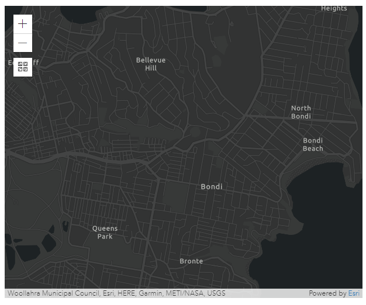
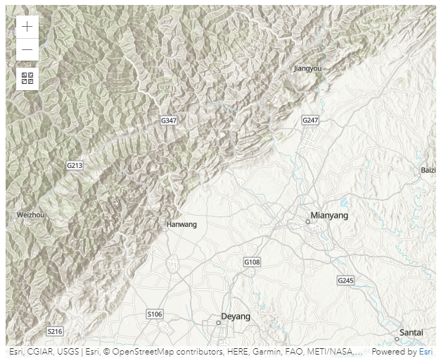
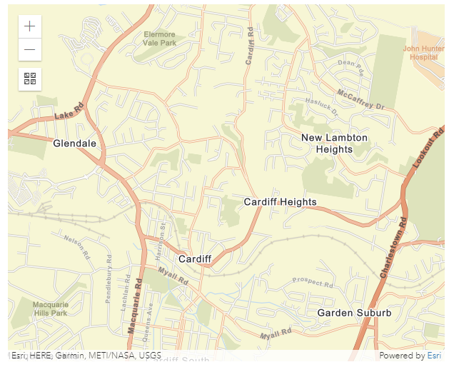
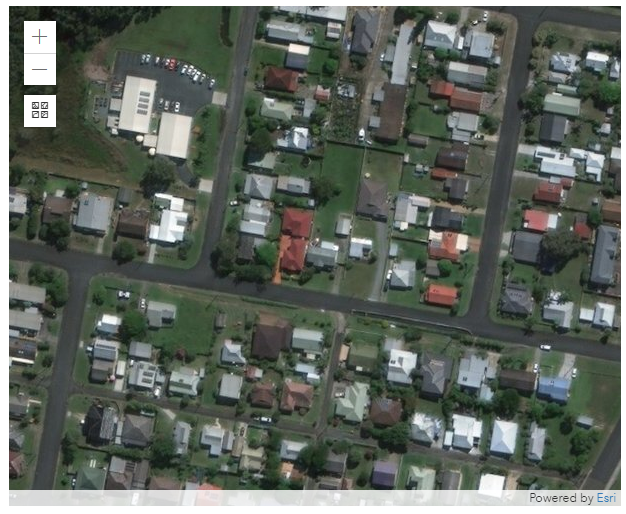
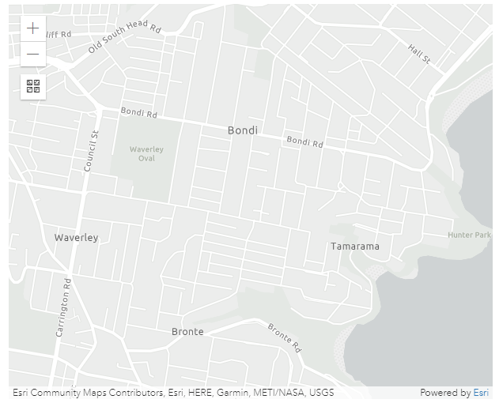
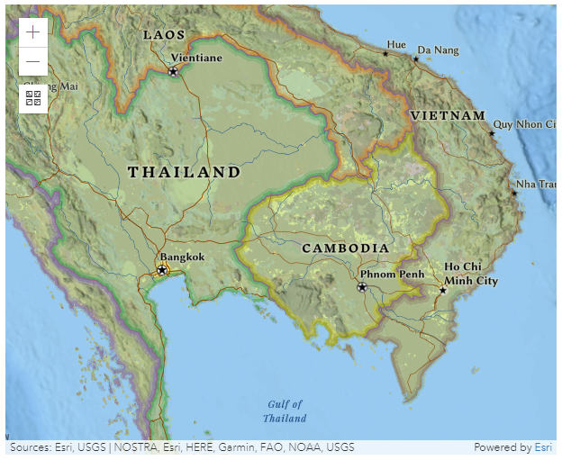
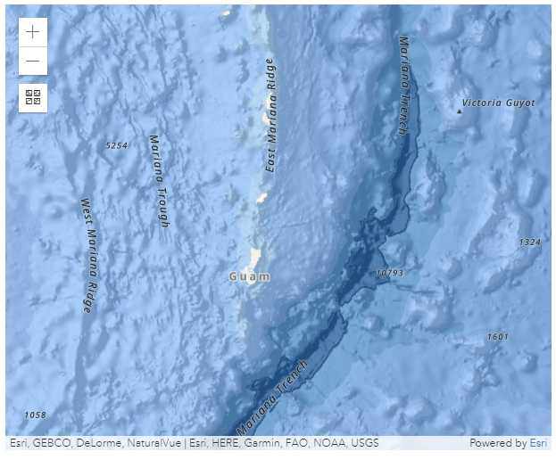
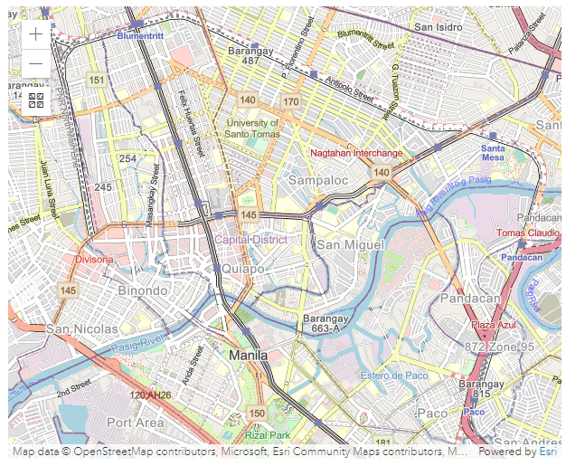
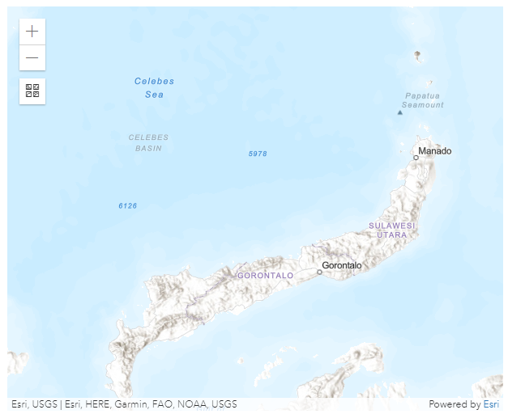

# Esri Map

This Block allows you to integrate an Esri Map into the page. An Esri Map has additional features to a regular map such as allowing you to visualize additional geographical information, terrain formation, or topographical information for a given area.

## Esri Map Properties

### Appearance

#### Base Map

Choose the visual context for the map from the options listed below:

<table><thead><tr><th width="150">Base Map</th><th width="360.28544382299776">Description</th><th>Thumbnail</th></tr></thead><tbody><tr><td>Dark Grey (default)</td><td>Shows the world on a gray canvas to focus your attention on thematic content.</td><td></td></tr><tr><td>Topography</td><td>Shows geographical details including the height and shape of mountains, sea levels, and other geographical features such as rivers.</td><td></td></tr><tr><td>Streets</td><td>Shows highway-level and street-level data for the world. Major roads are highlighted and all roads are labeled.</td><td></td></tr><tr><td>Streets Night</td><td>Shows highway-level and street-level data for the world, designed for use at night or in a low light environment. Major roads are highlighted and all roads are labeled.</td><td></td></tr><tr><td>Satellite</td><td>Shows high-resolution satellite imagery for many areas. </td><td></td></tr><tr><td>Hybrid</td><td>Shows high-resolution satellite imagery for many areas, with road labels or location references overlaid on top.</td><td></td></tr><tr><td>Gray</td><td>Shows the world on a light gray canvas to focus your attention on thematic content.</td><td></td></tr><tr><td>National Geographic</td><td>Provides a detailed view of political boundaries, and emphasises certain characteristics of the land such as mountains.</td><td></td></tr><tr><td>Oceans</td><td>Designed for Marine GIS professionals to provide important reference points within the Oceans and Seas of the world. </td><td></td></tr><tr><td>Open Street Map</td><td>Open Street Map (OSM) is a collaborative project to create an open, editable neighborhood map. The Esri replica is updated continuously with the latest edits. </td><td></td></tr><tr><td>Terrain</td><td>Shows terrain details including the height of the land and sea.</td><td></td></tr></tbody></table>

#### Allow pan and rotate

Adds a button to the map which allows the user to rotate the map.

#### Longitude, Latitude, Height, and Tilt Angle

The map will load the location specified with Longitude, Latitude, Height, and Tilt Angle.

### Behavior

#### Use Variables

This allows you to choose between manually entering a value for the _API Key_ or selecting from a static variable_._

#### API Key

The API key is used to get the private [feature layers](esri-map.md#feature-layers). For more details, [visit the official Esri map documentation](https://developers.arcgis.com/documentation/mapping-apis-and-services/security/api-keys/).&#x20;

The API Key property is required for the Esri Map when there are feature layers added.

#### Show Basemap Gallery

This will add a button on the map and give the option to change the [Base Map](esri-map.md#base-map) layout.

#### Allow Show Current Location

This will show the user's current location on the map. Requires the location of the device.

### Feature Layers

A Feature Layer is a single layer overlaid on the base map that can be created in a variety of ways and display different visualizations. Spatial feature layers include features that use Geometry and allow you to render the scene in either 2D or 3D. These features also provide more information about the real world which can be displayed through pop-up windows within the scene. Non-spatial feature layers do not provide this information about geographical features.

For more details, [visit the official Esri Map documentation](https://developers.arcgis.com/javascript/latest/api-reference/esri-layers-FeatureLayer.html).&#x20;

### Markers Data Source

#### Mode

This can be changed to either use _Static Items_ or a _Dynamic Data Source_. In both cases, markers need to be configured in the [Data section](esri-map.md#data). If the static items option is chosen, markers for locations can be entered manually under the _Data_ section. If the Dynamic Data Source option is chosen, marker locations coming from the Data Source can be used.&#x20;

[See the Common Properties article for more details on common Data Source properties.](../common-properties.md#data-source)

### Data

Markers for locations can be manually added and they will show on the map. Actions are triggered when you click on a marker on the map. Markers are entered by Longitude and Latitude. Markers can also have a text label that will be shown on top of the marker.&#x20;

.png>)

### Action

#### Common Properties&#x20;

Actions are triggered when you click on a label marker on the map.&#x20;

Properties that are common to most Blocks include: _navigate to_ and _show confirmation dialog;_

[See the Common Properties article for more details on common action properties.](../common-properties.md#action)
