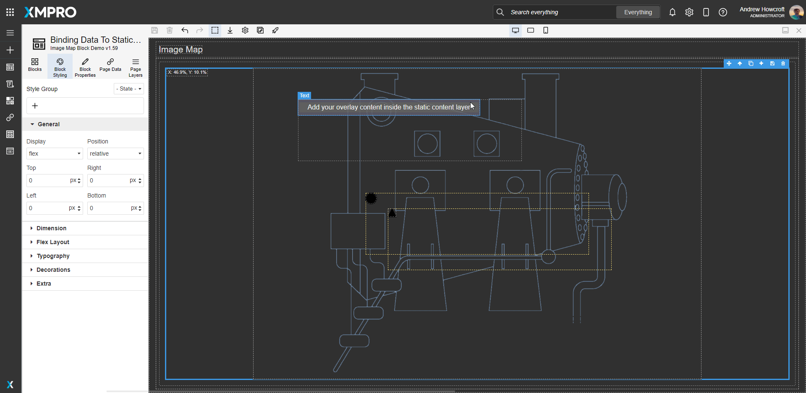

# Image Map

The Image Map Block allows you to render dynamic and static content onto an Image. You can drag on content such as indicators or text and these render on top of the image at runtime, at the specified coordinates.&#x20;

The Image Map Block accepts an image, and this aspect ratio is maintained when the Block is resized on the canvas; at run-time when the window is resized; or the App is launched on differently sized displays, such as a tablet or a large control room monitor.

Static and/or dynamic data can be added and their aspect ratio is also maintained so that they autoscale with the image.

The static content is a container used to lock the position of other Blocks, for example, to show general information on the corners of a plant diagram. For the best results, specify the position as a percentage and the text size as vh/vw.


[vw and vh are length units](https://www.w3.org/TR/css3-values/#viewport-relative-lengths) representing 1% of the viewport size for viewport width (vw) and height (vh), respectively. They are ideal for specifying size - especially text - in a responsive design because they are independent of the base font size.


A dynamic template is a container of other Blocks, linked to a data source. An instance of the template will show at run-time for each data point returned by the data source, positioned at the data point's specified X and Y coordinates.&#x20;

Multiple dynamic templates can be added if data points have different behavior and/or different data sources/filters. For example, you may have a different color indicator and a different drill-down action per asset type, such as conveyors, borers, and crushers.

Besides autoscaling, the second feature of the Image Map Block is a tooltip located top left of the image to tell you the exact X/Y coordinates of any point on the image at design time. Move your mouse across the image on the canvas to decide the exact placement of data points or static content.&#x20;

<figure><figcaption></figcaption></figure>

## Image Map Properties

### Appearance

#### Common Properties

The _visibility_ property is common to most Blocks;

[See the Common Properties article for more details on common appearance properties.](../common-properties.md)

#### Image

Select the background Image.

## Tooltip

A tooltip in the top left corner of the image shows the coordinates of the mouse location when hovering over the canvas. You can use this at design time to determine the X/Y position to render your static and dynamic content.

<figure><figcaption></figcaption></figure>

## Dynamic Templates

Dynamic Templates are layers on the Image Map Block that act as containers for additional Blocks like Text, Indicator, etc. These Blocks can be bound to values that come from the Dynamic Template's [Data Source](image-map.md#data-source). A Text Block is added by default to get you started - it can be amended or replaced.

One Dynamic Template is added by default and cannot be removed. No instances will show during run-time unless its Data Source, X Value, and Y Value are configured.

### Data Source

#### Common Properties

The _Data Source_ property is common to most Blocks;

‌[See the Common Properties article for more details on common Data Source properties.](../common-properties.md#data-source)

### Data

#### X Value&#x20;

The X Value determines the horizontal position of the Dynamic Template's run-time instances. Acceptable values are percentages, i.e. between 0 and 100.&#x20;

#### Y Value

The Y Value determines the vertical position of the Dynamic Template's run-time instances. Acceptable values are percentages, i.e. between 0 and 100.


The X and Y Values determine the run-time position of each instance of the dynamic template. You can adjust the template's position on the **canvas** under block styling. &#x20;


### Positioning

Although the runtime position is determined by the X and Y values, you can amend the canvas position by changing the top and left percentages in the Block Styling menu's [General ](../../concepts/application/block-styling.md#general)accordion.&#x20;

You can also change the Width and Height to a percentage or vw/vh in the [Dimension](../../concepts/application/block-styling.md#dimension) accordion, and font size to vw/vh in the [Typography](../../concepts/application/block-styling.md#typography) accordion to ensure that the text is responsive.

### Adding a Dynamic Template

To add another Dynamic Template, select any Dynamic Template and click on the _plus_ button in the top right Block toolbar.

.gif>)

### Removing a Dynamic Template

To remove a Dynamic Template, select the Dynamic Template and click on the _delete_ button in the top right Block toolbar.&#x20;


The default Dynamic Template cannot be removed.


.gif>)

## Static Content

Static Content is a layer on the Image Map Block that acts as a container to lock the position of additional Blocks like Text, Indicator, etc.&#x20;

A Text Block is added by default to get you started. It can be amended or replaced.

### Positioning

Unlike Dynamic Templates, the canvas and the runtime position are the same for Static Content. You can manually position it anywhere on the image by changing the top and left percentages in the Block Styling menu's [General ](../../concepts/application/block-styling.md#general)accordion.&#x20;

.gif>)

You can also change the Width and Height to a percentage or vw/vh in the [Dimension](../../concepts/application/block-styling.md#dimension) accordion, and font size to vw/vh in the [Typography](../../concepts/application/block-styling.md#typography) accordion to ensure that the text is responsive.

### Adding Static Content

To add Static Content, select the Image Map Block and click on the _plus_ button in the top right Block toolbar.&#x20;


If your Image layer covers the Image Map, click the _up_ button in the top right Block toolbar.


### Removing Static Content

To remove Static Content, select it and click on the _delete_ button in the top right Block toolbar.&#x20;

### Binding Data To Static Content

Add a Box Block to reference a Data Source within the Static Content layer - such as Live Data from Data Streams. Once a Data Source has been configured for the Box, you can bind data on any blocks added inside via the Dynamic Properties option.

<figure><figcaption></figcaption></figure>
