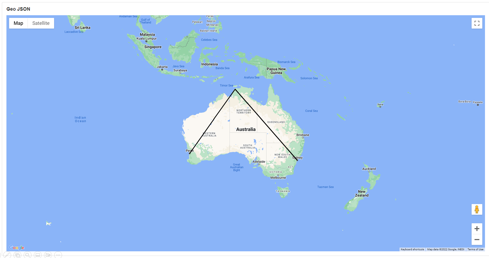
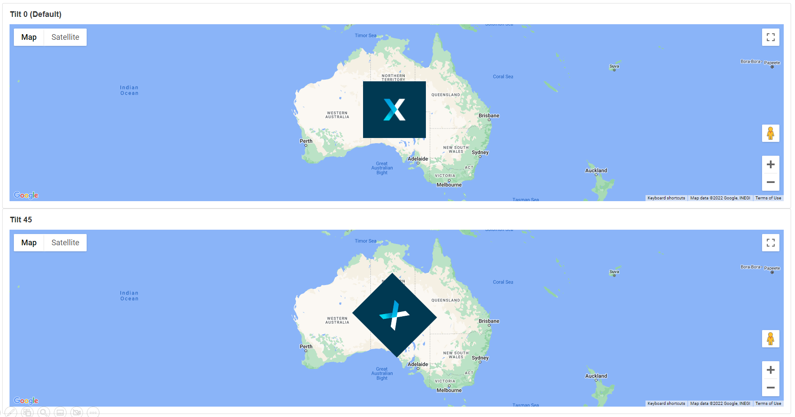

# Map

This Block adds a map to the page. This is useful if you want to show locations to the user, such as where to find something. A Data Source can be connected to the Map to load predefined target locations. The map can then be useful for displaying locations stored in a database.&#x20;

.png>)

## Map Properties

### Appearance

#### Common Properties

The _visibility_ property is common to most Blocks;

[See the Common Properties article for more details on common appearance properties.](../common-properties.md#appearance)

Options that are specific to maps include the ability to change the _latitude, longitude_, and _zoom level_.

#### Latitude & Longitude

This is the default coordinator location of the Map.&#x20;

.png>)

#### Zoom

The default zoom amount of the Map.

.png>)

### Behavior

#### Common Properties

The _disabled_ property is common to most Blocks;

Some of the properties are visible only when the dynamic mode option is enabled in _Markers Data Source_.

&#x20;[See the Common Properties article for more details on common behavior properties.](../common-properties.md#behavior)

#### Use Variables

This allows you to choose between manually entering a value for the _Provider API Key_ or selecting from a static variable.

#### Provider&#x20;


Google map and Google Static requires Provider API Key and the user needs to provide their own otherwise Google Static will not load and Google map will be shown in development mode. Bing does not require a Provider API Key to show the map.


If the Mode is Google or Google Static, the Provider API Key property is required for the Map.

This specified the provider of the Map. The default provider is Bing and can be changed to Google or Google static. If you have a customized map experience already set up on Google or Bing Maps, you can enter your Provider API Key.

.png>)

#### Type

This determines the layout of the map. Options include Roadmap (default), satellite, or hybrid.

.png>)

#### Enable Navigation Controls

This determines if the navigation controls on the right-hand side of the map are visible.

.png>)

#### Auto-Adjust Position to Markers

This will automatically change the camera position of the map to the area where the markers are.&#x20;

.png>)

#### Show Marker Labels

This determines if the markers of a location are visible. Actions are triggered when you click on a label marker on the Map.

.png>)

### Overlay

This sub-section of Behavior only applies when the [Provider](map.md#provider) option is Google. &#x20;

#### Geo Json

A GeoJSON file of type .json, representing simple geographical features, can be uploaded to the App Files and overlaid on the Map.&#x20;

<figure><figcaption></figcaption></figure>

<figure><figcaption></figcaption></figure>

#### Image

An image file can be uploaded to the App Files and overlaid on the Map. Once an Image is selected, it is required to specify the Image South West point & Image North East point for correct positioning.

<figure><figcaption></figcaption></figure>

#### Image South West point

The coordinates of the South West point of the Image, in the format _latitude, longitude_.&#x20;

<figure><figcaption></figcaption></figure>

#### Image North East point

The North East coordinates of the Image, in the format _latitude, longitude_.&#x20;

<figure><figcaption></figcaption></figure>

#### Image Tilt

Enter the number of degrees to tilt the image. The default is zero.

<figure><figcaption></figcaption></figure>

<figure><figcaption></figcaption></figure>

### Markers Data Source

#### Mode

This can be changed to either use _static items_ or a _dynamic data source_. In both cases, markers need to be configured in the [Data section](esri-map.md#data). If the static items option is chosen, markers for locations can be entered manually under the _Data_ section. If the dynamic data source option is chosen, marker locations coming from the Data Source can be used.&#x20;

&#x20;[See the Common Properties article for more details on common Data Source properties.](../common-properties.md#data-source)

### Data

Markers for locations can be manually added and they will show on the Map. Markers are entered by Longitude and Latitude.

.png>)

### Actions

#### Common Properties

Actions are triggered when you click on a label marker on the map. Actions are only available if the dynamic mode option is enabled in _Markers Data Source_.&#x20;

Properties that are common to most Blocks include: _navigate to_ and _show confirmation dialog;_

[See the Common Properties article for more details on common action properties.](../common-properties.md#action)
