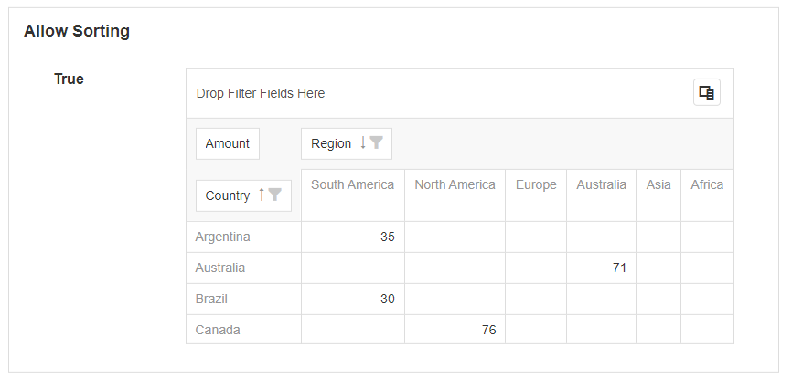

# Pivot Grid

This Block allows you to display data in the format of a Pivot Grid. The Pivot Grid can display the data in a customizable way and allows the users to specify which rows and columns are compared against each other. It consists of the grid itself as well as a field chooser which allows you to change the way the data is represented.

.png>)

## Pivot Grid Properties

### Appearance

#### Common Properties

Options for the appearance include its _visibility_.&#x20;

[See the Common Properties article for more details on common appearance properties.](../common-properties.md#appearance)

Options that are specific to Pivot Grids include the options to _show borders, show column totals, show column grand totals, show row totals, show row grand totals, show drill down,_ and _show totals prior_.&#x20;

[For details on common grid properties, see the Data Grid article](../basic/data-grid.md#common-properties).

#### Show Column Totals

This specifies if the totals across each row are counted and displayed on the side of a grouped column.&#x20;

.png>)

.png>)

#### Show Column Grand Totals

This specifies if the totals across each row are counted and displayed on the side.

.png>)

.png>)

#### Show Row Totals

This specifies if the totals across each column are counted and displayed after each grouped row.

.png>)

.png>)

#### Show Row Grand Totals

This specifies if the totals for each column are counted and displayed at the bottom.

.png>)

.png>)

#### Show Drilldown

When this is enabled, selecting any of the values in the data region will open a grid that drills down for each record.

.png>)

#### Show Totals Prior

By default, the totals for columns and rows are displayed at the end of the grouped row or column. If this option is enabled, the totals for columns or rows will be displayed before them, instead of after.&#x20;

.png>)

.png>)

### Behavior

Options for the behavior include _sorting the data by summary, allowing sorting, allowing filtering_, and _retaining the layout_.&#x20;

#### Allow sorting by summary

This allows the user to sort by each individual column. To sort, right-click on a column and select _Sort by this Column._

.png>)

#### Allow Sorting

This displays an arrow next to the row or column name. This lets the user sort the order of the columns and rows based on their names.&#x20;

.png>)

#### Allow Filtering

This displays a filter icon next to the row or column name. This allows the user to filter the rows or columns to only display certain values.&#x20;

.png>)

.png>)

#### Retain Layout&#x20;

If set to true, this will save the column, row, and data layout configuration in the browser. If changes are made to the Pivot Grid, and the user leaves the page and comes back later, the layout of the table will be the same as before they left it. If this option is set to false, the layout will reset to the default fields specified under _Fields_.

### Data Source

#### Common Properties

Data Sources can be connected to a Pivot Grid. This will allow you to display data on the Pivot Grid.&#x20;

[See the Common Properties article for more details on common Data Source properties.](../common-properties.md#data-source)

The Data Source property is required for the Pivot Grid.

### Fields

The fields specify the default fields that are visible for the rows and columns on the Pivot Grid. The fields can be bound to a row or column from the Data Source and certain properties can be configured.

#### Area

This specifies where on the Pivot Grid the data will be shown. This includes whether it is shown on the row, column, data area, or filter area.

#### Data Type

The data type of the row, column, or cell. This can be a number, string of characters, true or false value, or a date.

#### Data Field

This is the field from the Data Source that is going to be used when displaying the data.&#x20;

.png>)
