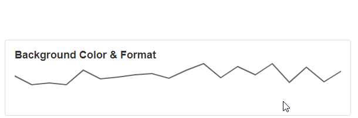

# Sparkline

A Sparkline is a Block that allows you to display data. A Sparkline can only display one series or data set in the graph and are therefore small graphs that do not take up much space. They can be embedded into text or easily added to the cells of a table. This is useful for displaying very specific data that focus on a single variable.

## Sparkline Properties

### Appearance

#### Common Properties

The Sparkline has the option to change its _visibility_ and to show a _tooltip_.&#x20;

[See the Common Properties article for more details on common appearance properties.](../common-properties.md#appearance)

Options that are specific to Sparkline include the ability to change the _type, change color, highlight first and last point, change point size_ and _format_.

#### Type

There are eight types of Sparkline. Area, Bar, Line, Spline, Spline Area, Step Area, Step Line, and Win/Loss.

.png>)

#### Highlight First and Last Point

This will highlight/circle the first and last value points on the series, which should be located at the start and end of the line/series.

#### First and Last Point Color

This will change the color used to highlight the first and last points.

.png>)

#### Show Min and Max&#x20;

This will highlight the min and max value on the Sparkline.

#### Min and Max Color

This will change the color of the min and max highlighter.

.png>)

#### Line Color&#x20;

This will change the color of the line.

#### Line Width

This will change the width of the line.

.png>)

#### Point Color&#x20;

This will change the color of the point.

#### Point Size

This will change the radius of the point.

.png>)

#### Background Color&#x20;

This will change the background color of the tooltip.

#### Format

This will display the values in the selected format when the tooltip is shown.&#x20;

### Data Source

#### Common Properties

Properties that are common to most Blocks include: _filter, sort, show # of results,_ and _skip # of results;_

‌[See the Common Properties article for more details on common Data Source properties.](../common-properties.md#data-source)

The Data Source property is required for the Sparkline Block.

### Data

This is where you can configure what X and Y-Axis to show on the graph.

The X-Axis and Y-Axis properties are required for the Sparkline Block.

#### Ignore Empty Points

If the value is empty it will not show it on the Sparkline.
