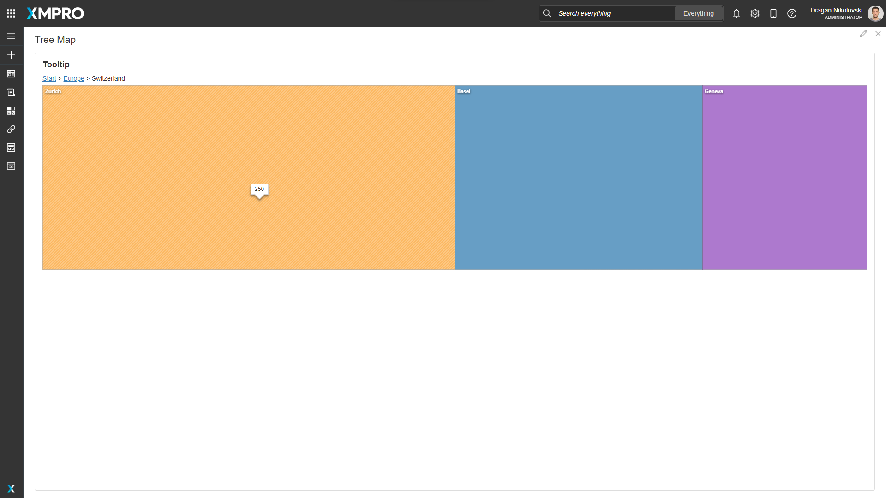

# Time Series Chart

The Time Series Chart is an interactive UI component that visualizes a large amount of time-oriented data. The Time Series Chart allows comparing data at run-time based on asset ID by dropping markers on the chart, as well as panning and zooming, and can show and hide specific assets or parameters via the hierarchy panel. 

.png>)

## Time Series Chart Properties

### Appearance

#### Common Properties

The _visibility_ property is common to most Blocks;

[See the Common Properties article for more details on common appearance properties.](../common-properties.md#appearance)

#### Show Legend

Determines if the legend is displayed or not.

#### X Axis Label Format

Determines how the date is formatted on the x-axis of the chart and pan & zoom panel.

| Label Format            |                           Image                          |
| ----------------------- | :------------------------------------------------------: |
| 12-Hour Clock (2 Lines) | .png>) |
| 12-Hour Clock (1 Line)  |  .png>) |
| 24-Hour Clock (2 Lines) | .png>) |
| 24-Hour Clock (1 Line)  |  .png>) |

#### Enable Toolbar

Determines whether the toolbar is displayed or not. The toolbar contains the button to change the y-axis type and the ellipsis menu. 

#### Enable Display Grid

Determines whether the ellipsis menu contains the Display Grid option, which shows the selected data in a grid.

#### Enable Download as CSV

Determines whether the ellipsis menu contains the Download as CSV option, which allows you to download the selected data as a CSV file.

#### Pan & Zoom Mode

This determines how the Pan & Zoom panel is displayed. Setting it to "Hidden" will remove the panel entirely, while "Compact" is a single-line component, and "Full" will display a Pan & Zoom with secondary panning and zooming for fine-tuning the selection.

| Pan & Zoom Mode |                        Image                        |
| --------------- | :-------------------------------------------------: |
| Full            |     |
| Compact         |  |
| Hidden          |   |

#### Pan & Zoom Color

This determines the color of the Pan & Zoom component.

#### Interval Size

This determines the default value for the Interval Size slider. The slider allows you to fine-tune the granularity of the displayed data. The displayed line chart data will be averaged over this interval.

#### Range - Static

This determines the starting date for the Pan & Zoom. The end date of the Time Series Chart is determined by the row with the latest timestamp. The Pan & Zoom range will update automatically with live data. 


The static range is used unless [Dynamic Start](time-series-chart.md#range-dynamic-start) and [Dynamic End](time-series-chart.md#range-dynamic-end) are not zero.


#### Range - Dynamic Start

This determines the starting date for the Pan & Zoom. If changed dynamically at runtime, the Pan & Zoom range will reload to reflect the new start.

The Dynamic Start date must be before the Dynamic End date.

#### Range - Dynamic End

Unlike the Static Range where the end date is determined by the row with the latest timestamp, this value specifies the end date for the Pan & Zoom. If changed dynamically at runtime, the Pan & Zoom range will reload to reflect the new end.

#### Initial Selection

This determines the time interval initially selected in the Pan & Zoom component and, correspondingly, the line chart. The selection will always start at the right side of the Pan & Zoom component.

#### Initial Selection Unit of Time

This determines which unit of time measurement is applied to the [initial selection](time-series-chart.md#initial-selection) value. The options are Minutes, Days, or Hours.

<figure><figcaption></figcaption></figure>

Upon launching the application, the initial selection and the unit of time can be observed on the interval timeline.

<figure><figcaption></figcaption></figure>

#### Display Avg, Min, Max, and Envelope

This determines whether the line chart will display only the average values as a plain line, or the minimum, maximum, and envelope over the selected Interval Size.

#### Show Tooltip On Hover

This determines whether a tooltip will appear when the cursor hovers over a line. The tooltip will display the values of the hovered point on the line.

#### Enable Zoom

Determines whether you can click and select on the chart to zoom into the selection.

#### Show X Axis

This determines whether the x-axis line and labels for the line chart are shown.

#### Show Y Axis

This determines whether the y-axis line and labels for the line chart are shown.

#### Default Y Axis Type

This determines the default Y Axis type, which can be changed at run-time using the button at the top-left corner of the line chart.&#x20;

If set to "Stacked" the selected parameters will be separated into different panes stacked vertically. If set to "Shared" the selected parameters will share a single pane with a single y-axis from the lowest to highest values in any line. If set to "Overlap", the selected parameters will share a single pane with multiple y-axes, with the lowest and highest value of each line chart displayed on the axis at the bottom and top.

#### Show Dots

Determines whether the points on the lines will display as dots.

#### Interpolation Function

This property allows you to define how the lines behave in the line charts.

| Function    |                    Line                    |
| ----------- | :----------------------------------------: |
| Monotone X  |    |
| Linear      |       |
| Step        |         |
| Step Before |   |
| Step After  |    |
| Basis       |        |
| Cardinal    |     |
| Catmull-Rom |  |

#### Palette

You can specify a custom color for each parameter in the line chart. If the number of parameters is greater than the number of colors specified, the colors will repeat.

### Behavior

#### Recommendations

The Alerts for selected Recommendations will be displayed at run-time as markers on the chart: the Alert's created time is used as the timestamp and its title as the text.


Known limitations:

* The marker title space is limited and the Alert title may be truncated.
* Some HTML special characters (e.g.`<`) used in the Alert title will be encoded.


#### Entity ID

Specify an _Entity ID_ field to filter the Recommendation Alerts.

### Data Source

#### Common Properties

A Data Source can be connected to a Time Series Chart. This will allow you to display data on the Time Series Chart.

‌[See the Common Properties article for more details on common data source properties.](../common-properties.md#data-source)

The Data Source property is required for the Time Series Chart.


Known limitations:

* SQL is not advised because large volumes of data may cause read issues and/or performance issues. Azure Data Explorer is the recommended time series data source.
* When adding a new field or expression to a Data Source already connected to a Time Series Chart, follow these steps for them to appear in the Time Series Chart configuration options:
  * Save the Data Source.
  * Open the Time Series Chart's Block Properties.
  * Save the Application.


### Data

#### Timestamp Expression

This is the column that the data will base its x-axis on. It must be a Date Time type column. For efficient performance, it is recommended to have an index in descending order on this column in your database.

The Timestamp Expression property is required for the Time Series Chart.

#### Default Selection

You can choose the line charts that the Time Series Chart will start with. If Group By Asset is disabled, you can select which parameters will be selected by default. If Group By Asset is enabled and a Hierarchy Data Source is selected, you will be able to select which Hierarchy items will be selected by default for each parameter.&#x20;

### Hierarchy

#### Group By Asset

This determines whether the data is to be grouped by an Asset Id column on the Data Source. If not enabled, the line chart will display a single line for each parameter selected.

**Asset Id Expression**

This is the column by which data will be grouped into separate lines. Each unique value in this column will have a line. If you choose to enable Hierarchy, this is also the Foreign Key that provides a link to the Id Expression of the Hierarchy Data Source.

When Group By Asset is true, the Asset Id Expression property is required for the Time Series Chart.

#### Show Hierarchy

This determines whether the Hierarchy is displayed. The hierarchy is the left panel containing a tree grid that allows you to modify the selected assets and parameters.

#### Data Source

A Hierarchy Data Source can be connected to a Time Series Chart. This will allow you to display data in the Hierarchy of the Time Series Chart.

[See the Common Properties article for more details on common data source properties.](../common-properties.md#data-source)

#### Id Expression

The Id Expression is the identifying column for the Hierarchy. The values in this column are linked to the Asset Id Expression of the line charts, and the Parent Id Expression.

If the Hierarchy Data Source is selected, the Id Expression property is required for the Time Series Chart.

#### Name Expression&#x20;

The Name Expression is a user-friendly name for what the user can see. For example, the text that is showing in the List.

If the Hierarchy Data Source is selected, the Name Expression property is required for the Time Series Chart.

#### Parent Id Expression

The Parent Id Expressions determine how the Hierarchy knows which rows are connected to each other as parent and child. The Parent Id refers to the Id of the parent row.

If the Parent Id expression is not defined, the Hierarchy will have a flat structure.

#### Resource Expression

The Resource Expression determines whether a row is a Resource Row and can have parameters selected for it. For example, each area in a mine may have many pumps, but only the pumps are Resources and have a Motor Current, etc.

If Resource Expression is not defined, only the leaf nodes in the tree will be Resources.

## Performance

### Connector Selection

Choose either a Connector designed for large volumes of data - or one that does not reload with each interaction.


