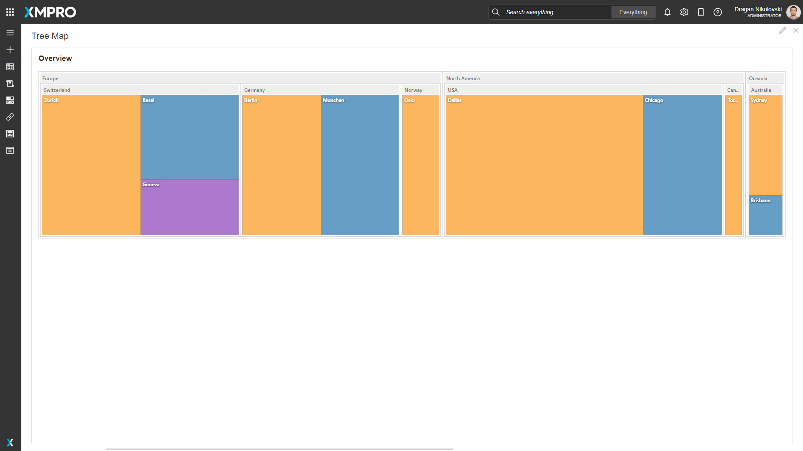
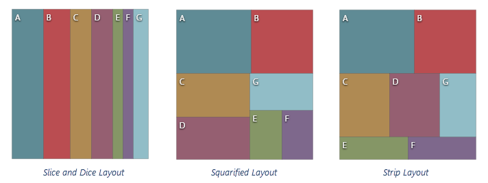
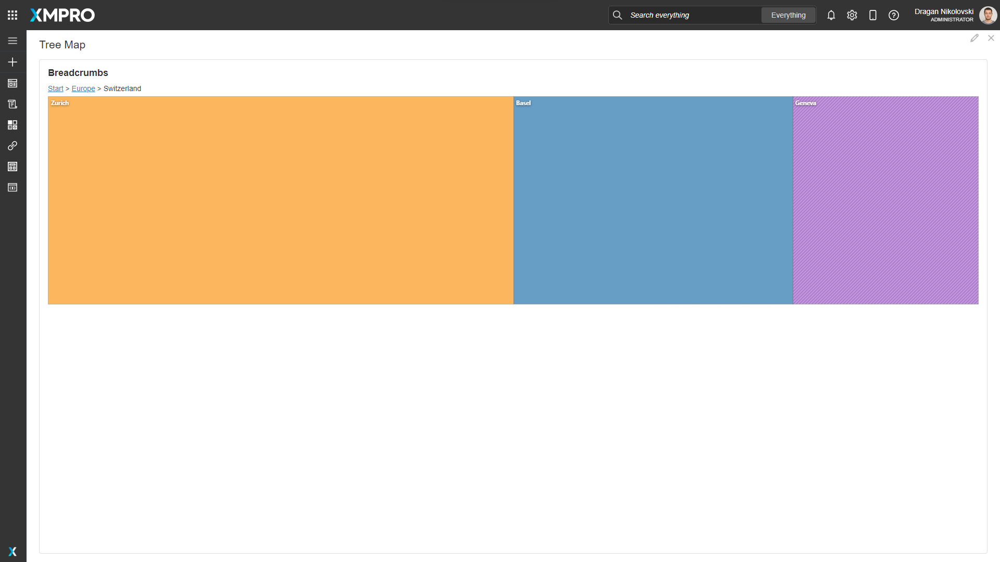
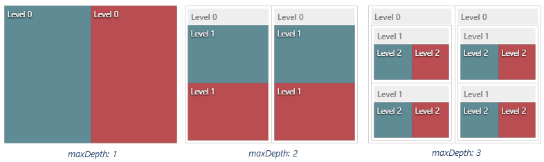

# Tree Map

The Tree Map is a UI component that displays hierarchical data by using nested rectangles.&#x20;

In the Tree Map component, hierarchical data is represented by a set of nested rectangles whose sizes are proportional to the visualized values. Tree Map operates with plain and hierarchical data sources. Also, it can visualize a hierarchy reconstructed from a flat data source.

<figure><figcaption></figcaption></figure>

## Tree Map Properties

### Appearance

#### Common Properties

You can change the _visibility_ of the Tree Map.&#x20;

[See the Common Properties article for more details on common appearance properties.](../common-properties.md#appearance)

#### Tiling Algorithm

Select the tiling algorithm that will be used to determine the position and size of tiles and groups:&#x20;

* Slice and Dice
* Squarified
* Strip Layout

<figure><figcaption></figcaption></figure>

#### Colorizing

Determine the colorizing algorithm.&#x20;

#### Palette

You can override the default colors by adding custom colors.

#### Range&#x20;

Determine the range and how the tiles should be colorized based on the range. Only available if [Colorizing](tree-map.md#colorizing) is set to Range or Gradient.

#### Breadcrumbs Position

Determines the position of the Breadcrumbs.

<figure><figcaption></figcaption></figure>

### Behavior

#### Show Drilldown

When this is enabled, selecting any of the values in the Tree Map will drill down for that tile or group.

#### Maximum Depth

Determine how many hierarchical levels must be visualized.

<figure><figcaption></figcaption></figure>

### Data Source

#### Common Properties

Properties that are common to most Blocks include data source and filter.

[See the Common Properties article for more details on common Data Source properties.](../common-properties.md#data-source)

The Data Source property is required for the Tree Map.

### Data

#### Display Expression&#x20;

The expression is a user-friendly name for what the user can see. For example, the text that is displayed to the user.

The Display Expression property is required for the Tree Map

#### Value Expression

This is the value that is used to set the size of the tiles and the groups.

The Value Expression property is required for the Tree Map.

**Id**

The Id property is required for the Tree Map

#### Parent Id

The _Parent Id_ tells the component how the fields are connected to each other. The Parent Id refers to the Id of the parent record. For example, in the hierarchy of employees, multiple people could report to one manager, so their parent Ids would be the Id of the person they are listed underneath. If the parent Id of a record is set to null or 0, it will automatically be placed as a root or main parent element on the tree.

The Parent Id property is required if the Data Source is a plain data source. For hierarchical data sources, the Parent Id property is not needed.&#x20;

#### Tooltip

Determines the text that will be shown when hovering over a block.

<figure><figcaption></figcaption></figure>

### Action

#### Common Properties&#x20;

Properties that are common to most Blocks include: _Navigate To, Update Page Data, Groups To Validate, and Show Confirmation Dialog;_

[See the Common Properties article for more details on common action properties.](../common-properties.md#action)
