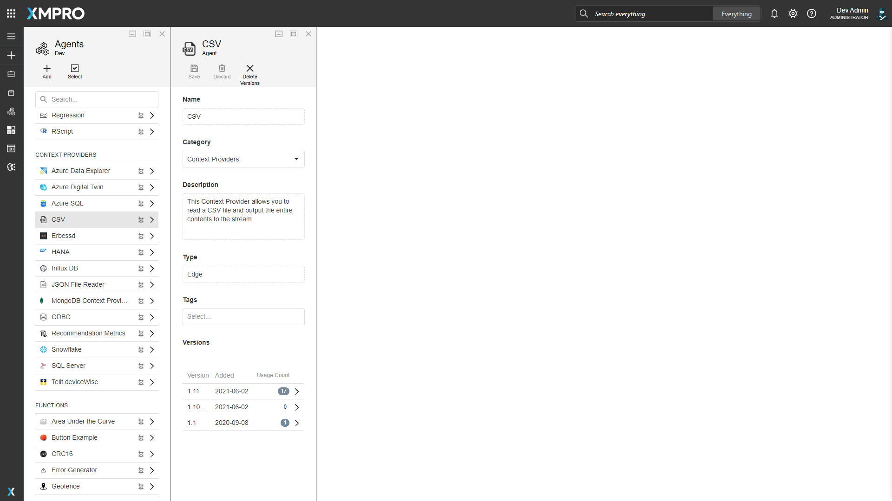
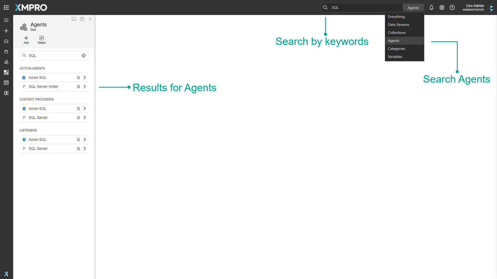
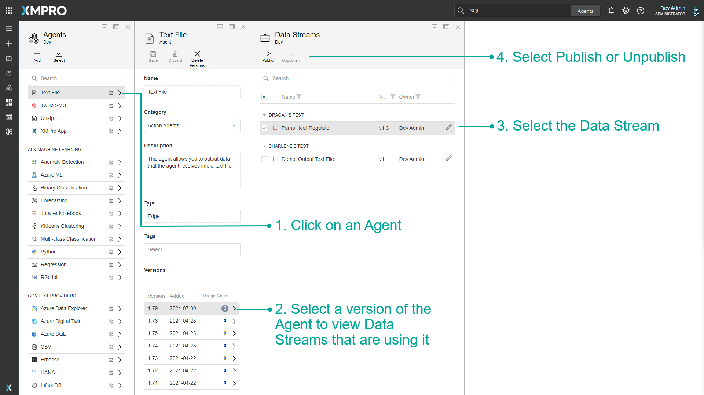

# Agent

An _Agent_ is a reusable object which forms the building block of a Data Stream. When a number of Agents are connected together, a Data Stream is formed.&#x20;

Each Agent is designed to perform a specific function in the stream. For example, they can be used to retrieve data from a database in real-time, display data, filter, sort the data, or save the data somewhere else, depending on the function of that individual Agent.&#x20;

Agents are needed to connect to specific systems. Since Agents are individual components, new Agents can also be added and integrated into the Data Stream to complete a specific functionality.


Videor Presentation Discussing Agents and Collections


Each Agent consists of code, [settings](./#settings), and other properties that are packaged into a file that can be uploaded to Data Stream Designer.&#x20;

XMPro has a [library of Agents](https://documentation.xmpro.com/resources/integrations) available to use. To acquire any of these Agents, please contact your XMPro sales representative or write to us at [support@xmpro.com](mailto:support@xmpro.com). Alternatively, since Agents can be written by anyone that has some knowledge of programming and has access to the required technologies, you can write your own Agent by following [these](../../how-to-guides/agents/building-agents.md) instructions.

## Categories

In Data Steam Designer, Agents are divided into different categories, depending on the overall function they perform. There are six different categories available: _Action Agents_, _Context Providers_, _Listeners, Transformations, AI & Machine Learning, Recommendations,_ and _Functions_. To be able to distinguish them properly, they have been tagged with a certain color as well as an abbreviation. These categories are separate from the [App and Data Stream Categories](../category.md).

### **Action Agents**

An Action Agent is an Agent that consumes events in a stream and then performs internal or external (third-party) actions, e.g. sending notifications or performing data warehouse updates. Action Agents output a response after each event has been processed. For example, the Azure SQL Action Agent writes data to an Azure SQL database.

### **Context Providers**

Context providers are Agents that provide context to a stream by consuming reference or static data and making it available. For example, the _SQL Server Context Provider_ provides static data to the Data Stream by reading the data in a database table and sending it to the next Agent.

### **Listeners**

Listeners are Agents that listen for data or events from sensors and third-party systems. For example, the _MQTT Listener_ listens for data from sensors as it is posted to MQTT.

### **Transformations**

Transformation Agents alter the shape or form of data. For example, the _Join Transformation_ joins data it receives from two separate data sources.

### **AI & Machine Learning**

AI & Machine Learning Agents allow you to run advanced AI to transform the data. For example, _Azure ML, IBM Watson, and Jupyter Notebook_.&#x20;

### **Recommendations**

Recommendation Agents are related to Recommendations and let you complete actions such as running recommendations, updating recommendations, and more.

### **Functions**

Functions perform specific mathematical or statistical operations on data. For example, the _FFT Function_ performs forward FFT calculations on the data it receives.

## Settings

An Agent consists of code and user settings. The code defines the actions an Agent performs in any Data Stream. The settings are the input for the code that executes, provided by the user when adding the Agent to a Data Stream, such as authentication credentials.

For example, consider the SQL Server Writer Agent. The function this Agent performs in a Data Stream is to take the data it receives and write it to a table in a database. The settings a user must define for the Agent so it can do that are as follows:

* Name of the SQL Server instance
* SQL Server username
* Whether SQL Server authentication should be used or not
* SQL Server password
* Database to which the data should be written
* Whether a new table should be created or not
* Table to which data should be written - if the user wishes to use an existing table
* Name of the table that should be created if the user wants to write the data to a new table
* If database triggers should be fired when a record is inserted

### Endpoints

Endpoints provide entry and exit points to the Agent.

The input endpoint allows the Agent to receive data from another Agent, whereas the output endpoint enables the Agent to pass data to another Agent. They are represented on the Data Stream canvas as green rectangles.&#x20;

The error endpoint allows an Agent to send any error data further along a part of the stream, designed to handle data records or events that do not meet certain requirements. It is represented on the Data Stream canvas as a red rectangle.

<figure><figcaption>
Fig 1. Data Stream Canvas and Agent's User Settings
</figcaption></figure>

<figure><figcaption>
Fig 2. Agent properties
</figcaption></figure>

## Finding Agents

The search bar can be used to find any specific Agents that you may be looking for. There is a dropdown option where you can specify to search through everything in Data Stream Designer, or only for Agents.

<figure><figcaption>
Fig 3. Searching for an Agent
</figcaption></figure>

## Versions

Agents can keep track of their different versions. Versions of an Agent can be copied, and changes made to it can be created as a new version without affecting previous versions. [See the Version article for more details on versions.](../version.md)

### Publish and Unpublish Data Streams

On the Agents page, there will be a number next to the version if the agent has been used in a Data Stream. Click the number to view a list of all Data Streams that are using that Agent version. Here you can directly unpublish or publish a Data Stream.&#x20;

As an Admin, this is useful if you need to unpublish a Data Stream and you don't have access to it. See the [How to Admin Unpublish Override](../../how-to-guides/publish/admin-unpublish-override.md) article for more details.

<figure><figcaption>
Fig 4. Data Stream Toolbox Interface
</figcaption></figure>

## Actions on the Agent

| **Action**      | **Description**                                          |
| --------------- | -------------------------------------------------------- |
| Add             | Adds a new Agent.                                        |
| Select          | Selects multiple Agents.                                 |
| Delete          | Deletes the Agent.                                       |
| Save            | Saves any changes made to the Agent up to this point.    |
| Discard         | Discards any changes made to the Agent up to this point. |
| Delete Versions | Deletes selected versions of the Agent.                  |

## Further Reading

* [How to Create and Manage Agents](../../how-to-guides/agents/manage-agents.md)
* [How to Run an Integrity Check](../../how-to-guides/data-streams/run-an-integrity-check.md)
* [How to Upgrade a Stream Object Version](../../how-to-guides/data-streams/upgrade-a-stream-object-version.md)
* [How to Use Error Endpoints](../../how-to-guides/data-streams/use-error-endpoints.md)
