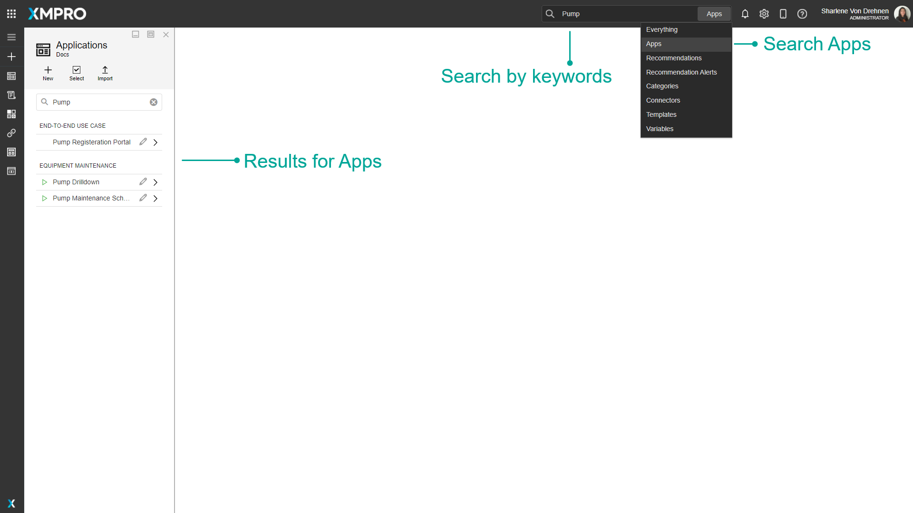

# Application

An XMPro Application or App is an event-driven web application created using XMPro's no-code App Designer. It enables subject matter experts to create and deploy real-time, event intelligence applications without being a programmer. This means that Engineers and subject matter experts can build apps in days or weeks without further overloading IT, enabling your organization to accelerate and scale your digital transformation.&#x20;

Applications are accessed through the App Designer Categories dashboard or the Applications button on the left menu.



## Finding Applications

The search bar can be used to find any specific Apps that you may be looking for. There is a dropdown option where you can specify to search through everything in App Designer, or only for Apps.

## Overview

Applications are grouped into categories, which are selected in the App properties. They are displayed on the App Designer home page dashboard and in the Applications list under their category. The dashboard shows the Apps' name, description, and icon as well as the publish status and date last modified.&#x20;

Applications have a Default Theme, which is the theme selected when any new pages are created. Each page can have its own theme.&#x20;

### Page

An Application is made up of one or more Pages. A Page is a web page within the Application that can be built using the no-code App Designer. The Application starts with a Landing Page, which acts as the main home page and is the first page to open when a user opens the application. Users can edit Pages or build the content on the webpage by selecting and dragging [Blocks](block.md) such as controls or text onto a [Canvas](canvas.md). An application can then be launched in order to see a preview of what the Application would look like during runtime. &#x20;

Pages can also be configured to display real-time or contextual data directly from a source of data, such as a database, Data Stream, or Recommendation. This can be done using [Data Integration](data-integration.md). Pages can also be configured to [navigate to other pages](navigation-and-parameters.md), where data can also be passed between pages using parameters. [See the Page article for more information on pages.](page.md)

### Versions

Different versions of Applications can be made to keep track of any major or minor changes made. Versions of an application can be opened by selecting the 'Versions' tab when editing the application. Viewing a particular version will open the application for that version. Copying a version allows you to continue working and making changes to the application while maintaining a version of it before you made changes, which can also act as a backup mechanism. [See the Version article for more information on versions.](../version.md)

### Access

An Application can be shared with other users. The person who originally created the Application will be listed as the owner and can never lose his/her right to access it unless it is deleted. When the application is shared with another user, the person sharing it can decide whether to give them co-owner, read, or write access to the application. [See the Manage Access article for more information on managing access.](../manage-access.md)

### Template

An Application can be saved as a Template which can then be used again by you or other users when creating a new Application. The Template will show as a pre-designed application that can be selected when configuring the layout of the new App. [See the Templates article for more information on Templates.](template.md)

### Company Landing Page

A Company Landing Page can be set for what Application Landing Page the user will see when they first open App Designer. You can choose to set a Company Landing Page for both Desktop or Mobile. You can select a different App for Desktop and a different App for Mobile. [See the Manage Landing Pages article for more information on Templates.](../../how-to-guides/manage-landing-pages.md)

## Actions on the Application

| **Action**                                               | **Description**                                                                                                                                                                                      |
| -------------------------------------------------------- | ---------------------------------------------------------------------------------------------------------------------------------------------------------------------------------------------------- |
| [Properties](./#properties-on-the-application)           | Opens the properties for the selected App. Also allows you to Delete the App.                                                                                                                        |
| [App Data](data-integration.md)                          | Opens the App Data section. [See the Data Integration article for more details about Data Integrations](data-integration.md).                                                                        |
| [Publish/Unpublish](../../how-to-guides/publish/)        | Publishes or unpublishes the Application.                                                                                                                                                            |
| [Manage Access](../manage-access.md)                     | Allows you to manage which users are allowed to view or modify this Application.                                                                                                                     |
| [Versions](../version.md)                                | Versioning for the Application.                                                                                                                                                                      |
| [Save Template](template.md)                             | Saves the current Application as a Template to create new Applications from. [See the Templates article for more information on templates.](template.md)                                             |
| Notes                                                    | Opens the Notes, which allows you to add notes about the Application for collaboration and future-proofing.                                                                                          |
| [Export](../../how-to-guides/import-export-and-clone.md) | Export the Application.                                                                                                                                                                              |
| [Clone](../../how-to-guides/import-export-and-clone.md)  | Clone the Application                                                                                                                                                                                |
| [App Files](app-files.md)                                | Opens the App Files, which allows you to manage files uploaded to this app. [See the App Files article for more details about App Files](app-files.md).                                              |
| Save                                                     | Saves any changes made to the Application up to this point.                                                                                                                                          |
| Discard                                                  | Discards any changes made to the Application up to this point.                                                                                                                                       |
| Delete                                                   | Deletes the Application.                                                                                                                                                                             |
| [Add Page](page.md)                                      | Allows you to add and import a Page to the Application. The Add Page button is located at the top right corner of the App Pages list. [See the Page article for more information on Pages.](page.md) |

## Further Reading

* [How to Create and Manage Applications](../../how-to-guides/apps/)
* [How to Create and Maintain notes](../../how-to-guides/apps/create-and-maintain-notes.md)
* [How to Manage Themes](../../how-to-guides/apps/manage-themes.md)
* [How to Set a Company Landing Page](../../how-to-guides/manage-landing-pages.md)
