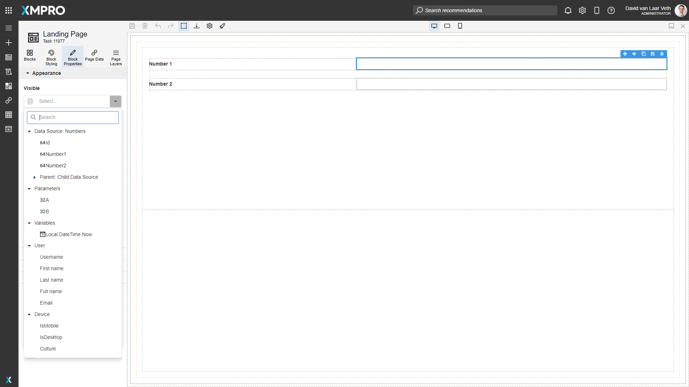

# Block Properties

Block Properties are properties that define the appearance and behavior of the Block. This allows you to customize the block's content such as the heading text, or configure any data you would like to display on your application.

Each block type has different properties. To access the Block Properties tab, double-click a Block in the canvas or click on a Block in the canvas and click the Block Properties command.

.png>)

Properties are split into several common categories. Click on a category to expand the accordion and see the Properties in that category.

The common categories are as follows:

<table><thead><tr><th width="211">Category</th><th>Description</th></tr></thead><tbody><tr><td>Appearance</td><td>Properties that define how a Block looks.</td></tr><tr><td>Behavior</td><td>Properties that define how a Block behaves.</td></tr><tr><td>Value</td><td>Properties that define what value a Block has.</td></tr><tr><td>Data Source</td><td>Properties that define what Data Source the Block has (applies to Blocks that allow a Data Source to be attached).</td></tr><tr><td>Data, Columns, Items</td><td>Properties that define what the Data Source properties are mapped to, or allow a static data set to be created (applies when relevant to the Block).</td></tr><tr><td>Grouping</td><td>Properties that define how the Data Source is grouped (applies when relevant to the Block).</td></tr><tr><td>Action</td><td>Properties that define what action, and validation to perform, and what Data Source to update when it or items inside the Block are clicked (applies to Blocks that allow an action).</td></tr><tr><td>Validation</td><td>Properties that define what validation should be performed on the value of the Block before allowing an action (applies to Blocks that allow user input).</td></tr></tbody></table>

## Dynamic and Expression Properties

Some properties have the option of being a Dynamic or Expression property. If the property has a button on the left with an A icon and "Static Value" when you hover it, it can be a Dynamic or Expression Property. Press the button to cycle through the modes.

.png>)

.png>)

Dynamic properties allow you to select a value for the property from the Page Parameters, Variables, User Details, Device Details, and from a column or expression of the current row of a parent Block's Data Source.&#x20;

### User Details

<table><thead><tr><th width="236">Property</th><th>Description</th><th data-hidden></th></tr></thead><tbody><tr><td>Username</td><td>Returns the Username of the user that is signed in.</td><td></td></tr><tr><td>First Name</td><td>Returns the First Name of the user that is signed in.</td><td></td></tr><tr><td>Last Name</td><td>Returns the Last Name of the user that is signed in.</td><td></td></tr><tr><td>Full Name</td><td>Returns the Full Name of the user that is signed in, using the format "[First Name] [Last Name]".</td><td></td></tr><tr><td>Email</td><td>Returns the Email of the user that is signed in.</td><td></td></tr></tbody></table>

### Device Details

<table><thead><tr><th width="238">Property</th><th>Description</th><th data-hidden></th></tr></thead><tbody><tr><td>IsMobile</td><td>
Returns True boolean value if the App is open on a mobile device. 

Example: For Mobiles and/or Tablets will be True.
</td><td></td></tr><tr><td>IsDesktop</td><td>
Returns True boolean value if the App is open on a desktop device. 

Example: For Laptops and/or Desktops will be True.
</td><td></td></tr><tr><td>Culture</td><td>
Returns the Device culture/language. 

Example: If the language is set to US English will return en-US.
</td><td></td></tr></tbody></table>


[See the Data Integration article for more information on Data Sources](data-integration.md#data-source).


Expression properties allow you to create short scripts to create a custom value from all the above options. [See the Variable and Expressions article to learn more about Expressions](variables-and-expressions.md).

.png>)

The Dynamic and Expression properties will have all the Block's ancestor's Data Sources displayed in the order of closest ancestor to furthest. For example, in the following images, the bottom-most Text Block in the Page Layers has two ancestors that have a Data Source: the Data Repeater Box and the Templated List. Therefore the two data sources are listed in the Text Block's Dynamic and Expression property dropdowns.

.png>)

.png>)

## Further Reading

* [How to Use Dynamic Properties](../../how-to-guides/apps/use-dynamic-properties.md)
* [How to Use Expression Properties](../../how-to-guides/apps/use-expression-properties.md)
* [How to Use Validation](../../how-to-guides/apps/use-validation.md)
