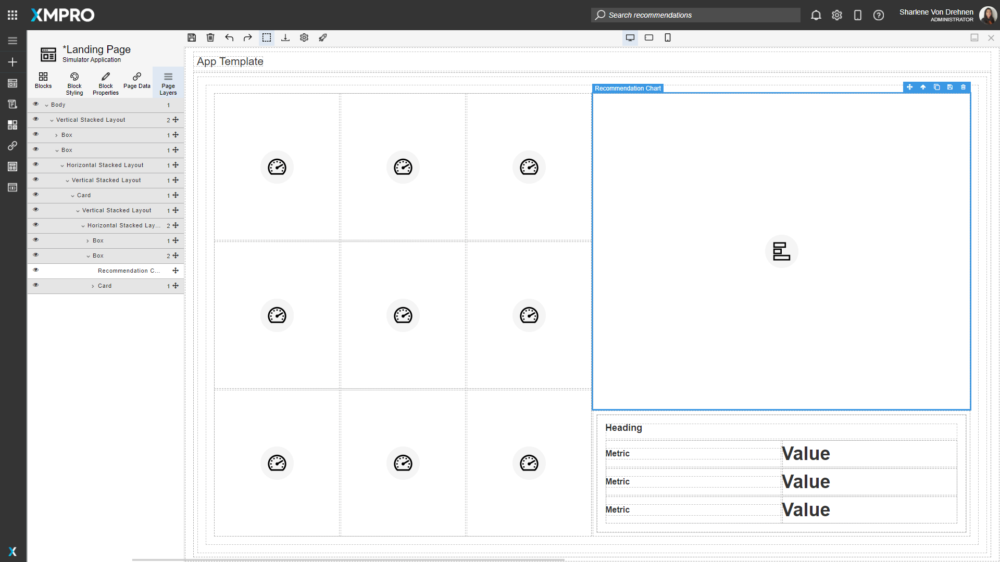

# Page Layers

Blocks are organized on the canvas in a hierarchy. The Page Layers tab in the toolbox displays a tree list representation of the hierarchy. This can make selecting blocks simpler and easier as some applications may have many nested layers and it can be difficult to select them on the canvas itself. This allows you to find the exact block you need to manipulate.

Parent Blocks can be expanded to view their nested Child blocks underneath. [See the Canvas article for more details on the canvas hierarchy.](canvas.md) The visibility of the block and the location of the blocks on the canvas can also be moved using this Page Layers list.

.png>)

A Block on the canvas will be outlined if it is selected. If the Page Layers tab is opened, the list will also update to show where the block is on the hierarchy.&#x20;

The number on the right shows how many children blocks the selected block has.

## Actions on the Page Layers

| **Action**        | **Description**                                                                                                                                         |
| ----------------- | ------------------------------------------------------------------------------------------------------------------------------------------------------- |
| Change visibility | Changes the visibility of the selected Block. If changed to hidden, the Block will not be seen on the canvas or when the page is launched.              |
| Expand            | Expands a selected Block to see the children.                                                                                                           |
| Collapse          | Collapses a selected Block's children.                                                                                                                  |
| Select            | Selects a Block. The selected block will be outlined on the canvas.                                                                                     |
| Drag/Move         | Moves the Block to a different location. This will also change the Block's location on the canvas.                                                      |
| Rename            | Renames the outline surrounding the Block. The Block's name is not shown anywhere when in view mode, it is purely for the sake of clarity in edit mode. |

## Further Reading

* [How to use Page Layers](../../how-to-guides/apps/use-page-layers.md)
