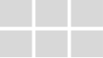
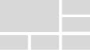
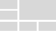
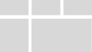
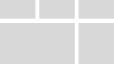
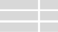
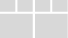

# Page

A Page is a web page built with XMPro's No Code App Designer. [Applications](./) can have one or more Pages in them and can navigate and pass data between Pages. One of the Pages is marked as a Landing Page, which means it functions as a home page and is the first page that will be navigated to when opening an App.&#x20;

Pages can be edited by clicking on a page in the App Pages list while editing an Application, or by clicking the edit button in the top right of a page while viewing an Application if you have edit access.

When editing a Page you can click and drag the grey header to scroll left and view the list of Pages for the whole App.

.png>)

.png>)

The Page editor has the following sections:&#x20;

| Area                  | Description                                                                                                                                                                                                                                                                                                                                                                                                                                                                                                                                                                                                                                                                                                                                                                                                     |
| --------------------- | --------------------------------------------------------------------------------------------------------------------------------------------------------------------------------------------------------------------------------------------------------------------------------------------------------------------------------------------------------------------------------------------------------------------------------------------------------------------------------------------------------------------------------------------------------------------------------------------------------------------------------------------------------------------------------------------------------------------------------------------------------------------------------------------------------------- |
| Blocks and Properties | 
You can switch between the tabs by clicking on the commands at the top. You can drag and drop blocks from the Blocks (Toolbox) tab into the Canvas, customize Block styling and properties from their respective tabs, manage Parameters, Variables, and Data Sources from the Page Data Tab, and see a hierarchical view of the Canvas in the Page Layers tab.

For more details on each concept, visit the <a href="page-layers.md">Page Layers article</a>, <a href="block.md">Blocks article</a>, <a href="block-styling.md">Block Styling article</a>, <a href="navigation-and-parameters.md">Navigation and Parameters article</a>, <a href="variables-and-expressions.md">Variables and Expressions article</a>, and <a href="data-integration.md#data-source">Data Integration article</a>.
 |
| Actions               | Actions can be performed on the page by clicking on commands here. The commands in the middle of the command bar switch between different screen widths and apply a media query to any Block Styles applied while selected                                                                                                                                                                                                                                                                                                                                                                                                                                                                                                                                                                                      |
| Devices               | 
The commands in the middle of the command bar switch between different screen widths or Devices and apply a media query to any Block Styles applied while selected.

<a href="devices.md">See the Devices article for more details on Devices</a>. 
                                                                                                                                                                                                                                                                                                                                                                                                                                                                                                                                                 |
| Canvas                | The Canvas is a no-code drag and drop editor for creating customized web pages. UI elements and blocks such as text boxes, graphs, or other various controls can be dragged onto the Canvas from the toolbox to build the contents of the Page. [See the Canvas article for more detail on the canvas](canvas.md).                                                                                                                                                                                                                                                                                                                                                                                                                                                                                              |

.jpg>)

## Theme

You can select from two themes for Pages: Light and Dark. An example of each theme is shown below.

### Light

.png>)

### Dark

.png>)

## Page Layouts

When a Page is created there is a choice between 12 different Page Layouts. The layouts have built-in responsive styles and reshape into a single column in a smaller screen layout. The layouts are as follows:

| Page Layout                                                                | Order of Cards on Mobile                                                        |
| -------------------------------------------------------------------------- | ------------------------------------------------------------------------------- |
|   |    |
|       |    |
|       |    |
|       |   |
|       |     |
|       |   |
|       |   |
|       |   |
|       |    |
|   |    |
|   |   |
|       |    |

## Responsive Page Layout Example

### Desktop

.png>)

### Mobile

.png>)

## Actions on the Page

| **Action**                                               | **Description**                                                                                                                                                                                                                                                                                        |
| -------------------------------------------------------- | ------------------------------------------------------------------------------------------------------------------------------------------------------------------------------------------------------------------------------------------------------------------------------------------------------ |
| Save                                                     | Saves any changes made to the Page up to this point.                                                                                                                                                                                                                                                   |
| Discard                                                  | Discards any changes made to the Page up to this point.                                                                                                                                                                                                                                                |
| Undo                                                     | Undo any changes made to the Page up to this point.                                                                                                                                                                                                                                                    |
| Redo                                                     | Redo any changes made to the Page up to this point.                                                                                                                                                                                                                                                    |
| Show Borders                                             | 
Switches the Canvas between two modes:  <strong>Bordered</strong>, in which every block has a dotted outline around them (invisible when viewing the Page), and

<strong>Unbordered</strong>, in which blocks do not have outlines and are shown as they will be when viewing the Page.
 |
| [Export](../../how-to-guides/import-export-and-clone.md) | Exports the Page layout. Does not include Data Sources.                                                                                                                                                                                                                                                |
| Settings                                                 | Opens the Page Settings, where you can change the Name and Theme, and delete the page.                                                                                                                                                                                                                 |
| Launch                                                   | Launches the page as it will be viewed in the Application.                                                                                                                                                                                                                                             |
| Delete                                                   | Deletes the Page.                                                                                                                                                                                                                                                                                      |

## Further Reading

* [How to Create and Manage Pages](../../how-to-guides/apps/manage-pages.md)
* [How to Import an App Page](../../how-to-guides/apps/import-an-app-page.md)
* [How to Design Pages for Mobile](../../how-to-guides/apps/design-pages-for-mobile.md)
* [How to Navigate Between Pages](../../how-to-guides/apps/navigate-between-pages.md)
* [How to Pass Parameters Between Pages](../../how-to-guides/apps/pass-parameters-between-pages.md)
