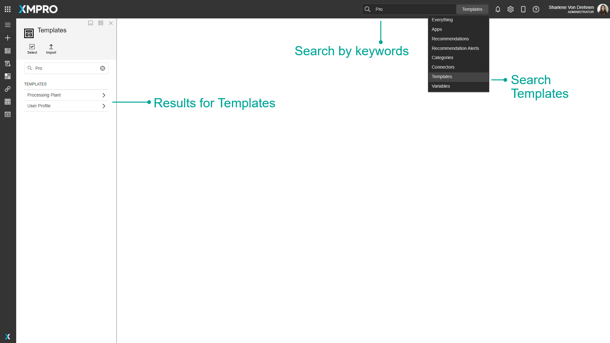

# Template

Templates are pre-designed [Applications](./) that can be selected when creating a new Application. Templates can be used to save time without having to build a whole new app layout from scratch, and also allow you to create a consistent theme or design that you can use across all your Applications.&#x20;

The base Template that the App Designer starts with is the Blank App. The Blank App creates an Application with one Landing Page and provides a choice of Page Layout the same as creating a new Page. Other templates are designed and saved by a user and have whatever page layouts the Application had when it was saved as a template.&#x20;

Templates can be searched by name, and filtered by category.

.png>)

When you click a Template it will give you a preview with screenshots, Name and Description, and a list of Pages that the Template contains:

.png>)

Templates are created by clicking Save as Template on an App. This will create a Template that has the Pages of the App. The Thumbnail screenshot will be shown on the New App page, and all the screenshots will be visible after clicking on the Template on the New App Page.


Please note that any Data Sources on the Pages will not be saved into the Template.&#x20;


.png>)

Existing Templates are managed by clicking the Templates button in the left menu.

.png>)

## Finding Templates

The search bar can be used to find any specific Templates that you may be looking for. There is a dropdown option where you can specify to search through everything in App Designer, or only for Templates.

## Actions on the Template

| **Action**                                               | **Description**                                             |
| -------------------------------------------------------- | ----------------------------------------------------------- |
| Save                                                     | Saves any changes made to the Template up to this point.    |
| Discard                                                  | Discards any changes made to the Template up to this point. |
| Delete                                                   | Deletes the Template.                                       |
| View                                                     |  Navigates to the                                           |
| [Export](../../how-to-guides/import-export-and-clone.md) | Exports the Template.                                       |

## Further Reading

* [How to Create and Manage Templates](../../how-to-guides/apps/manage-templates.md)
