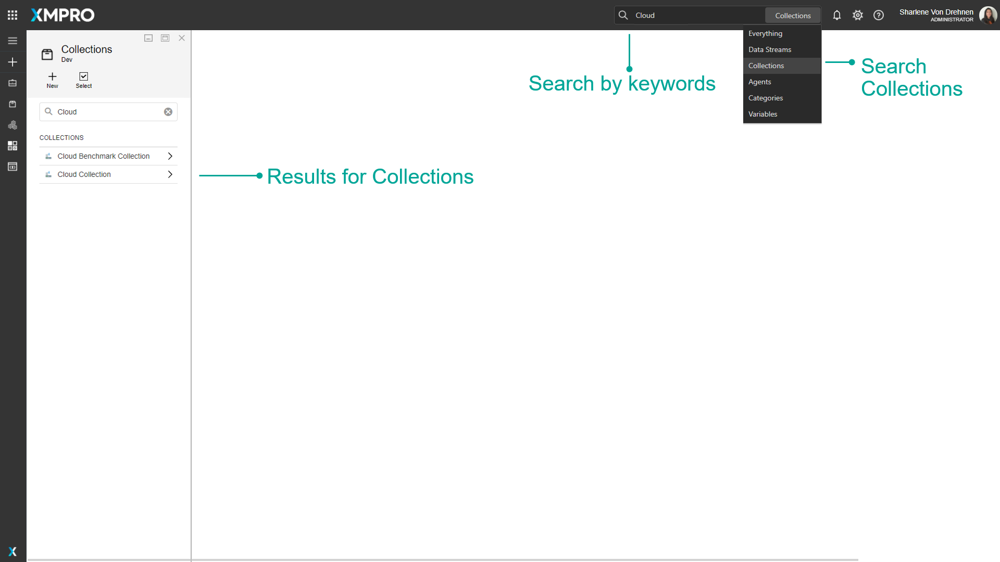

# Collection and Stream Host


It is recommended that you read this documentation along with the articles listed below to improve your understanding of how Stream Hosts and Collections work.

* [Agents](agent/)
* [Data Stream Processing](data-stream/)


## Overview

### Stream Hosts

A Stream Host is an Application that can either be installed as a Windows Service or as a Console Application. Stream Hosts enable Data Streams to run and execute actions and are also responsible for getting the configurations of [Non-Virtual Agents](agent/virtual-vs-non-virtual-agents.md). In other words, the Stream Host Application needs to be running for [Agents](agent/) in a [Data Stream](data-stream/) to be able to process the data, according to the design of the Stream.

Both [Virtual and Non-Virtual](agent/virtual-vs-non-virtual-agents.md) Agents essentially run on a Stream Host, but how they are handled at design time differs greatly. Non-Virtual Agents require a Stream Host to be online for Data Stream Designer to be able to get their configurations, but Virtual Agents don’t need a Stream Host to be running.



### Collections

Stream Hosts are grouped into different Collections, which are created and maintained in Data Stream Designer. A Collection can be defined as a Category that contains a set of Stream Hosts that run the same Data Streams. Each Stream Host is associated with a Collection by keeping the ID of the Collection in the _appsettings.json_ file of the Stream Host, which can be found in the location where the Stream Host has been installed. Thus, all the Stream Hosts that have the same Collection ID stored in this file, will automatically fall under the Collection that has that ID.

After a Collection has been created within Data Stream Designer, you will be able to associate a Data Stream with a default Collection. Unless changes are made for individual Agents in your Data Stream, each Agent will use this Collection to perform the actions it was designed to perform. However, Data Stream Designer allows you to build a stream in which some Agents use one Collection and other Agents use a different Collection. For more information on how to configure this, click [here](https://docs.xmpro.com/docs/data-stream-designer/concepts/collections/#remote-receivers-and-publishers).

Along with the Collection ID, the _appsettings.json_ file contains other configurations for the Stream Host. Each of these configurations are listed and described in the table below.

| **Property**     | **Description**                                                                                                                                                                                                                                                                                                                                    |
| ---------------- | -------------------------------------------------------------------------------------------------------------------------------------------------------------------------------------------------------------------------------------------------------------------------------------------------------------------------------------------------- |
| ID               | Uniquely identifies the Stream Host.                                                                                                                                                                                                                                                                                                               |
| Name             | Name of the Stream Host.                                                                                                                                                                                                                                                                                                                           |
| Collection ID    | ID of the Collection associated with the Stream Host.                                                                                                                                                                                                                                                                                              |
| Rank             | Indicator of the preference given to the Stream Host. This especially applies when more than one Stream Host with the same Collection ID is running. The Stream Host with the lowest rank will be used to get the configurations of Non-Virtual Agents. The rank has a default value of 0. See [Stream Host Rank.](collection.md#stream-host-rank) |
| Secret           | Used to verify the connection between the Stream Host and the Collection. This field needs to correspond to the _Key_ that is stored for a Collection in Data Stream Designer. If this key is revoked/replaced, all Stream Hosts will be disconnected.                                                                                             |
| Server URL       | URL that the Stream Host needs to use to connect to Data Stream Designer.                                                                                                                                                                                                                                                                          |
| Cryptography key | Key that the Stream Host will use to encrypt or decrypt secure user settings, for example, a SQL Server Password.                                                                                                                                                                                                                                  |

The table below contains a list of the configurations stored for a Collection along with a description for each. This information can be found by opening the Collections page from the left-hand menu in Data Stream Designer and selecting your Collection from the list. Please note that the only field you will not be able to change is the ID of the Collection.

| **Property**     | **Description**                                                                                                                                  |
| ---------------- | ------------------------------------------------------------------------------------------------------------------------------------------------ |
| ID               | Uniquely identifies the Collection.                                                                                                              |
| Key              | Used to verify the connection between the host and Data Stream Designer. If this key is revoked/replaced, all Stream Hosts will be disconnected. |
| Name             | Name of the Collection.                                                                                                                          |
| Remote Receiver  | See [Remote Receivers and Publishers](../how-to-guides/data-streams/remote-receivers-and-publishers.md).                                         |
| Remote Publisher | See [Remote Receivers and Publishers](../how-to-guides/data-streams/remote-receivers-and-publishers.md).                                         |
| Metadata         | Tags that have been added to the Collection.                                                                                                     |

.png>)

### Publish and Unpublish Data Streams

On the Collections page, click _More_ and _Data Streams_ to view a list of all Data Streams that are using a given Collection. Here you can directly unpublish or publish a Data Stream.&#x20;

As an Admin, this is useful if you need to unpublish a Data Stream and you don't have access to it. See the [How to Admin Unpublish Override](../how-to-guides/publish/admin-unpublish-override.md) article for more details.

## Finding Collections

The search bar can be used to find any specific Collections that you may be looking for. There is a dropdown option where you can specify to search through everything in Data Stream Designer, or only for Collections.

## Actions on the Collection

| **Action**         | **Description**                                                                                                                                                    |
| ------------------ | ------------------------------------------------------------------------------------------------------------------------------------------------------------------ |
| New                | Adds a new Collection.                                                                                                                                             |
| Select             | Selects multiple Collections.                                                                                                                                      |
| Delete             | Deletes the selected Collections.                                                                                                                                  |
| Save               | Saves any changes made to the Collection up to this point.                                                                                                         |
| Discard            | Discards any changes made to the Collection up to this point.                                                                                                      |
| Stream Hosts       | Opens a new page with a list of hosts that have installed this Collection.                                                                                         |
| Connection Profile | Download the Connection Profile used in the installation of a Stream Host.                                                                                         |
| Download Host      | Download the installation file for the selected platform.                                                                                                          |
| Variables          | Manage the Collection's Variables.                                                                                                                                 |
| Data Streams       | Opens a new page with a list of all Data Streams in the selected Collection.                                                                                       |
| Revoke Key         | Revokes the current key and will generate a new one. Hosts that are using the revoked key will be unable to connect until their configuration is manually updated. |
| Delete             | Deletes the selected Collection.                                                                                                                                   |

## Remote Receivers and Publishers

The Remote Receiver and Remote Publisher properties are used to bridge the gap between Agents in a stream that is associated with different Collections, for example:

Consider having a stream that has two Agents:

* _Listener\_A_, which is associated with _Collection\_A_, and
* _Action\_Agent\_B_, which is associated with _Collection\_B_

_Listener\_A_ needs to communicate to _Action\_Agent\_B_, but they belong to different Collections. As a result, the engine will automatically use the Remote Receiver and Publisher to pass data from one Collection to another.

Please note that only [MQTT](http://mqtt.org/) is currently supported for this functionality.

**Example:**

Consider a stream that has the following Agents:

1. Event Simulator
2. Event Printer

For the purpose of this example, the Event Simulator will be named ES\_1 and the Event Printer EP\_1, where ES\_1 is using Collection\_A and EP\_1 is using Collection\_B. Since these two Agents are using two different Collections, data flow from ES\_1 to EP\_1 is not possible as there is no physical connection (the Stream Hosts in these Collections can be on different machines in different parts of the world).

To solve this problem and allow data flow from ES\_1 to EP\_1, the Collection EP\_1 is using needs to be set up as follows:

* The Remote Receiver for Collection\_B needs to be set to MQTT and the broker address needs to be specified.
* The Remote Publisher for Collection\_B needs to be set to MQTT and the broker address needs to be specified.

When the stream is published now, the data simulated by ES\_1 will be published to MQTT, which will enable the engine to get the data EP\_1 expects by listening for it on MQTT. Thus, data flow between ES\_1 and EP\_1 has been established.&#x20;

.png>)

The below image is an example of the configuration for _Collection\_B_.&#x20;

.png>)

## Connection Profiles

### Overview

A Connection Profile is a file, containing certain details about a Collection, that can be downloaded from Data Stream Designer. The purpose of this file is to make the installation process of Stream Hosts easier by providing you with an option to upload this file to the Stream Host installer instead of manually specifying the Collection information. This file contains the values described in the table below.

| **Property**  | **Description**                                                                                                                                                                                                                                  |
| ------------- | ------------------------------------------------------------------------------------------------------------------------------------------------------------------------------------------------------------------------------------------------ |
| Device Name   | Name of the Stream Host. This name will be the same as the device name that needs to be specified when downloading a Collection Profile. If you install the Stream Host as a Windows Service, the service name and device name will be the same. |
| Collection ID | The ID of the Collection the Stream Host will be associated with.                                                                                                                                                                                |
| Secret        | Used to verify the connection between the stream host and the Collection. If this key is revoked/replaced, all stream hosts will be disconnected.                                                                                                |
| Server URL    | URL that the Stream Host needs to use to connect to Data Stream Designer. This is the URL of the instance of Data Stream Designer that has been installed on the server.                                                                         |
| Key           | Key used to encrypt or decrypt user settings.                                                                                                                                                                                                    |

### Download a connection profile

To download an installation profile, follow the steps below:

1. Open the _Collections_ page from the left-hand menu.
2. Select the Collection you would like to install the Stream Host for.
3. Click _Connection Profile._
4. Enter a _Device Name._
5. Click _OK_. The download will start automatically.

## Stream Host Installation

To install a Stream Host, [please refer to these instructions](../how-to-guides/stream-host.md#how-to-install-a-stream-host).

## Set Log Level&#x20;

The Log Level determines the type of information or level of detail that will be logged. The two Log Levels are Trace and Info.

### Info

The Info Log level is the default Log Level. This will only log _Info_ level messages or logs, which include details on when a Stream Host is starting or stopping. Any errors related to Connections or the Stream Host itself will also be logged at this level.&#x20;

### Trace

The Trace Log level will log more detailed messages and errors about the Data Stream or specific Agents themselves. This is very useful for debugging as it can log information about what is happening inside the code itself, such as which methods are being called and when. Using the Trace Log Level for a long period of time can take up a lot of space on the hard drive. Selecting the Trace Log Level will log both _Trace_ and _Info_ Level Logs.&#x20;

.png>)

## Stream Host Rank

All the Stream Hosts contained in a Collection will be used to run the Data Streams associated with that Collection. However, you can choose which Stream Host should be responsible for getting the configurations of Non-Virtual agents. The rank given to a Stream Host defines what preference the Stream Host will be given in such a scenario. The Stream Host with the lowest rank will be picked by the system. All Stream Hosts will always have a default rank value of 0.

### Example

Consider having a Data Stream with the following Agents:

* MQTT listener
* Filter transformation
* SQL Server Writer

The purpose of this Data Stream is to get temperature readings from a sensor on a machine, filter the readings that are higher than 120°C and write these values to a table in a SQL Server database. All three agents are configured to use Stream Hosts in the “_Mine 09_” Collection to run (see image below).

However, to get the user settings for the SQL Server Writer Action Agent, which is a Non-Virtual Agent, Data Stream Designer will pick and use the first Stream Host available. This can be changed by setting the rank of the Stream Host you want to use to be lower than the other Stream Hosts that are available. &#x20;

## Further Reading

* [How to Create and Manage Collections](../how-to-guides/data-streams/manage-collections.md)
