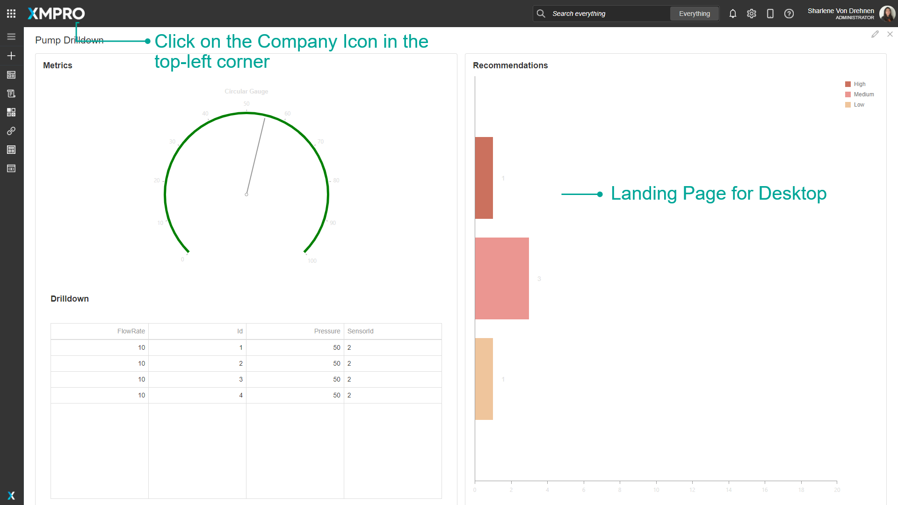
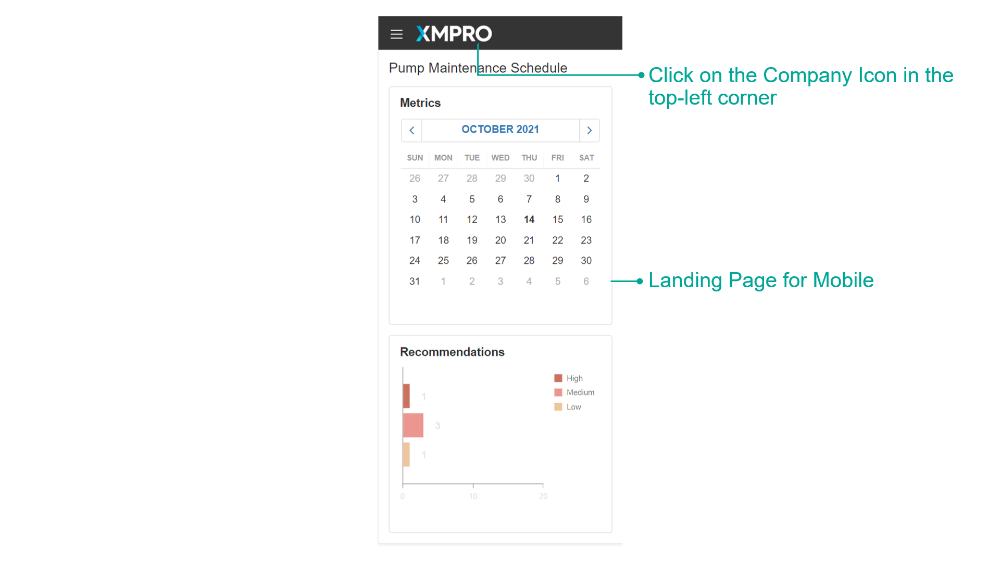

# Landing Pages

## Overview

A list of categories is displayed by default when you open App Designer or Data Stream Designer. In App Designer, this can be changed to display a custom landing page instead. When a custom landing page is set for a company, any user from that specific company will see that landing page when they first open App Designer. An App can be used as a landing page as long as it is published. This is useful if a company has a main App that they access and prevents them from continuously navigating to that App.

Apps and Data Streams can also be favorited. This is useful for Apps or Data Streams that are frequently used, and favoriting them will allow them to appear on the main page of Subscription Manager for quick and easy access.&#x20;


It is recommended that you read this documentation along with the articles listed below to improve your understanding of how Apps and Data Streams work.

* [Application](application/)
* [Data Stream](data-stream/)


## Default Landing Page

When you load Data Stream Designer or App Designer, the default landing page lists the categories that contain Data Streams or Apps respectively.&#x20;

Indicators at the bottom of each category card inform how many Data Streams/Apps are:

1. Published
2. Draft
3. Errors (published Data Streams with errors)

Click the category card to view all the contents, or on the counter for a filtered view.

<figure><figcaption></figcaption></figure>

## Favoriting Apps and Data Streams

Apps and Data Streams can be favorited for quick and easy access. When you favorite an App or Data Stream, they will appear on the main page in Subscription Manager.

If there are no favorited Apps or Data Streams, Subscription Manager will display a list of published Apps and Data Streams instead, if there are any.

.png>)

If there are no Favorited or published Apps or Data Streams, no Apps or Data Streams will show.

There are also direct links to allow you to create an App, Data Stream, or Recommendation by clicking on the 'Create New' button.


To learn more about how to Favourite Apps or Data Streams, visit the [How to Manage Landing Pages article](../how-to-guides/manage-landing-pages.md#favorite-an-app).&#x20;


## Company Landing Page

You can choose to set an App as the Company Landing Page, which overrides the default landing page. The landing page for the App selected will be the first page a user sees when opening App Designer.&#x20;

You can select different Apps for Desktop and Mobile.


You can only choose from published Apps to be a landing page.


.png>)


To learn more about how to set a Company Landing Page, visit the [How to Manage Landing Pages article](../how-to-guides/manage-landing-pages.md#set-a-company-landing-page).&#x20;


### Desktop

To view the Landing Page for Desktop, open App Designer on a Desktop computer. You can also click on the company icon in the top-left corner.&#x20;

### Mobile

To view the Landing Page for Mobile, open App Designer on a Mobile device. You can also click on the company icon in the top-left corner.&#x20;

## Further Reading

* [How to Manage Landing Pages](../how-to-guides/manage-landing-pages.md)
