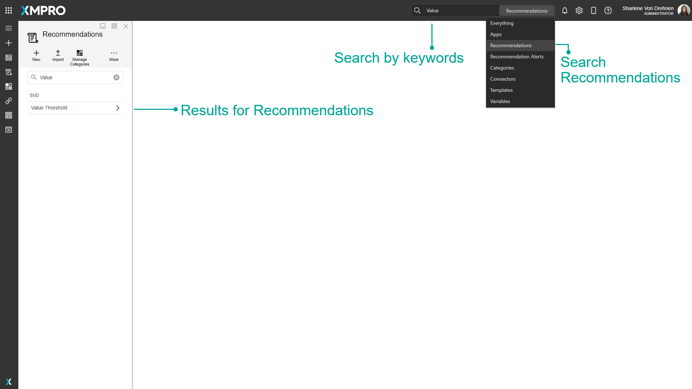

# Recommendation

Recommendations enable engineers or employees of an organization to respond to critical events based on expert knowledge in the organization before the opportunity expires, while managers can close the loop by monitoring that it is done in a timely and appropriate manner.

Recommendation Alerts are advanced alerts that are triggered when a critical event occurs. Alerts get created when real-time data meets the conditions of recommendation rules. The Alerts are then discovered by employees through email or SMS notifications and the monitoring of systems.&#x20;

Discussions allow users to message each other about the particular event that triggered the alert. Other people who view the alert can also view those discussions to be up-to-date with any new information. Triage Instructions are instructions given to help whoever is resolving the Recommendation Alert. Custom Forms can also be shown to the user when they view an alert. Users can use the forms to enter relevant information over the course of resolving the Alert.



In practical terms, Recommendations observe live data from a [Data Stream](../data-stream/) with a Run Recommendation Agent and evaluate the data against conditions defined in their [Rules](rule.md). If a Rule's condition is met, a [Recommendation Alert](recommendation-alert.md) is created from the Rule.

Recommendations are created and managed in the App Designer. To manage Recommendations, click the Recommendations button in the menu on the left, and then click on the Manage Recommendations button.

.png>)

.png>)

## Finding Recommendations

The search bar can be used to find any specific Recommendations that you may be looking for. There is a dropdown option where you can specify to search through everything in App Designer, or only for Recommendations.

## Category

Recommendations can be grouped into [categories](../../how-to-guides/recommendations/manage-categories.md). This refers to the category under which the Recommendation is found in the Recommendations list.&#x20;

## Data Stream

This is [Data Stream](../data-stream/) from which the Recommendation will receive data from.

## Enable Execution Order

A flag that determines whether the Rules will be evaluated in ascending order or all at once. [See the Execution Order article to read more about the Execution Order.](execution-order.md)

## Auto Escalate

A flag that determines whether an existing pending Recommentaion Alert should be resolved and escalated to a newly created Alert. This would occur when new data is received that meets a Rule's Logic further up the Execution Order of the current Recommendation Alert's Rule. [See the Auto Escalate article to read more about the Auto Escalate.](auto-escalate.md)

## Rules

[Rules](rule.md) determine the conditions for creating Recommendation Alerts, and what created alerts should look like.

## Variables

Variables are a way to transform the data received from the Data Stream before applying it to the Rule Logic.

## Actions on the Recommendation

| **Action**                                               | **Description**                                                                                                                                  |
| -------------------------------------------------------- | ------------------------------------------------------------------------------------------------------------------------------------------------ |
| Save                                                     | Saves any changes made to the Recommendation up to this point.                                                                                   |
| Discard                                                  | Discards any changes made to the Recommendation up to this point.                                                                                |
| [Publish/Unpublish](../../how-to-guides/publish/)        | Publishes or unpublishes the Recommendation, which makes it start listening for data from the Data Stream.                                       |
| [Manage Access](../manage-access.md)                     | Allows you to manage which users are allowed to view or modify this Recommendation and the Recommendation Alerts created by this Recommendation. |
| Timeline                                                 | Upcoming feature.                                                                                                                                |
| [Versions](../version.md)                                | Versioning for the Recommendation.                                                                                                               |
| Delete                                                   | Deletes the Recommendation.                                                                                                                      |
| [Clone](../../how-to-guides/import-export-and-clone.md)  | Clones the Recommendation as a new Recommendation.                                                                                               |
| [Export](../../how-to-guides/import-export-and-clone.md) | Export the Recommendation as an encrypted file.                                                                                                  |

## Further Reading

* [How to Create and Manage Recommendations](../../how-to-guides/recommendations/manage-recommendations.md)
* [How to Create and Manage Variables](../../how-to-guides/recommendations/manage-variables.md)
