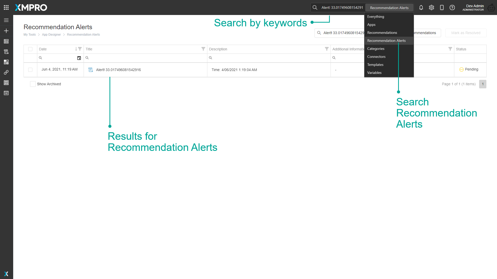
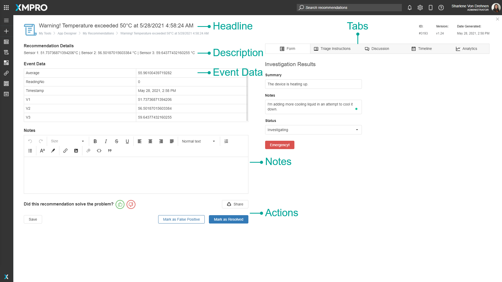
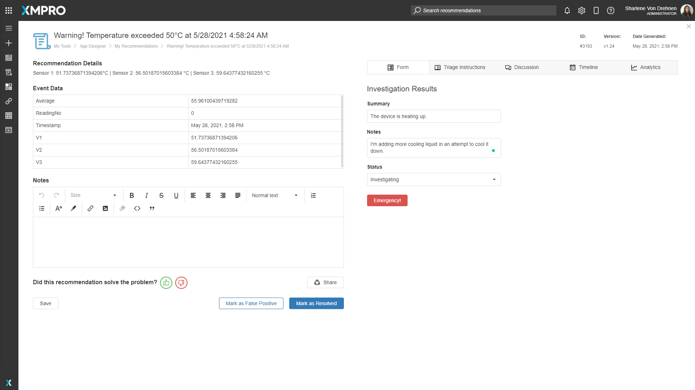
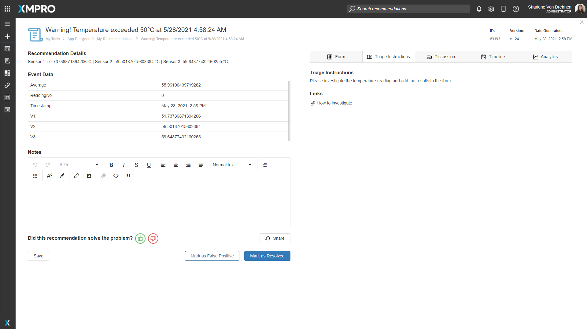
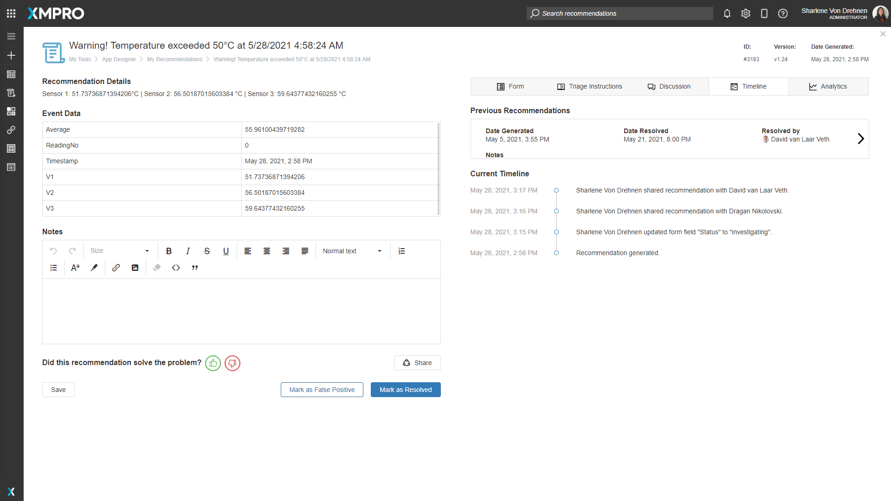
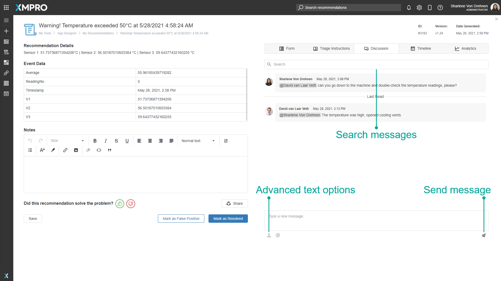
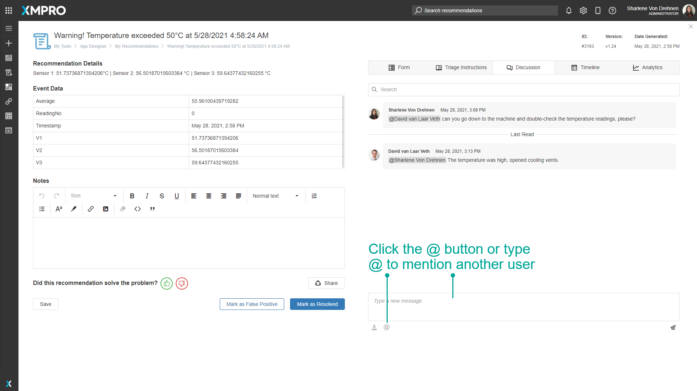
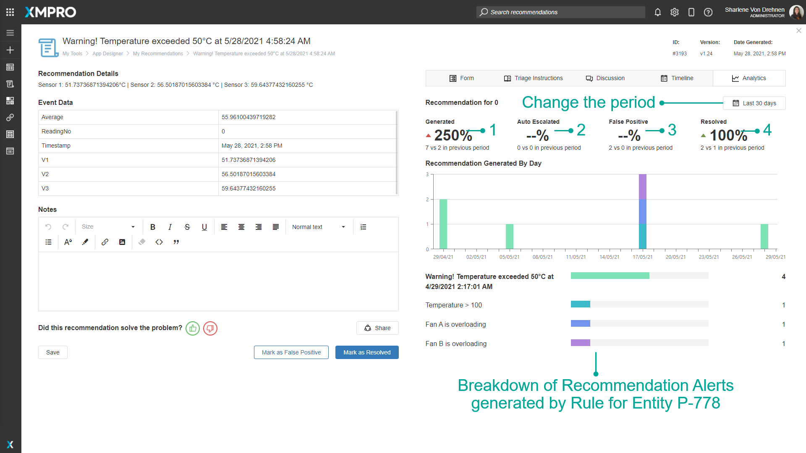

# Recommendation Alert

Recommendation Alerts are advanced alerts that get triggered when real-time data meets the criteria defined in a [Recommendation Rule](rule.md). They notify you when certain conditions occur in your data and provide decision support for how to take action.

The Recommendation Alerts are found by clicking on the Recommendations button in the menu on the left of the App Designer.

.png>)

The grid provides an overview of all the Alerts that you have access to. The rightmost Status column shows whether the Alert is Pending or Resolved.&#x20;

You can order, filter by specific values, and search the alerts by any of the columns, and search in all columns in the Search bar.

To see Resolved as well as Pending Alerts, check the "Show Archived" checkbox.

Click on an Alert in the grid to navigate to the Recommendation Alert details.&#x20;

.png>)

## Finding Recommendation Alerts

The search bar can be used to find any specific Recommendation Alerts that you may be looking for. There is a dropdown option where you can specify to search through everything in App Designer, or only for Recommendation Alerts.

## Detailed View

The Recommendation Alert page provides details of the alert and allows you to input information into the Form, view Triage Instructions, have a Discussion with your team, and see the alert Timeline and Analytics.&#x20;

### Headline

The headline of the Alert. Generated by the [Rule Headline](rule.md#properties-on-the-rule).

### Recommendation Details

A paragraph on the details of the Alert. Generated by the [Rule Description](rule.md#properties-on-the-rule).

### Event Data

The data received by the Data Stream. If "[Log Data On All Occurrences](rule.md#properties-on-the-rule)" is checked in the Rule, this data will be updated as new data is received.

### Notes

An area to write notes and observations.

### Actions&#x20;

An area that contains all the actions that can be done to the Recommendation Alert. For more details see [Recommendation Actions](action-requests.md).

### Form

A form where relevant information can be entered. It is only available if the Recommendation has an attached Form. Accessed by clicking on the Form tab.

### Triage Instructions

An area that provides useful information on actions to take to resolve the Alert and links to relevant resources. It is only available if the Recommendation has Triage Instructions enabled. Accessed by clicking on the Triage Instructions tab.

### Discussion

An area in which messages can be posted to collaborate with members of your team. Each discussion is specific to a particular Recommendation Alert. [A more detailed explanation can be found below](recommendation-alert.md#discussion).

### Timeline

All previous alerts created by the same Rule and a list of all the events to happen on this Alert.

### Analytics

An area in which the number of Alerts of the same Recommendation and Entity Identifier (specified in the Run Recommendation Agent) can be compared, as well as a breakdown Generated, Auto Escalated, False Positive, and Resolved alerts over a period of time. [A more detailed explanation can be found below](recommendation-alert.md#analytics).

## Discussion

The discussion section is an area in which messages can be sent by anyone who has access to the Recommendation Alert. Messages are displayed with the latest message at the bottom of the list. Any messages which have not been read since the last time you visited the page will be below the "Last Read" line break.

You can search for messages that contain a certain word or phrase by typing in the search bar at the top.

You can add a message by typing in the editor at the bottom of the discussion section and clicking the button with a paper plane icon at the bottom right corner.

Advanced text editing can be opened by clicking the button with an underlined letter A icon at the bottom left corner.

You can mention another user by typing the @ symbol or clicking the button with the @ symbol, which will pop up a list of users. Clicking on a user will mention them in the message and send an email to them when the message is sent.

## Analytics

The analytics section compares the currently viewed period of alerts with the previous period and displays the difference as a percentage. The statistics compared are:&#x20;

1. The number of Alerts generated
2. The number of Alerts that were auto escalated
3. The number of Alerts marked as false positive
4. The number of Alerts resolved.

Below the breakdown, there is a chart of the number of Alerts of the same Recommendation and Entity Identifier. The Entity Identifier is defined in the Run Recommendation Agent in the Data Stream.&#x20;

Below the chart is a breakdown of the number of different Alerts in the selected period, separated by Rule.

## Further Reading

* [How to Manage Alerts](../../how-to-guides/recommendations/manage-alerts.md)
* [Manage Alerts on Mobile](../../how-to-guides/recommendations/manage-alerts-on-mobile.md)
