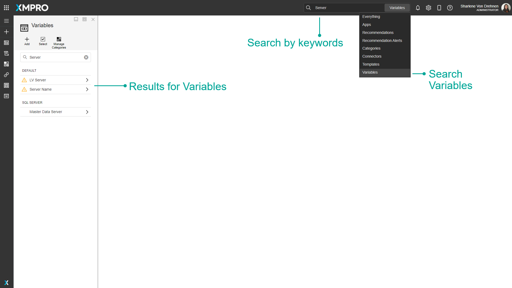

# Variable

Variables are placeholders used to maintain integration keys and secrets. They can be used by IT administrators, engineers, or other users to store and use credentials or passwords in a safe and secure manner.

They provide a central point to maintain credentials that can improve security. Engineers and other users can reference and use these credentials without knowing the actual value they contain. More secure credentials such as passwords can be encrypted to add an extra layer of security.&#x20;



Variables can be added in both the App Designer and the Data Stream Designer. The value of the Variable is only available in the environment it is created in. For example, if the Variable is created in the Data Stream Designer, both the name and value of the Variable will be available in the Data Stream Designer. However, in the App Designer, only the name will be available and the value will be left empty.&#x20;

## Finding Variables

The search bar can be used to find any specific Variables that you may be looking for. There is a dropdown option where you can specify to search through everything in App Designer, or only for Variables.

## Category

Variables can be grouped into categories. This category is separate from the [App and Data Stream Categories](category.md).

## Encrypt Value

If selected, the value of a Variable will be encrypted. This way the value cannot be seen by any user. If not selected, the value can be seen when the Variable is selected and configured.

If a value is not encrypted, and you select _encrypt value_, the value that is already in the input field will be cleared automatically.&#x20;

Similarly, if the value is already encrypted, and you deselect _encrypt value,_ the value already entered will be cleared.&#x20;

## Value

The value of the Variable, for example, the _username, server name,_ or _password_.

## Using a Variable

Once a Variable has been saved, the Variable can be selected from a dropdown list when you are required to fill in forms or credentials. For example, in order to connect to a database to display data on your App, you will need to connect to it using a server name, username, and password.

## Actions on the Variable

| **Action**        | **Description**                                                                                                                               |
| ----------------- | --------------------------------------------------------------------------------------------------------------------------------------------- |
| Add               | Adds a new Variable.                                                                                                                          |
| Select            | Selects multiple Variables.                                                                                                                   |
| Manage Categories | Creates and edits categories to organize the variables. These categories are separate from the [App and Data Stream Categories](category.md). |
| Save and Close    | Saves any changes made to the Variable up to this point.                                                                                      |
| Discard           | Discards any changes made to the Variable up to this point.                                                                                   |
| Delete            | Deletes the Variable.                                                                                                                         |

## Further Reading

* [How to Create and Manage Variables](../how-to-guides/manage-variables.md)
