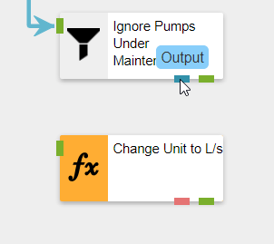
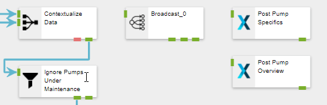
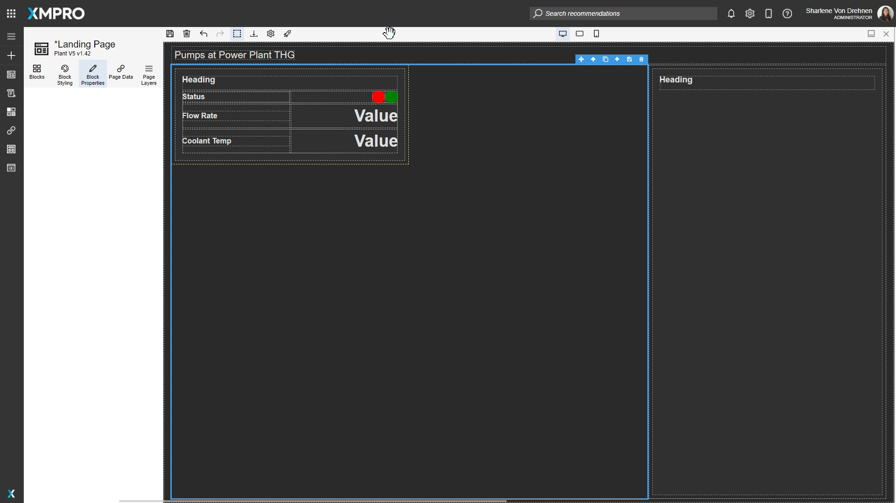

# End-To-End Use Case


This Use Case assumes the XMPro platform is installed and configured, or you are using the [Free Trial](free-trial.md) that has everything set up for you.


This step-by-step tutorial is meant to be an introduction to using the XMPro platform. Completing it will give you a solid foundation to understand the more advanced concepts and detailed how-to guides. This tutorial will explain how to create and design a Data Stream, configure Stream Objects to ingest, analyze, transform, and perform actions on data. You will also learn how to set up a Recommendation to generate alerts based on rule logic, create and design an App, create Data Sources and Connections, and configure a simple Data Grid and Chart.


Please note that the XMPro platform requires third-party cookies to be enabled on your browser.


## Use Case

Let's assume there is a power plant that uses a heat exchanger to keep the turbine cool and at the optimum temperature. The heat exchanger circulates water between the cooling tower and the heat exchanger to dissipate heat. To keep a proper circulation of liquid, there are three pumps \[A, B, C] installed. Each Pump has a sensor that provides live data for Flow Rate (L/m) and Temperature (°C) using MQTT.

Unless the Pump is under maintenance the Flow Rate should be above 15000 L/m and Water temperature should be below 130°C
.

Engineers should be alerted if the average flow rate falls below 250 L/s. If the average temperature starts to rise above 130°C then a critical level alert should be raised.

Engineers should be provided a view to check the history of pump telemetry, maintenance records, and reservoir level to enable them to take necessary action.

## 1. Design Data Streams with Real-Time Data Sources

The Use Case requires that we gather the Flow Rate and Temperature data from three pumps constantly, and pass it on to be analyzed and have actions performed on the data. We will achieve this with the use of Data Streams. A Data Stream is a visual representation of a flow of data. It is created through the Data Stream Designer.&#x20;

To access the Data Stream Designer, log into your XMPro Account and press the button in the top-left corner of the screen and click on the Data Stream Designer item.

.png>)

A Data Stream has four components:

1. Ingesting data through Listener Agents
2. Contextualizing sensor data/telemetry through Context Provider Agents
3. Analyzing and transforming data through Transformation and AI Agents
4. Performing actions or outputting data to other integrations through Recommendation and Action Agents

We will follow those four steps below.

### Read & Wrangle Live and Context Data

In this section, we will simulate reading data from pump sensors and a metadata store, and combine the data together into a single flow.


See the [Data Stream Concept article](../concepts/data-stream/) for more information on Data Streams.


To begin, we will need to create a new Data Stream. To create a Data Stream, follow the steps below:

1. Open the _New Data Stream_ page from the left-hand menu.
2. Give the Data Stream a name. For example, "Pump Condition Monitoring"
3. Select the Type "Streaming". Data Streams of the Streaming type will run polling Agents at a set interval, for instance, every 10 seconds, whereas Recurrent Data Streams run on a customizable schedule, for instance, once a day at 12am. The recurring type only applies to polling-based Stream Objects, which we won't use in this example.
4. Select the category under which the Data Stream is to be added.
5. Feel free to load a suitable icon. If you do not, the default icon will be used. Sample icons can be found in the [Icon Library](../resources/icon-library.md).
6. Select a collection that will be used to publish Data Stream.
7. Enter a description to best describe the Data Stream.
8. Click on "Save".

.png>)

In a production environment, Data Streams would integrate with external data emitters through Agents like OSIsoft PI or MQTT Listeners. However, for the sake of keeping the example simple, we won't be using any Agents that require an environment to be set up. Instead, we will be simulating the data with the Event Simulator, Calculated Field, and CSV Context Provider Agents.

To simulate the telemetry from the pumps, follow the steps below:

Drag into the canvas one of each of the following Agents:

* [Event Simulator (Listener)](https://app.gitbook.com/o/-MZASoMaVZCmWsNG58Xo/s/n0STfQs9DHPwLC3m41zJ/)
* [Calculated Field (Transformation)](https://app.gitbook.com/o/-MZASoMaVZCmWsNG58Xo/s/K3sLn6CJ5rHsdPzoM513/)
* [CSV (Context Provider)](https://app.gitbook.com/o/-MZASoMaVZCmWsNG58Xo/s/GXmCW9YXz3UyPMXWyFoj/)
* [Join (Transformation)](https://app.gitbook.com/o/-MZASoMaVZCmWsNG58Xo/s/2TiZMvlCsgDjO5L7S4tx/)


Refer to [How to Upload an Agent to Data Stream Designer](../how-to-guides/agents/manage-agents.md#uploading-an-agent-to-data-stream-designer) if you are not able to find the Agents in the toolbox or the correct versions.


You can search for the Agent in the search bar, and click and drag the Agent into the canvas to add it. An instance of an Agent added to the canvas is referred to as a Stream Object.


Once you have all four Stream Objects in the Data Stream canvas, rename them as follows:

* Event Simulator as "Simulate Pump Data"
* Calculated Field as "Add Pump Identifier"
* CSV as "Simulate Context Data for Assets"
* Join as "Contextualize Data"

To change the name of a Stream Object, click the text and edit it.

Your stream should end up looking like this:

.png>)

Once you have renamed all four Stream Objects, connect them with arrows as follows:

1. "Simulate Pump Data" to "Add Pump Identifier"
2. "Add Pump Identifier" to "Contextualize Data" (first input)
3. "Simulate Context Data for Assets" to "Contextualize Data" (second input)

To connect two Stream Objects, click and drag the green rectangle (Output) at the bottom edge of the first Stream Object, move the cursor to the green rectangle on the left edge of the second Stream Object (Input).


Your connected Stream Objects should look like this:


Now we will configure the added Stream Objects. Save your Data Stream now and after every change to propagate the changes throughout the Data Stream.


&#x20;See the article on [how to configure Stream Objects](../concepts/data-stream/stream-object-configuration.md) for more information.


#### Simulate Pump Data

.png>)

We will need to simulate ingesting data about flow rate and temperature from sensors in the pumps. We can achieve this with the Event Simulator Agent. The "Simulate Pump Data" Event Simulator will constantly generate data defined by the Event Definitions at a rate defined by the Events per Second property.&#x20;


To edit the configuration of a Stream Object, either double-click it or click it once to select it and click the "Configure" button on the canvas header.


Edit the "Simulate Pump Data" Stream Object and click the + button to the right of the Event Definition grid to add event definitions.

Add two event definitions as follows:

* _Name_: WaterTemperature\
  _Type_: Range\
  _Minimum Value_: 100\
  _Maximum Value_: 160\
  _Spike Value_: 0
*   _Name_: FlowRate\
    _Type_: Range\
    _Minimum Value_: 14000\
    _Maximum Value_: 16000

    _Spike Value_: 0

Ignore the Spike Value and Generate Spike options, as they are not relevant to the current scenario.

Change the Events per Second to 1. Click "Apply" on the Simulate Pump Data configuration page. Then click "Save" on the Data Stream page.

.png>)

#### Add Pump Identifier

.png>)

We need to add a way to simulate having three different pumps. At the moment the data is not identified, so we will need to add a range of identifiers to the data. This can be achieved with the Calculated Field Agent. The "Add Pump Identifier" Calculated Field will add a "PumpId" field to the data generated with values "A", "B", and "C" for each subsequent row.&#x20;

To configure the Stream Object, double click on "Add Pump Identifier" to open its configuration. Or, you can also highlight the Stream Object and click on the "Configure" option at the top of the Data Stream.

Keep "Append to Current" as the "Results Returned As" value. This will add the value calculated by the expression to each row instead of creating a new row with the identifier.

Click the + button to the right of the Expressions grid to add the following expression:

* _Calculated Field_: "PumpId" - The field won't exist yet in the dropdown, so you must enter it yourself.\
  _Expression_: `ReadingNo % 2 == 0 ? "A" : ReadingNo % 3 == 0 ? "B" : "C"`\
  _Data Type_: String

.png>)

Press "Apply" on the PumpId expression and the Add Pump Identifier configuration pages, and press "Save" on the Data Stream page.

#### Simulate Context Data for Assets

.png>)

There is often metadata associated with assets that is not part of the live data from the sensors.  In this case, metadata includes whether the pump is currently under maintenance, the manufacturer, and the last service date. We must retrieve this data from elsewhere. In a production environment, this might be an SAP EAM system, but for this example, we can achieve this through the CSV Context Provider Agent.

Double-click on the "Simulate Context Data for Assets" Stream Object to open the configuration menu. You can also highlight the Stream Object and click on the "Configure" option at the top of the Data Stream. &#x20;

&#x20;Download the provided file. The contents of the file are below the download link.


AssetsContext.csv


```
PumpId,UnderMaintenance,Manufacturer,ServiceDate
A,FALSE,Bosch,2020-10-12
B,FALSE,Bosch,2020-08-06
C,FALSE,Bosch,2020-01-04
```

Then under Data check the _Use Uploaded File?_ checkbox and upload the file into the CSV Context Provider. The CSV Definition will be automatically detected and filled.

Change _UnderMaintenance_ from a _String_ to a _Boolean_, using the options from the dropdown. Also change _ServiceDate_ from a _String_ to a _DateTime_, using the dropdown. Leave the _Limit Rows_, _Filter Criteria,_ and _Sort by_ properties as their default values.&#x20;

When completed, press the "Apply" button at the top of the configuration, and then save the Data Stream.

.png>)

#### Contextualize Data

.png>)

The metadata about each pump needs to be appended to each row of sensor data received from the pumps. This can be achieved with the Join Agent.

The "Contextualize Data" Join will join together the data from the CSV Context Provider and the Calculated Field using the PumpId as the common field. Configure it as follows:

* _Behavior_: Context - we want to join some context data to our row.
* _Context Endpoint_: Right - we must tell the Stream Object which input has Context data. The Context Data is received by the Right endpoint, as shown in the image below.

.png>)

* _Select List_: all fields except R\_PumpId (as the same data will be in L\_PumpId).
* _Join Type_: Inner Join.
* _On_: `L_PumpId` `=` `R_PumpId`


You may need to maximize the page to see the grid properly. You can do this by pressing the "Maximize" button in the top-right corner of the page. Press the "Restore" button in the top-right corner to return it to the regular size.


Press "Apply" on the Contextualize Data configuration page, and press "Save" on the Data Stream page.

.png>)

### Create Analytics and Calculations

In this section, we will add some analytics and calculations that will find exceptions, transform the units of the data and find the average level across 5 seconds.&#x20;

#### Ignore Pumps Under Maintenance

.png>)

We want to only pass data onward in the Stream if the current pump is not under maintenance. This can be achieved with the Filter Agent. To do this, drag in a Filter Agent and connect the "Contextualize Data" Join endpoint to the Filter.&#x20;

Rename the Filter to "Ignore Pumps Under Maintenance", and save. Double-click on the Stream Object to open the configuration menu. Click on the + symbol to add a new rule for the filter. Select "Add Condition", and configure the Filter to have the logic `R_UnderMaintenance` `Equals` `false`.

The configuration and Data Stream should look like this:


There are two green outputs to the Filter Stream Object, the left output is where the data is output to when the filter is true. The right output is where the data is output to when the filter is false. The left True Output should be the output that you connect to the next Stream Object.&#x20;

.png>)

Press "Apply" on the Ignore Pumps Under Maintenance Data configuration page, and press "Save" on the Data Stream page.

#### Change Unit to L/s

.png>)

The data from the Pump Data has different units than what we want to use - it is measured in L/m and we want the units to be in L/s. This can be solved with the Calculated Field Agent. To transform the data, drag in a Calculated Field Agent, and rename it to "Change Unit to L/s".&#x20;

Connect the "Ignore Pumps Under maintenance" Filter endpoint to the Calculated Field and Save. Make sure you connect the left True Output of the  "Ignore Pumps Under maintenance" Stream Object to the Calculated Field's input.&#x20;



Configure the Calculated Field as follows:

* _Calculated Field_: L\_FlowRate
* _Expression_: `L_FlowRate / 60`
* _Data Type_: Double

This will divide the flow rate by 60 to make the value in L/s instead of L/m.

Press "Apply" on the Change Unit to L/S configuration page, and press "Save" on the Data Stream page.


#### Average across 5 seconds

.png>)

The Use Case requires that engineers should be alerted if the flow rate averaged over 5 seconds falls below 250 L/s, and if the temperature averaged over 5 seconds also starts to rise above 130°C then a critical level alert should be raised. This can be achieved with the Aggregate Agent.

To calculate the average temperature and flow rate over 5 seconds, drag in the Aggregate Agent and name it "Average across 5 seconds". Connect the "Change Unit to L/S" Calculated Field endpoint to the Aggregate Agent and save.


You may need to maximize the page to see the grid properly. You can do this by pressing the "Maximize" button in the top-right corner of the page. Press the "Restore" button in the top-right corner to return it to the regular size.


Configure the Aggregate Agent as follows:

* _Attributes to group on_: L\_PumpId
* _Aggregate_:
  * Average (of) L\_FlowRate (as) FlowRateAvg
  * Average (of) L\_WaterTemperature (as) CoolantTemperatureAvg
* _Unit_: Second
* _Size_: 5

Press "Apply" on the Average across 5 seconds configuration page, and press "Save" on the Data Stream page.


.png>)

#### Data Conversion

.png>)

We want the data for the average flow rate to be in integer format to display it more easily. This can be achieved through the Data Conversion Agent. To do this, drag in a Data Conversion Agent and rename it to "Data Conversion". Connect the "Average across 5 seconds" endpoint to the Data Conversion Agent and press "Save" on the Data Stream page.

Configure the Data Conversion Agent with the following two rows (You may need to maximize the page again). Click on the + symbol to add each row:

First row:

* _Input Column_: "FlowRateAvg"
* _Output Alias_: "FlowRateAvg"
* _Data Type_: "Int64"

Second row:

* _Input Column_: "CoolantTemperatureAvg"
* _Output Alias_: "CoolantTemperatureAvg"
* _Data Type_: "Int64"

The input columns should already have FlowRateAvg and CoolantTemperatureAvg as options listed in the dropdown menu.

This will replace the FlowRateAvg and CoolantTemperatureAvg with values converted to Integer format.

Press "Apply" on the Data Conversion configuration page, and press "Save" on the Data Stream page.


.png>)

### Output Formatting and Action Integrations

In this section, we will integrate our Data Stream with the App Designer to trigger Recommendations and send data to Apps.

#### Run Recommendation

.png>)

First, we want to trigger Recommendations with the data from the Data Stream. This can be achieved with the Run Recommendation Agent. To do this, drag in a Run Recommendation Agent and rename it to "Run Recommendation". Connect the "Data Conversion" endpoint to the Run Recommendation Agent and press "Save" on the Data Stream page

Configure the Run Recommendation Stream Object as follows:

* _Url_: the URL of the App Designer site
* _Key_: the App Designer Key.
* _Output on first occurrence Only?_: true
* _Entity Identifier_: L\_PumpId - this is for the Recommendation to create separate Alerts for each Entity
* _Columns To Return_: Leave empty (Return all columns)&#x20;


It is highly recommended that you use any [variables](../concepts/variable.md) that you already have that store the URL or key. You may use the variables that have already been set up if you are using the Free Trial.


&#x20;Otherwise, the App Designer URL and Key can be found by following these steps:

1. Open the App Designer in a new tab by clicking the "Waffle" button (a.ka. "App Launcher") in the top left corner of the page and clicking "App Designer".
2. Copy the App Designer URL from the browser's address bar and paste it into the Url field in the Run Recommendation configuration.&#x20;
3. Click the "Settings" button in the top bar and click the "Copy" button to the right of the Integration Key and paste it in the Key field in the Run Recommendation configuration. You will only be able to see this if you have Admin access. If you do not have Admin access, you can ask an Admin to share the key with you.


If you are configuring the URL and Integration Key without using variables, make sure you uncheck the "Use Connection Variables" checkbox option first.


.png>)

.png>)

This is how your Data Stream and configuration should look:


Press "Apply" on the Run Recommendation configuration page, and press "Save" on the Data Stream page.

#### XMPro App

.png>)

We want to send data to an App to be displayed as a decision support dashboard for the engineers. This can be achieved through the XMPro App Agent.

Drag two XMPro App Agents onto the Data Stream and name them "Post Pump Overview" and "Post Pump Specifics". One will send an overview of the data for all pumps, and the other will send a large cached amount of data for each pump.

Now we run into a problem; we want to connect multiple agents to the same data. To solve this, drag a Broadcast Agent into the Stream, and rename it to "Broadcast". Disconnect the "Ignore Pumps Under Maintenance" input arrow and connect it to the new Broadcast Stream Object. You can disconnect the arrow by highlighting the arrow itself and clicking on the "Delete" button at the top of the Data Stream.&#x20;

Alternatively, you can click on the green rectangle (input) on the "Ignore Pumps Under Maintenance" Stream Object, and drag the arrow to the green rectangle (input) of the "Broadcast" Stream Object. Connect the Broadcast endpoints to the two XMPro App Stream Objects and the "Ignore Pumps Under maintenance" Filter, as shown in the video below:



Press the "Save" button at the top of the Data Stream. Your Data Stream should now look like this:


Configure the "Post Pump Overview" Stream Object to store in cache and output only one row per pump as follows: (Follow the steps given for the Run Recommendation Agent above to get the Url and Key.)

* _Url_: the URL of the App Designer site
* _Key_: the App Designer Key.
* _Cache Size_: 1
* _Replace Cache_: false
* _Cache Per Entity_: true
* _Entity Identifier_: L\_PumpId
* _Primary Key_: L\_PumpId


It is highly recommended that you use any [variables](../concepts/variable.md) that you already have that store the URL or key. You may use the variables that have already been set up if you are using the Free Trial.



If you are configuring the URL and Integration Key without using variables, make sure you uncheck the "Use Connection Variables" checkbox option first.


Press "Apply" on the Post Pump Overview configuration page and press "Save" on the Data Stream page.


Configure the "Post Pump Specifics" Stream Object to cache and output 20 rows per pump as follows:

* _Url_: the URL of the App Designer site
* _Key_: the App Designer Key. [For more detail on how to find the key in the Site Settings, see this article](../how-to-guides/manage-site-settings.md#app-designer-settings).
* _Cache Size_: 20
* _Replace Cache_: false
* _Cache Per Entity_: true
* _Entity Identifier_: L\_PumpId
* _Primary Key_: L\_PumpId and L\_ReadingNo


It is highly recommended that you use any [variables](../concepts/variable.md) that you already have that store the URL or key. You may use the variables that have already been set up if you are using the Free Trial.



If you are configuring the URL and Integration Key without using variables, make sure you uncheck the "Use Connection Variables" checkbox option first.


Press "Apply" on the Post Pump Specifics configuration page and press "Save" on the Data Stream page.


Your Data Stream is now complete. To start the stream, click on the "Publish" button. To see the data flow at each Stream Object, press the "Live View" button and select all the Stream Objects. Alternatively, you can also select specific Stream Objects. For example, if you just want to see the data flowing through to the XMPro App, select the XMPro App Stream Object.

### Troubleshooting the Data Stream

To see if data is flowing properly within the Data Stream, you will need to Publish the Data Stream. Before publishing, you want to make sure there are no errors in the configurations of the Stream Objects. Click on the "Integrity Check" option at the top of the Data Stream. If any errors are present, the Stream Object with the errors will turn red. Hovering over the Stream Object will show you the list of errors. Once these errors are fixed, you will need to run the Integrity Check again.


To read more about Integrity Checks, read the [Verifying Stream Integrity](../concepts/data-stream/verifying-stream-integrity.md) article.


Once all Stream Objects have passed the Integrity Check, you can click on "Publish", then "Live View", on the top of the Data Stream. The Live Data will open on the side, and you can then click on "Select Views" to click on the Stream Objects you want to troubleshoot.


If data is displaying for the Stream Object, that means the Stream Object should be working correctly. If not, you can recheck your configuration values for the Stream Object. You can also check if you have a Stream Host running. There are also other ways that you can troubleshoot Data Streams.


For more ways on how you can troubleshoot a Data Stream, read the [Troubleshoot a Data Stream](../how-to-guides/data-streams/troubleshoot-a-data-stream.md) article.


## 2. Create Event Rules & Recommendations

The Use Case requires that engineers should be alerted if the flow rate averaged over 5 seconds falls below 250 L/s, furthermore, if the temperature averaged over 5 seconds also starts to rise above 130°C then a critical level alert should be raised. To achieve this we will use Recommendations.

Recommendations can be found in the App Designer. Open the App Designer in a new tab by clicking the button in the top left corner of the page and clicking "App Designer".

.png>)

To access the Recommendation management section of the App Designer, click on the "Recommendations" button in the left menu and press the "Manage Recommendations" button on the page.

.png>)

### Create Event Rule and Rule Logic

To trigger the required Alerts, we will be creating a Recommendation with two Rules. First, create a Recommendation called "Pump Flow Threshold". The Data Stream should be the same "Pump Condition Monitoring" stream we created previously.

To create a new Recommendation, follow the steps below after navigating to the Recommendation management page:

1. Click "New".
2. Specify a name and category for your new Recommendation.
3. Choose a Data Stream to receive data from.
4. Click "Save"_._

.png>)


Make sure to click the "Manage Access" command and give at least yourself Run Access, otherwise, you won't be able to see any Recommendation Alerts that will be generated by this Recommendation.


.png>)

This Rule will notify Engineers when the Flow Rate is lower than 250 L/s and give them instructions and resources to help resolve the issue.

Select the _Enable Execution Order_ checkbox, since we want the more critical rule to override the medium rule. Create a Rule by pressing the + button to the right of the Rules list.

.png>)

Give the Rule the following properties:


The tags for the Alert Heading and Alert Description fields will not work if they are copied and pasted into the field. You will need to select the tags yourself by adding an `@` symbol and selecting from the tags in the list.


| Name              | Value                                                                                                                                                                     | Description                                                                                                                                                                                                                                                                                                                                                                                                                                                                                                                                                |
| ----------------- | ------------------------------------------------------------------------------------------------------------------------------------------------------------------------- | ---------------------------------------------------------------------------------------------------------------------------------------------------------------------------------------------------------------------------------------------------------------------------------------------------------------------------------------------------------------------------------------------------------------------------------------------------------------------------------------------------------------------------------------------------------- |
| Rule Name         | Medium - Flow rate falling                                                                                                                                                | The Rule Name is for identification only and will not be shown to the user in the Recommendation Alerts grid or detailed view.                                                                                                                                                                                                                                                                                                                                                                                                                             |
| Alert Headline    | Warning `@L_PumpId`: Flow rate is falling                                                                                                                                 | This refers to the headline that the Recommendation Alert will be created with. Any tag (starting with @) will be replaced with the value output from the Data Stream. Add tags by typing @ and selecting the item.                                                                                                                                                                                                                                                                                                                                        |
| Alert Description | Flow rate is reported to be falling, danger of plant overheating and shutdown. Flow Rate: `@FlowRateAvg` Coolant Temperature: `@CoolantTemperatureAvg`                    | This refers to the description that the Recommendation Alert will be created with. Any tag (starting with @) will be replaced with the value output from the Data Stream.                                                                                                                                                                                                                                                                                                                                                                                  |
| Alert Ranking     | Medium                                                                                                                                                                    | The priority level that the Recommendation Alert will be created with. Priority level determines the order in which the Alerts will be displayed.                                                                                                                                                                                                                                                                                                                                                                                                          |
| Icon              | An icon of your choice (hover your mouse over the default icon to upload a different one - sample icons can be found in the [Icon Library](../resources/icon-library.md)) | The icon that will be displayed on the Recommendation Alert in the grid and in detailed view.                                                                                                                                                                                                                                                                                                                                                                                                                                                              |
| Impact Metric     | <p>Prefix: <em>$</em></p><p>Value: <em>15</em></p><p>Unit of Measurement: <em>K</em></p>                                                                                  | The impact that the Recommendation Alert will have. For example, if the value for this was $15K, that means that the cost of the condition causing the Alert would be $15K (or $15000). This will be shown on Alerts in the Recommendation Block in App Pages.                                                                                                                                                                                                                                                                                             |
| Rule Logic        | `FlowRateAvg` `Is less than or equal to` `250`                                                                                                                            | <p>Data sent from the selected Data Stream is passed through the Rule Logic and if the conditions created are met by the data (and if Recurrence is set to All Occurrences or First Occurrence and no Pending Alert exists), a new Recommendation Alert will be created. </p><p>You can add new conditions or groups by clicking the + button. Groups can be nested within each other to create advanced logic. In an "And" group, all the conditions must be true, and in an "Or" group, only one of the conditions must be true to trigger an alert.</p> |

The Rule Logic determines whether a Recommendation Alert will be created on receiving data from the Data Stream.

.png>)


[For more details on Rule Logic, see this article](../concepts/recommendation/rule.md#rule-logic).


### Create recommendations & Triage Instructions

There should be some instructions for the engineers to follow to help resolve the issue when it occurs. This can be provided through the Triage Instructions.&#x20;

Continue creating the Rule with the following properties:&#x20;

| Name                                        | Value            | Description                                                                                                                                                                                                                                                                                                                                                                                                                                                                                                                                                                                                                                                                                                                                                                                                                                                                                                           |
| ------------------------------------------- | ---------------- | --------------------------------------------------------------------------------------------------------------------------------------------------------------------------------------------------------------------------------------------------------------------------------------------------------------------------------------------------------------------------------------------------------------------------------------------------------------------------------------------------------------------------------------------------------------------------------------------------------------------------------------------------------------------------------------------------------------------------------------------------------------------------------------------------------------------------------------------------------------------------------------------------------------------- |
| Enable Form                                 | false            | A flag that determines whether the Recommendation Alert will be created with a [Form](../concepts/recommendation/form.md).                                                                                                                                                                                                                                                                                                                                                                                                                                                                                                                                                                                                                                                                                                                                                                                            |
| Additional Recommendation Management Column | -                | An additional column in the Recommendation Alerts grid.                                                                                                                                                                                                                                                                                                                                                                                                                                                                                                                                                                                                                                                                                                                                                                                                                                                               |
| Resolution                                  | Manual           | <p>Resolution determines whether new data from the Data Stream will automatically resolve the Recommendation Alert if the Rule Logic is no longer true. </p><p><strong>Manual Resolution:</strong> A user must manually resolve each recommendation. </p><p><strong>Automatic Resolution:</strong> Recommendation auto resolves when trigger conditions are no longer true. This may impact performance.</p>                                                                                                                                                                                                                                                                                                                                                                                                                                                                                                          |
| Recurrence                                  | First Occurrence | <p>Recurrence determines whether new data from the Data Stream will create new Recommendation Alerts if there already exists a Pending Recommendation Alert and the Rule Logic is true. Recurrence will create an Alert for each unique Entity selected by the Data Stream. For example, since there are three pumps (A, B, and C), each pump will generate its own Alert when something goes wrong, and it will need to be resolved before new Alerts for that pump are created. </p><p><strong>First Occurrence:</strong> The current recommendation must be resolved before others can be triggered for the same rule.</p><p><strong>All Occurrences:</strong> A new recommendation will be triggered every time the rule conditions are true.</p><p>Recurrence will be disabled and be considered to be <strong>First Occurrence</strong> if the Recommendation has <strong>Execution Order</strong> enabled.</p> |
| Log Data On                                 | First Occurrence | <p>Determines whether new events from the Data Stream that satisfy the Rule Logic, after a recommendation has been triggered, will be logged or not.</p><p><strong>First Occurrence:</strong> Current recommendation will only log the initial event which triggered the recommendation.</p><p><strong>All Occurrences:</strong> Event data will be stored for every instance that satisfies the rule logic.</p>                                                                                                                                                                                                                                                                                                                                                                                                                                                                                                      |
| Enable Triage Instructions                  | true             | A flag that determines whether the Recommendation Alert will be created with Triage Instructions.                                                                                                                                                                                                                                                                                                                                                                                                                                                                                                                                                                                                                                                                                                                                                                                                                     |
| Triage Instructions                         |                  | <p>Instructions to help whoever is resolving the Recommendation Alert.</p><p><em>Find the Triage Instructions below to copy for this use case.</em></p>                                                                                                                                                                                                                                                                                                                                                                                                                                                                                                                                                                                                                                                                                                                                                               |

| <p>Possible problems causing a discharge pressure drop:</p><p></p><p><strong>Blocked Suction Pipe</strong></p><p>A partial obstruction can be caused by a piece of foreign material being drawn across the bottom of the suction pipe during the operation of the pump. Such an obstruction may not be sufficient to stop operation completely, but will result in a reduced output from the pump. It will also cause a drop in discharge pressure and amps, and will increase the vacuum reading on the pump suction. Rough running and vibration of the pump may also occur due to cavitation within the pump.</p><p></p><p><strong>Blocked Impeller</strong></p><p>Impellers are capable of passing a certain size particle. If a particle larger in size enters the suction pipe, it may become lodged in the eye of the impeller, restricting the output of the pump. Such an obstruction will usually result in a drop of amperes and a drop in both discharge pressure and suction vacuum readings. The out-of-balance effects resulting from this condition may cause pump vibration.</p><p></p><p><strong>SHUTTING DOWN PROCEDURE</strong></p><p>Before you shut down the pump, it should be allowed to operate for a short period on only clean water to clear the system.</p><p></p><p>Then proceed as follows:</p><ol><li>Depress the ‘STOP PUMP’ push-button on the control panel.</li><li>Gland seal water (if any) must be left on during all subsequent operations, namely: start-up, running, shutdown, runback and system drain. Gland water may only then be turned off.</li></ol> |
| ----------------------------------------------------------------------------------------------------------------------------------------------------------------------------------------------------------------------------------------------------------------------------------------------------------------------------------------------------------------------------------------------------------------------------------------------------------------------------------------------------------------------------------------------------------------------------------------------------------------------------------------------------------------------------------------------------------------------------------------------------------------------------------------------------------------------------------------------------------------------------------------------------------------------------------------------------------------------------------------------------------------------------------------------------------------------------------------------------------------------------------------------------------------------------------------------------------------------------------------------------------------------------------------------------------------------------------------------------------------------------------------------------------------------------------------------------------------------------------------------------------------------------------------------------------------------------------------------------- |

### Provide additional resources for decision support

You can provide the Engineers with helpful links to videos, PDFs, or websites to help resolve the issue with the Resources.

Continue creating the Rule by checking Enable Resources and adding the following Resources:

| Resource       | Url                                                            |
| -------------- | -------------------------------------------------------------- |
| Test Procedure | http://xmdocsdownload.s3.amazonaws.com/Technical/WarmanETP.pdf |

You can see this rule in action by clicking the "Publish" command in the Recommendation and in the Pump Condition Monitoring Data Stream. If the average flow rate coming from the Data Stream is lower than 250 L/s the Rule will generate an Alert for each Pump that can be viewed in the Recommendation Alerts grid.

Click on the "Recommendations" button to go back to the Recommendation Alerts grid.

.png>)

To see more details about the alert, click on a row in the "Recommendation Alerts" grid. The Recommendation Alert page provides details of the alert and allows you to monitor, discuss, and take action.&#x20;

.png>)

### Multiple Rules and Rule escalation

We want to trigger new Alerts that override the Medium level alert raised before if the temperature averaged over 5 seconds also starts to rise above 130°C.

To do this we will create the second Rule and configure the escalation settings. This second Rule will notify Engineers when the Coolant Temperature is higher than 130°C and Flow Rate is lower than 250 L/s and give them instructions and resources to help resolve the issue.

To create another Rule, click on the Recommendations page from the left-hand menu, and click on "Manage Recommendations". Select the "Pump Flow Threshold" Recommendation that was created previously.

To make amendments to the Recommendation, you will first need to unpublish the Recommendation, by clicking on the "Unpublish" button at the top of the Recommendation. Finally, click on the "plus" symbol under "Rules" to add the new Rule.

Create the new Rule with the following properties:

| Name                                        | Value                                                                                                                                                                            |
| ------------------------------------------- | -------------------------------------------------------------------------------------------------------------------------------------------------------------------------------- |
| Rule Name                                   | Critical - Plant is overheating                                                                                                                                                  |
| Alert Headline                              | Alert `@L_PumpId`: Plant has started to overheat due to low flow.                                                                                                                |
| Alert Description                           | Plant is overheating due to low flow rate, immediate action is required to avoid damage. Temperature:  `@CoolantTemperatureAvg` Flow Rate: `@FlowRateAvg`                    |
| Alert Ranking                               | High                                                                                                                                                                             |
| Icon                                        | Feel free to load a suitable icon or use the default. Sample icons can be found in the [Icon Library](../resources/icon-library.md).                                             |
| Impact Metric                               | <p>Prefix: <em>$</em></p><p>Value: <em>25</em></p><p>Unit of Measurement: <em>K</em></p>                                                                                         |
| Rule Logic                                  | <p><code>FlowRateAvg</code> <code>Is less than or equal to</code> <code>250</code> </p><p> <code>CoolantTemperatureAvg</code> <code>Is greater than</code> <code>130</code></p> |
| Enable Form                                 | false                                                                                                                                                                            |
| Additional Recommendation Management Column | -                                                                                                                                                                                |
| Resolution                                  | Manual                                                                                                                                                                           |
| Recurrence                                  | First Occurrence                                                                                                                                                                 |
| Log Data On                                 | First Occurrence                                                                                                                                                                 |
| Enable Triage Instructions                  | false                                                                                                                                                                            |
| Enable Resources                            | false                                                                                                                                                                            |

.png>)

We also want the Critical Rule to override the Medium Rule. To do this, ensure that the _Enable Execution Order_ and _Auto-Escalate_ checkboxes are ticked in the Recommendation, and reorder the Rules to put the Critical Rule at the top.

.png>)

You can see the full Recommendation in action by clicking the "Publish" command in the Recommendation. Ensure that your Data Stream is also published and running. If the average coolant temperature is higher than 130°C and the average flow rate coming from the Data Stream is lower than 250 L/s the Rule will generate an Alert for each Pump that can be viewed in the Recommendation Alerts grid. Any pending Alerts from the Medium rule will be resolved and escalated to the new Alert.

.png>)

.png>)

3\. Create Event Boards & Apps


The Use Case requires that the Engineers should be provided a view to check the history of Pump telemetry, maintenance records, and Reservoir Level in order to enable them to take necessary action. This requirement can be met through the use of an App with a couple of Pages.

### Layout Event Boards

First, create an Application (or App) by pressing the "New Application" button in the left menu and clicking the "Blank App" template.

.png>)

Give the App the following properties:

* _Name_: "Power Plant THG Event Board"
* _Description_: "An App to monitor assets at a power plant."
* _Category_: any
* _Icon_: Feel free to load a suitable icon. If you do not, the default icon will be used. Sample icons can be found in the [Icon Library](../resources/icon-library.md).
* _Default Theme_: Dark
* _Landing Page Layout_: the first item

.png>)

Click on the "Save" button. This will take you to a page where you can view the list of pages in the App or edit the App itself. Click on the Landing Page to edit it.

.png>)

### App Layout

We will want two sections on the landing page, so follow the steps to duplicate the Vertical Stacked Layout as shown in the screenshot below.

1. Click "Page Layers".
2. Click on the carets to expand the layers until you reach the **second** Vertical Stacked Layout.
3. Click on the Vertical Stacked Layout.
4. A blue toolbar will appear at the top-right corner of the block. Press the third button with a "Clone" symbol to duplicate the Vertical Stacked Layout and everything it contains.

.png>)

.png>)


See the article on [Page Layers](../concepts/application/page-layers.md) for more information.


The result should look as below:

.png>)

You can rename both Vertical Stacked Layouts to identify them. In the Page Layers tab, double click the Left Vertical Stacked Layout to change the text to 'Left Vertical Stacked Layout'. Double click on the text of the other Right Vertical Stacked Layout and rename that to 'Right Vertical Stacked Layout'.

The left side of the page should be twice as wide as the right side, so follow the steps to change the Left Vertical Stacked Layout's Flex Grow property in the Block Styling to 2 as shown in the screenshot below.

1. Make sure the Left Vertical Stacked Layout is still selected in the Page Layers.
2. Click the "Block Styling" button to open the style manager.
3. Click the "Flex Layout" accordion item to expand it.
4. Change the Grow field to 2.
5. Press the "Save" button at the top of the Application designer.

.png>)


See the articles on [How to use the Style Manager](../how-to-guides/apps/use-block-styling-and-devices.md) and [How to use Flex](../how-to-guides/apps/use-flex.md) for more information.


The result should look like this:

.png>)

We want to display the properties of the pumps in regularly spaced and sized cards on an App page. To do this, create one card with a Data Source, which will repeat the card for each pump.&#x20;

Change the Left Vertical Stacked Layout's Display property in the Block Styling to block, so that the cards will overflow to however many pumps are present.

Press the "Save" button at the top of the Application designer.

.png>)

Follow the steps below to select the left Card and delete it. We will replace the default Card with a useful layout.&#x20;

1. Open the Page Layers.
2. Expand to the Left Vertical Stacked Layout's Card.
3. Click the Card item to select the Card element.
4. Click the last button on the blue toolbar to delete the Card.

.png>)

.png>)

Replace the deleted Card by dragging in a Card from the Blocks, which will include some extra items.

.png>)


See the article on [Blocks](../concepts/application/block.md) for more information.


We want the card to take up half the width of the left section, and overflow to the next line when there are more than 2 cards.&#x20;

1. Select the new Card using the Page Layers tab.&#x20;
2. Click on the "Block Styling" tab.&#x20;
3. At the top, in the "Style Group" field, click on the checkbox on the left of the "card-gutter" tag to unselect the card-gutter style group. This is because we only want to apply styles to this specific element.
4. Under the "General" subsection, change "Display" to "inline-block".&#x20;
5. Under the "Dimensions" subsection, change the Width to 50.
6. Under the "Dimensions" subsection, change the unit to %.&#x20;

.png>)

.png>)

Rename the Metric text items to "Status", "Flow Rate", and "Coolant Temperature". You can double-click the text items and change the text. The Status should show an Indicator (a colored circle) to display the status of the pump. Delete the top Value.

Right-align the remaining two Values by expanding the Typography section and changing the Text Align property to Right.

.png>)

Drag two Indicator Blocks from the Blocks tab into the deleted Value text item's box. Click the Box and change the Flex Justify to End. This will align the Indicators to the right side of the box.

.png>)

The "Status" indicator should be red or green, depending on whether the pump is under maintenance or not. Change the left Indicator's Color in the Block Properties to "#ad6363" (red), and the right to "#398a33" (green).

.png>)

### Data Source for Pump Data

Add the Data Source that will be used to display our pump data.&#x20;

1. Click on the "Page Data" button.
2. Click the + button next to Data Sources.&#x20;
3. Add a Data Source with _Name_ as Pump Data, _Connection_ as Data Streams Connector, and _Entity_ as Post Pump Overview.&#x20;
4. Check Live Data Updates as well to keep the data constantly updated.
5. Click on the "Save" button.

.png>)

.png>)

Click the Card and set the Data Source in the Block properties tab to Pump Data. Set Show Default Row to Never, as we don't want an empty card at the end. You can also open the Page Layers tab and look at the highlighted Block to confirm that the correct Block is selected.

.png>)

When the data comes in for each pump, we want the cards to display the values for each pump. To do this, we will give the values, indicators, and heading dynamic or expression values.

To change a property to Expression mode, follow the steps below:

1. Select the block (in this case the Heading of the card) through the canvas or Page Layers.
2. Click the "Block Properties" button.
3. When adding an expression for the "PumpId", press the button on the left of the Text property field to toggle between Static, Dynamic and Expression value modes. Change the mode to Expression so you can enter an expression to display the Pump Id that is selected.
4. Give the Heading's Text property an expression value of `"Pump " + {L_PumpId}` by clicking the button on the left side of the field twice.

.png>)

.png>)


See the [Dynamic and Expression Properties section of the Block Properties article](../concepts/application/block-properties.md#dynamic-and-expression-properties) for more information.


Select the Value Block next to 'Flow Rate'. Click on the "Block Properties" tab and give the Text an expression value of `ToStr(Round({L_FlowRate})) + " L/m"`. Give the Coolant Temperature Value Text Block an expression value of `ToStr(Round({L_WaterTemperature})) + "°C"`.

The circle Indicators' Visible property should be changed to an expression value of `{R_UnderMaintenance}` and `!{R_UnderMaintenance}` respectively.

Change the text of the Title to "Pumps at Power Plant THG".

To launch the App to see how it looks, press the "Save" button at the top of the Page and then press the "Launch" button.

.png>)

Each unique pump entity will have its own card, and data will be updated constantly for the Flow Rate and Coolant Temperature.

To get back to editing the App, press the "Edit" button at the top-right of the App. This button will only be shown for users who have been granted access to the App.

.png>)


See the [How to Manage Access](../how-to-guides/manage-access.md) article for more information.


#### Drilldown Page

The Engineers want to be able to see a detailed chart and history of each pump when they click on a pump's card on the landing page. To make a new drilldown Page, close the Landing Page, and add a new Page with the + button. Name the Page "Pump Details".

.png>)

To link to the newly created Pump Details Page when clicking a card, close the page and open the Landing Page again. You can click and drag the grey header of the page to the right to see the list of pages.



Click on the "Page Layers" tab. Expand the carets until you get to "Box Hyperlink", and select it.

.png>)

1. Click on the "Block Properties" tab.
2. Change the _Navigate to_ property to "Page", the _Page_ property to "Pump Details", and click the "Edit" button to the right of Pass Page Parameters.&#x20;
3. Press the + button on the Pass Page Parameters page to add a new Parameter to the Pump Details Page.&#x20;
4. Name the Parameter "PumpId" and give it the _Type_ "String".&#x20;
5. Click on "Add".&#x20;
6. As mentioned previously, clicking on the icon on the left of the textbox field can toggle between Static, Dynamic, and Expression modes. Click on the button in the Value column once to change it to 'Dynamic' mode, which is indicated by the Database symbol.&#x20;
7. Select the value "L\_PumpId" as this is the value we want to pass to the drill-down page.
8. Click "Apply" to apply your changes to the Pump Details page's Parameters and the Box Hyperlink.

.png>)

.png>)


If you are unable to see the parameters in the drop-down list, double-check that the Data Source has been applied to the correct Card block, as shown [above](end-to-end-use-case.md#data-source-for-pump-data).


To see the navigation in action, launch the Landing Page and click on one of the cards. You will be navigated to the Pump Details page.

Press the "Edit" button at the top right of the Pump Details page to edit it.&#x20;

We want a similar layout for this page, so follow the steps from the Landing Page to duplicate the Vertical Stacked Layout, and make the left side twice as wide as the right side. [See the instructions that previously showed how to do this](end-to-end-use-case.md#app-layout).

We want two cards inside the Left Vertical Stacked Layout, so select the left Card and duplicate it.

.png>)

We want the top left card to be twice as tall as the bottom left card, so change the top left Card's Flex Grow property to 2 in the Block Styling. Remember to uncheck the card-gutter style group to make the style only apply to the selected element.

.png>)

We want the title of the page to be the Pump's name, so change the Title's Text property to an expression value `"Pump " + {Parameter.PumpId}`.&#x20;

We also want the Headings of the page to explain what is being shown, so change the top-left heading's text to "Details" and the bottom-left heading's text to "Maintenance History".

.png>)

We need to get the data from the Data Stream. Go back to the Page Data tab, and next to 'Data Sources', click on the "plus" symbol to add another Data Source. Name the new Data Source "Pump Live Data", with the Connection "Data Streams Connector", Entity as "Post Pump Specifics", and Live Data Updates checked.&#x20;

Drag a Chart into the Details card. Highlight the Chart, and in the Block Properties tab, set the Data Source of the Chart to "Pump Live Data".&#x20;

Add a Filter to the Data Source of `L_PumpId` `Equals` `{Parameter.PumpId}`. Click on the "plus" button to start adding the filter.

.png>)

When selecting the "PumpId", press the button on the left of the field to toggle between Static and Dynamic value modes. Change the mode to Dynamic so you can select a dynamic value from the dropdown. Here you can select the "PumpId" Parameter. This will make sure the chart is only showing data from the pump that we are looking at.

.png>)


See the [Chart](../blocks/visualizations/chart.md) article for more information.


We want the chart to look great and display a line series in a separate panel for flow rate and temperature.  To do this, edit the Block Properties of the Chart as follows:

In the Appearance accordion item set the _Legend Alignment_ to "Align Bottom Center".


In the Axes accordion item, change _Type_ to "Date Time", _Enable Pan and Zoom_ to "False" and _Display Grid Lines_ to "False".

.png>)

In the Data accordion item, add two series with the + button to the right of the Series list as follows (leave the default value if it is not specified):

| Property    | Flow Rate Series | Temperature Series  |
| ----------- | ---------------- | ------------------- |
| Name        | Flow Rate        | Temperature         |
| Color       | #7ee2b5          | #c46565             |
| Type        | Line             | Line                |
| Pane        | Default          | Temperature         |
| X Axis Data | L\_Timestamp     | L\_Timestamp        |
| Y Axis Data | L\_FlowRate      | L\_WaterTemperature |

When making the 'Temperature' series, you will need to add a new Pane called 'Temperature.'&#x20;

To add a new Pane for the chart, click the 'Edit' button next to 'Pane' in the series property page.


You can see how this looks by launching the page with the PumpId parameter "A", "B", or "C"

.png>)

On this page we want to also show the Engineers the pump maintenance history. This can be achieved through the use of a grid and a SQL Data Source. Below is a script that can be used to create the table used:

```
CREATE TABLE [dbo].[PumpMaintenance](
	[Id] [bigint] IDENTITY(1,1) NOT NULL,
	[PumpId] [nvarchar](10) NOT NULL,
	[Timestamp] [date] NOT NULL,
	[Comments] [nvarchar](max) NOT NULL,
 CONSTRAINT [PK_PumpMaintenance] PRIMARY KEY CLUSTERED 
(
	[Id] ASC
))

INSERT INTO [dbo].[PumpMaintenance] ([PumpId], [Timestamp], [Comments]) VALUES (N'A', CAST(N'2021-05-26' AS Date), N'Routine Inspection, No issues reported.')
INSERT INTO [dbo].[PumpMaintenance] ([PumpId], [Timestamp], [Comments]) VALUES (N'B', CAST(N'2021-05-25' AS Date), N'Routine Inspection, No issues reported.')
INSERT INTO [dbo].[PumpMaintenance] ([PumpId], [Timestamp], [Comments]) VALUES (N'C', CAST(N'2021-05-24' AS Date), N'Routine Inspection, No issues reported.')
INSERT INTO [dbo].[PumpMaintenance] ([PumpId], [Timestamp], [Comments]) VALUES (N'A', CAST(N'2021-03-15' AS Date), N'High Vibration detected, main shaft replaced.')
INSERT INTO [dbo].[PumpMaintenance] ([PumpId], [Timestamp], [Comments]) VALUES (N'B', CAST(N'2021-03-14' AS Date), N'Routine Inspection, bearing replaced.')
INSERT INTO [dbo].[PumpMaintenance] ([PumpId], [Timestamp], [Comments]) VALUES (N'C', CAST(N'2021-03-13' AS Date), N'Routine Inspection, bearing replaced.')
INSERT INTO [dbo].[PumpMaintenance] ([PumpId], [Timestamp], [Comments]) VALUES (N'A', CAST(N'2021-01-04' AS Date), N'Routine Inspection, No issues reported.')
INSERT INTO [dbo].[PumpMaintenance] ([PumpId], [Timestamp], [Comments]) VALUES (N'A', CAST(N'2020-07-25' AS Date), N'Routine Inspection, bearing replaced.')
```

Drag a Data Grid into the Maintenance History card and edit its Block Properties. Press the + button next to the Data Source select box to add a new Data Source, and name it "Pump Maintenance."

.png>)

We want to add a SQL Data Source, but we don't have a SQL Connection yet. Press the + button next to the Connection select box and click on "SQL Connector."

Give the new SQL Connector a Name, enter your own connection string, User Name, and Password, and choose a Database. If you are using the Free Trial, you can get these details in your welcome email. XMPro sets up a 2GB database for you to use during the 120-day trial period.

.png>)

Save the Connection and select it in the New Data Source. Select the "PumpMaintenance" table and give the Data Source the name "Pump Maintenance".

.png>)

Save the new Data Source and select it in the Data Grid's Block Properties.

This grid will show all the Pump Maintenance rows, but we want to show just the rows that this page is looking at. To do that, edit the Filter and add the filter logic: `PumpId` `Equals` `{Parameter.PumpId}`

.png>)

We want to change the Data Grid's columns around to make them look good. Open the Columns accordion item, and reorder the columns by dragging the dotted handles to the left of the list. Order them Id, Comments, Timestamp, PumpId.

.png>)

We don't want to show the PumpId, as it will always be the same. To hide it, click the "PumpId" row in the list and change the _Visible_ property to "False". Apply the changes to the column.

.png>)

The Timestamp column should be in Date format, not Date Time. Edit the Timestamp column and change _Type_ to "Date".

.png>)

Launch the page with the PumpId parameter "A", "B", or "C" to see this in action. It should look like this:

.png>)

### Easy Access to Recommendations&#xD;

We want engineers to be able to see and respond to Recommendation Alerts from this App, so we should drag a Recommendations Block into the right card of both Pages. Also, rename the heading to "Recommendations".

.png>)

To filter the Recommendation Alerts to the relevant ones only, select the "Pump Flow Threshold" in the Block Properties of the Recommendations Block on both pages.

.png>)

On the Pump Details Page, we only want to show the Recommendation Alerts for the specific pump we're looking at. To do this, Change the Entity ID property to `Equals` `Parameter.PumpId`.

.png>)

We have now completed the requirements of the Use Case. To see the App running live, click on the "Launch" button. You can also publish the App by dragging the canvas to the left to open the page list, and clicking on "Publish". Here is how the final drill-down page looks:

.png>)
