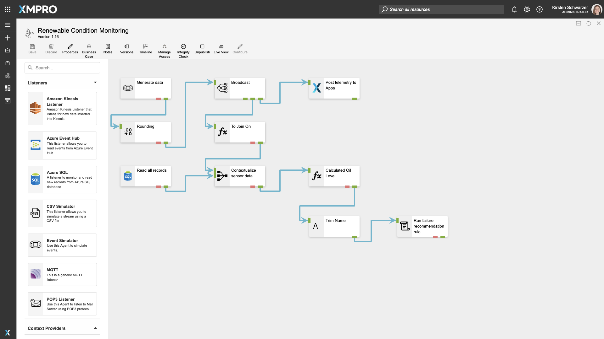
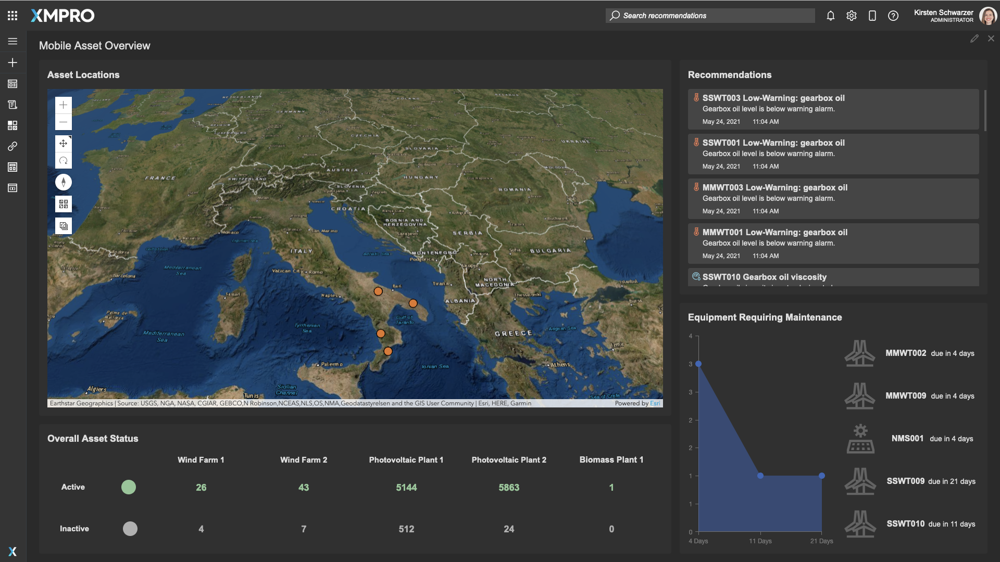
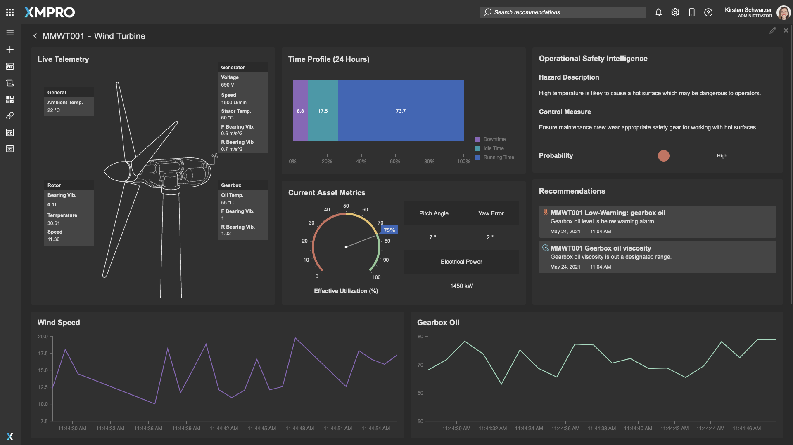
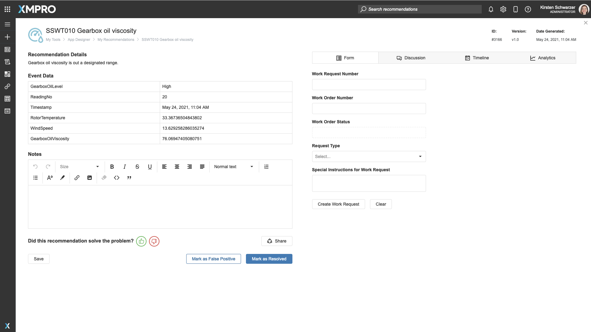

# Free Trial

## How To Sign Up

Are you interested in taking the XMPro Application Development Platform for a test drive? Visit [this link](https://xmpro-sm.azurewebsites.net/identity/Register/Form?promotion=true) to sign up for a 90-day free account with no credit card required to get started.&#x20;

After completing the registration form, you will receive a confirmation email with your login details.

## What's Included in the Free Trial

During the free trial, you will get access to the full suite of XMPro Products along with:

* Unlimited [Data Streams](../concepts/data-stream/)
* Unlimited [Applications](../concepts/application/#overview)
* Unlimited [Recommendations](../concepts/recommendation/)
* Selection of XMPro [Agents](../concepts/agent/) and [Connectors](../concepts/connector.md)
* Basic 2GB Azure SQL database for master data storage

If you require additional Agents and Connectors that are not available in your trial account, please [contact support](http://xmpro.com/support/).


You will need to upgrade your XMPro Free Account to a paid subscription to continue using the services after your trial period expires. Read the [free trial terms and conditions](https://xmpro.com/free-trial-terms/) for more details.&#x20;


## Explore The Demo Use Case

Your free trial account includes a pre-built demo use case, which includes a Data Stream, App and Recommendation focused on solving a specific business problem.

In this scenario, a renewable energy company wants to move from a planned maintenance schedule to condition-based maintenance for their assets across multiple plants.&#x20;

There is a Data Stream to:&#x20;

* Simulate real-time telemetry data for the assets
* Combine it with contextual data from a SQL database
* Check whether the data exceeds certain thresholds
* Run recommendation rules
* Publish data to an XMPro App

We've also created an App to provide the energy company's engineers with decision support for their new condition-based maintenance program.

The App provides them with:

* A map view of all their assets at their various plants
* The remaining useful life for assets that require maintenance in the next 14 days
* Recommendation alerts when specific assets exceed certain thresholds

If you drill down into a specific asset, you will see:

* Live telemetry data such as bearing vibration and temperature for different components
* Live wind speed and gearbox oil level visualizations
* Operational safety intelligence information to prevent safety incidents during maintenance
* The effective utilization score for this specific asset

In this scenario, XMPro will generate a recommendation alert when:

* Gearbox oil viscosity for a wind turbine goes above 75&#x20;
* Oil level reaches a low threshold

## Next Steps

This demo use case demonstrates how you can use the XMPro Platform to build a real-time application in 3 simple steps:

1. Create Data Streams to integrate your data sources & orchestrate the data flow
2. Design visualizations for a real-time view of your operations
3. Create prescriptive recommendations that trigger when critical events happen

Once you're done exploring the demo, you can start building your first End-To-End Use Case by following [this detailed tutorial](end-to-end-use-case.md).&#x20;
