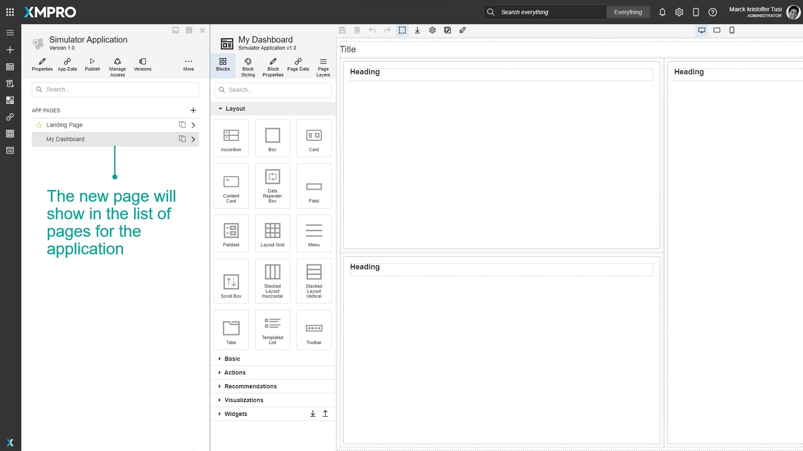
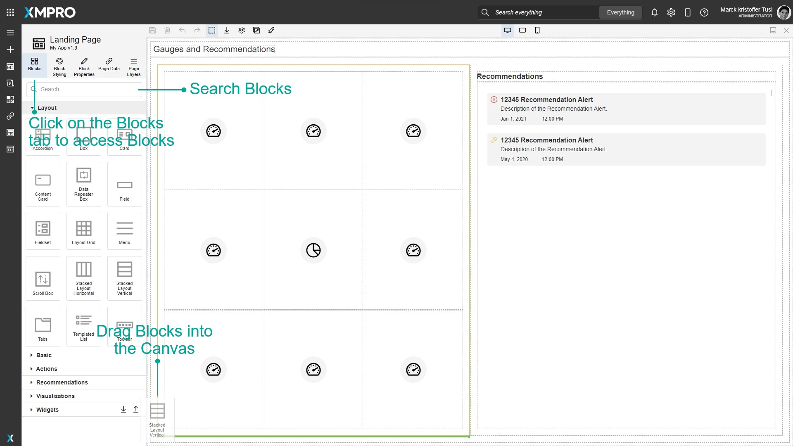
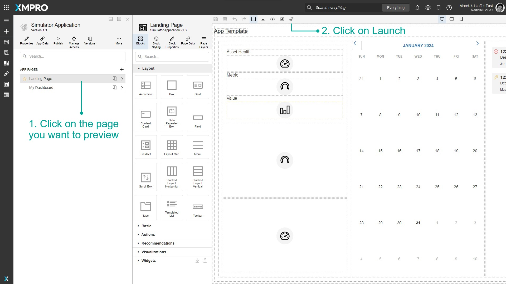
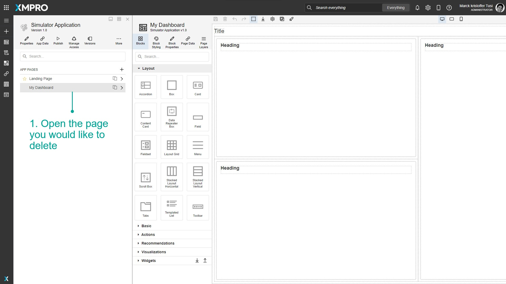
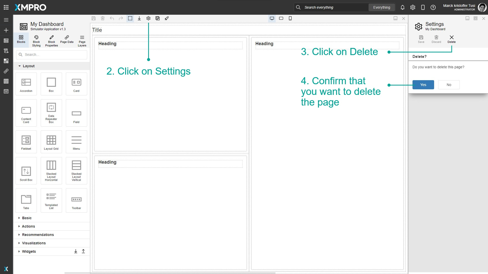

# Manage Pages

A Page is a web page built with XMPro's App Designer. Pages allow you to separate the Application into sections, navigate between the Pages, and pass data between Pages using Parameters.&#x20;


It is recommended that you read the article listed below to improve your understanding of Pages.

* [Page](../../concepts/application/page.md)
* [Canvas](../../concepts/application/canvas.md)
* [How to Manage Apps](manage-apps.md)


## Creating a Page

To create a Page within an existing application, follow the steps below:

1. Click on _Applications_ from the left-hand menu.
2. Click on the _edit_ button of the Application from the list.

.png>)

&#x20;   3\. Click on the _plus_ button to add a new Page.\
&#x20;   4\. Enter the details of the new Page.\
&#x20;   5\. Choose the layout of the new Page.\
&#x20;   6\. Click on _Save_.

.png>)

The new Page will show in the list of pages for the Application.

## Designing a Page

Once a Page has been created, you can design your Page to meet your specifications. There are many Blocks or controls that can be added from the Blocks tab such as Text, Number, and Date Boxes, Grids, Charts, Gauges, Accordions, and Tabs. [The full list of Blocks can be found here](../../concepts/application/block.md#list-of-blocks).&#x20;

### Adding New Blocks

Blocks are accessed through the Blocks tab in the page designer and can be added to the page by dragging them into the Canvas. Blocks can also be searched by typing in the search bar at the top.&#x20;

### Moving Blocks in the Canvas

Blocks can be rearranged within the Canvas in a few ways:

#### Moving Blocks using the Canvas

1. Click and drag the Block you want to move.
2. Hover over where you want to move the Block to. A green line and an orange outline will appear to show where the Block will end up.
3. Release the mouse to drop the Block.

#### Moving Blocks using the Toolbar

Sometimes the Block you want to move may be hard to click or behind other Blocks. In this case, you can move the Block by its drag handle button in the blue toolbar.

1. Select the Block by clicking one of its children and clicking the Select Parent button in the blue toolbar or by selecting it in the Page Layers.
2. Click and drag the drag handle button in the blue toolbar.
3. Hover over where you want to move the Block to. A green line and an orange outline will appear to show where the Block will end up.
4. Release the mouse to drop the Block.

#### Moving Blocks by the Page Layers

Sometimes you may need to be more precise in dragging a Block. In this case, you can move the Block by rearranging it in the Page Layers. [See the Page Layers article for more information on how to use Page Layers.](use-page-layers.md)

1. Expand the Block you want to move and the Block you want to put in the Page Layers.
2. Click and drag the drag handle in the Page Layers.
3. Hover over where you want to move the block to. A green line and an orange outline will appear to show where the block will end up.
4. Release the mouse to drop the block.

## Launching a Page

Once a Page has been designed, you can view the finished product of the designed Page by launching it.

1. Click on the page you want to preview.
2. Click on _Launch_.&#x20;

## Deleting a Page

To delete the Page, open the Page itself and delete it via the settings menu. Follow the steps below to delete the Page:

1. Open the Page you would like to delete.

&#x20;   2\. Click on _Settings_.\
&#x20;   3\. Click on _Delete_.\
&#x20;   4\. Confirm that you want to delete the Page.

## Further Reading

* [How to Import an App Page](import-an-app-page.md)
* [How to Design Pages for Mobile](design-pages-for-mobile.md)
* [How to Navigate between Pages](navigate-between-pages.md)
* [How to Manage Connections](manage-connections.md)&#x20;
* [How to Use Dynamic Properties](use-dynamic-properties.md)
* [How to Use Expression Properties](use-expression-properties.md)
* [How to Use the Page Layers](use-page-layers.md)
* [How to Use Block Styling and Devices](use-block-styling-and-devices.md)
* [How to Use Validation](use-validation.md)
* [How to Use Variables & Expressions](use-variables-and-expressions.md)
* [How to Manage Widgets](manage-widgets.md)
