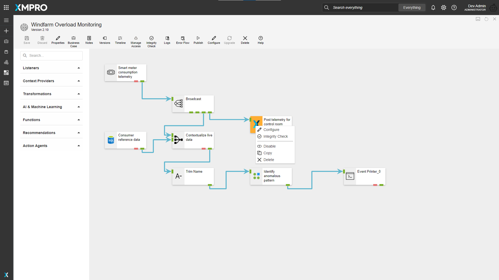
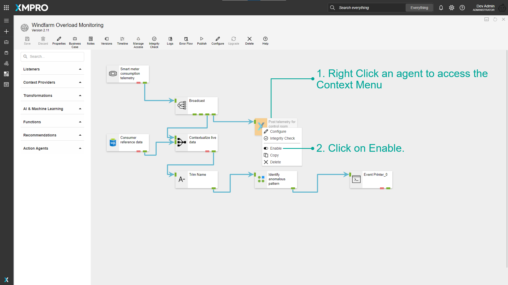
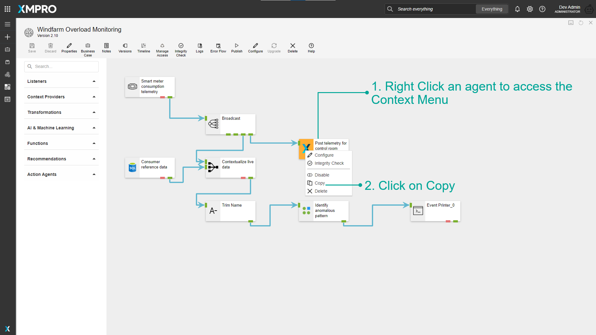

# Context Menu

The **Right Click Menu** or the **Context Menu** is the menu, which appears when you right-click on the Stream Object in Data Stream. This menu gives you added functionality by offering you actions you can take with the Stream Object.

## Configure

You can configure the Stream Object through the Context Menu.

[See the Stream Object Configuration article for more details on Agent Configuration.](../../concepts/data-stream/stream-object-configuration.md)

## Integrity Check

You can run an Integrity Check on the agent through the Context Menu.

[See Verifying Stream Integrity article for more details on Integrity Check.](../../concepts/data-stream/verifying-stream-integrity.md)

## Disable/Enable

You can disable/enable a Stream Object through the Context Menu.

### Disable a Stream Object

Stream Objects can be disabled in a Data Stream. Disabled Stream Objects will be excluded from the output when the Data Stream is published.&#x20;

.png>)

Observe that the Disabled Stream Object is now greyed out.


Agents with no entry points and multiple entry points cannot be disabled.&#x20;


### Enable a Stream Object

Disabled Stream Objects can again be enabled in a Data Stream. Enabled Stream Objects will be Included in the output when the Data Stream is published.&#x20;

Observe that the Stream Object is not greyed out.

.png>)

## Copy

You can copy a Stream Object and Paste it on the canvas.

Click anywhere on the canvas and right-click.

.png>)

## Delete

You can Delete a Stream Object using the Context Menu.
