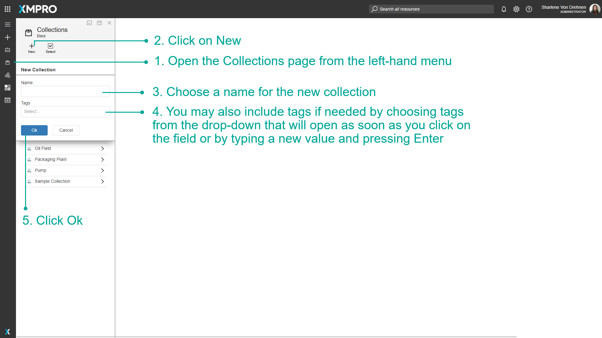
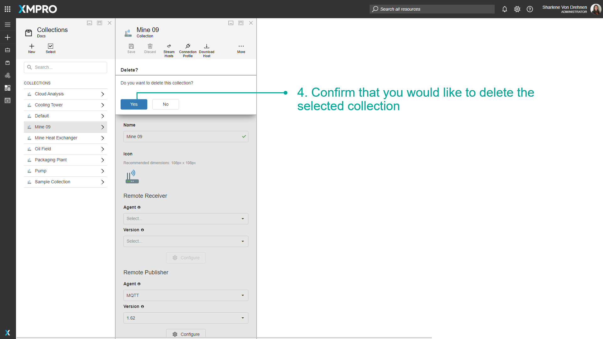

# Manage Collections

Stream Hosts are grouped into different Collections, which are created and maintained in Data Stream Designer. A Collection can be defined as a category that contains a set of Stream Hosts that run the same Data Streams. Collections are used to prevent you from having to redeploy a Data Stream to multiple Stream Hosts, devices, and assets. When a Data Stream is published for a Collection, the devices themselves can just subscribe to that Collection.


It is recommended that you read the article listed below to improve your understanding of Collections.

* [Collection and Stream Host](../../concepts/collection.md)


## Create a Collection

Collections are an important concept in the Data Stream Designer. You might have to create a Collection soon after starting to use the Application as they are crucial to the workings of use cases and Streams. A Collection also has to be created before installing a Stream Host as the Stream host is dependent on the information contained in a Collection. To create a Collection, follow the steps below:

1. Open the _Collections_ page from the left-hand menu.
2. Click on _New_.
3. Choose a name for the new Collection.
4. You may also include tags if needed by choosing tags from the drop-down that will open as soon as you click on the field or by typing a new value and pressing _Enter_.
5. Click _Ok_.

.png>)

## Change a Collection key

It might be needed to replace or change the key that is associated with a Collection from time to time. To replace a key with a new one, follow the steps below:

1. Open the _Collections_ page from the left-hand menu.
2. Select the Collection from the list.
3. Click on _Revoke Key_.
4. Confirm that you would like to revoke the key. After clicking _Revoke_, the key will be replaced with a new key.

.png>)

## Delete a Collection

To remove a Collection, follow the steps below:

1. Open the _Collections_ page from the left-hand menu.
2. Select the Collection you would like to remove.
3. Click on the _Delete_ button.

.png>)

&#x20;   4\. Confirm that you would like to delete the selected Collection.

## Further Reading

* [How to Use Remote Receivers and Publishers](remote-receivers-and-publishers.md)
