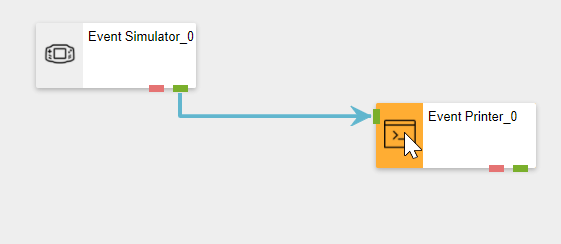

# Manage Data Streams

A Data Stream is a visual representation of a flow of data, which is depicted by the use of Agents that are connected by arrows that allow data to flow from one Agent to the next. Data streams are built in an interactive canvas environment that allows you to drag Agents from the toolbox to a drawing area. These Agents allow you to complete certain actions on the data. This includes aggregating, filtering, displaying, or re-saving the data into another database. &#x20;


It is recommended that you read the article listed below to improve your understanding of Data Streams.

* [Data Stream](../../concepts/data-stream/)


## How to Create a Data Stream

To create a Data Stream, follow the steps below:

1. Open the _New Data Streams_ page from the left-hand menu.
2. Give the Data Stream a name.
3. Enter the type (streaming or recurring).
4. Enter the category under which the Data Stream is found in the Data Stream list.
5. Give the Data Stream an icon. Sample icons can be found in the [Icon Library](../../resources/icon-library.md).
6. Enter the Collection the Data Stream will have.
7. Enter a description.
8. Click on _Save_.

.png>)

.png>)

## How to Open a Data Stream

Data Streams can be opened via the _Data Streams_ Page on the left-hand menu, or via the main page that contains the list of Categories.

To open Data Streams from the left-hand menu:

1. Open the _Data Streams_ page from the left-hand menu.
2. Select the Data Stream you want to open.

.png>)

To open Data Streams from the list of categories:

1. Click on the Logo to open the main page.
2. Click on the Category of the Data Stream.

.png>)

&#x20;   3\. Click the Data Stream you want to open.

.png>)

## Adding Agents to the Canvas

To add Agents to the canvas, drag and drop Agents from the left-hand toolbox to make up the data flow for your Data Stream. [See the Agents article for more information on Agents.](../../concepts/agent/)

1. Expand an Agent category to view the list of Agents.
2. Click and drag an agent onto the Canvas.
3. To connect Agents, click on an output endpoint and drag it to an input endpoint for the Agent you want to connect to.

## Copying and Pasting Stream Objects

Stream Objects that are in the Data Stream can be copied and pasted using keyboard shortcuts. To copy a Stream object:

1. Select an Agent to highlight it.
2. To highlight multiple Agents, hold the ctrl key while you are selecting them.
3. Once the Stream Object/s are highlighted in yellow, press and hold ctrl + C.&#x20;
4. To paste the Stream Object that was just copied, press and hold ctrl + P.


You can also copy a Stream Object from one Data Stream and paste it into a different Data Stream.


## Deleting Stream Objects

To delete a Stream Object on the canvas, follow the steps below:

1. Select a Stream Object by clicking on it.
2. Click on Delete.

You can also delete Stream Objects that are on the Data Stream canvas by using the 'delete' keyboard shortcut.&#x20;

1. Select an Agent to highlight it.
2. To highlight multiple Agents, hold the ctrl key while you are selecting them.&#x20;
3. Once the Stream Object/s are highlighted in yellow, click on the delete key on the keyboard.&#x20;

## How to Share a Data Stream

Data Streams can be shared between users. [See the Manage Access article to read more about managing access to users.](../../concepts/manage-access.md) To share a Data Stream, follow the steps below:

1. Click on _Manage Access_.
2. Click on _Add_.
3. Enter the user you want to share the Stream with.
4. Choose between read, write, or co-owner permissions.
5. Click on _Ok_.

To change permissions of existing users, follow the steps below:

1. Click on _Manage Access._
2. Select the user.

&#x20;   3\. Change their permissions.\
&#x20;   4\. Or, delete permissions for the user.

To remove the permissions for multiple users, follow the steps below:

1. &#x20;Click on _Share_.
2. Click on Multiple Select.
3. Select multiple users.
4. Click on _Delete_.

## Cloning Data Streams

To clone a Data Stream, follow the steps below:

1. From within the Data Stream canvas, click on “_Properties_“.
2. Click on “_Clone_“. This button may not initially be visible on the _Properties_ page but can be found in the menu that appears if you hover with your mouse cursor over the “_More_” button.
3. Specify a name for the Data Stream.
4. Choose a category to copy the Data Steam to. Please note that this should not be the same as the category of the original Data Stream.
5. Click _Save_.

## Further Reading

* [How to Manage Recurrent Data Streams](manage-recurrent-data-streams.md)
* [How to Use Business Cases and Notes](use-business-case-and-notes.md)
* [How to Run an Integrity Check](run-an-integrity-check.md)
* [How to Manage Live View](use-live-view.md)
* [How to Troubleshoot a Data Stream](troubleshoot-a-data-stream.md)
* [How to Upgrade a Stream Object Version](upgrade-a-stream-object-version.md)
* [How to Setup Input Mappings](setup-input-mappings.md)
* [How to Use Error Endpoints](use-error-endpoints.md)
* [How to Use the Timeline](use-the-timeline.md)
