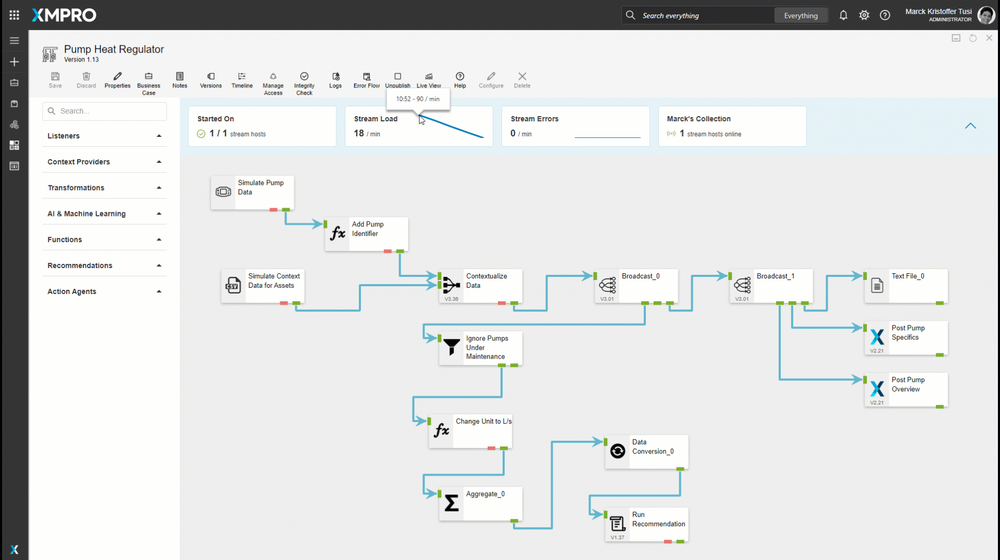
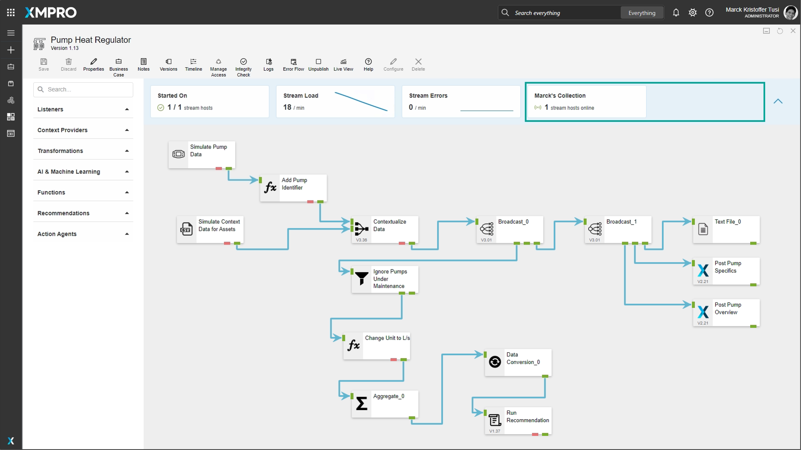

# Use Stream Metrics

When a Data Stream is published, the Stream Metrics become visible and allow you to view the number of Stream Hosts on which the Data Stream successfully started, the amount of data and errors that are being processed per minute in the Data Stream, and the number of active Stream Hosts per Collection.  &#x20;


It is recommended that you read the article listed below to improve your understanding of Stream Metrics.

* [Running Data Streams](../../concepts/data-stream/running-data-streams.md)
* [How to Manage Data Streams](manage-data-streams.md)



Stream metrics do affect performance. See the [Data Stream Designer Settings](../manage-site-settings.md#analytics) article for more information on how to toggle this feature on and off.


## Stream Metrics Components

The Stream Metrics has four parts: Started On, Stream Load, Stream Errors, and Stream Hosts per Collection.

### Started On

Started On shows the number of Stream Hosts on which the Data Stream started vs the total number of Stream Hosts online across all Collections.

The indicator is:

* green if the Data Stream started on all Stream Hosts
* amber if some started (indicates an error on the Stream Host)
* red if the Data Stream failed to start on all Stream Hosts (likely an error on the Data Stream)


This is useful to alert the composer when the Data Stream is first published that the Data Stream failed to start.&#x20;


<figure><figcaption></figcaption></figure>

### Stream Load

Stream Load represents the amount of data that is being processed by the agents in the Data Stream. The left side of the Stream Load card shows the amount of data that has been processed in the last minute and the right side has a sparkline with a 5-minute history. Hovering over the sparkline will display the amount of data that was processed for the selected minute.&#x20;

### Stream Errors

Stream Errors represent the number of errors that are being generated by the agents in the Data Stream. The left side of the Stream Errors card shows the amount of errors that are generated in the last minute and the right side has a sparkline with a 5-minute history. Hovering over the sparkline will display the number of errors that were generated for the selected minute.&#x20;

### Stream Hosts per Collection

The Stream Hosts per Collection card shows the name and the number of active Stream Hosts in each Collection. If the Data Stream has objects that are in different Collections it will show a card for each Collection.&#x20;

