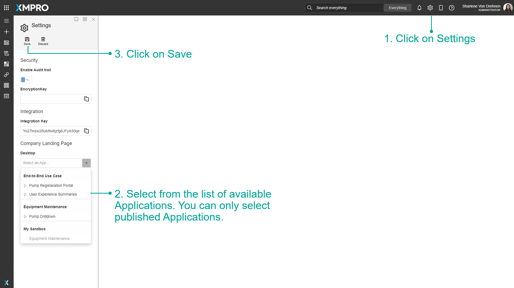

# Manage Landing Pages

In the App Designer, a Company Landing Page can be set for what Application Landing Page the user will see when they first open App Designer. Apps and Data Streams can also be favorited for fast access at a later time.&#x20;


It is recommended that you read the article listed below to improve your understanding of Applications.

* [Application](../concepts/application/)
* [Landing Pages](../concepts/landing-pages.md)
* [How to Manage Apps](apps/manage-apps.md)


## Favorite an App

To Favourite Apps, follow the steps below:

1. Click on the star to favorite an App.
2. Go to Subscription manager. Favorited Apps will show on the main page of Subscription Manager.


Apps can only be favorited using the category tiles list.


## Favorite a Data Stream

To Favourite Data Streams, follow the steps below:

1. Click on the star to favorite a Data Stream.
2. Go to Subscription manager. Favorited Data Streams will show on the main page of Subscription Manager.


Data Streams can only be favorited using the category tiles list.


.png>)

## Set a Company Landing Page

To set the Company Landing Page for either Mobile or Desktop, follow the steps below:

1. Click on Settings
2. Select from the list of available Applications.&#x20;
3. Click on Save.


You can only select Applications that are already published.&#x20;


