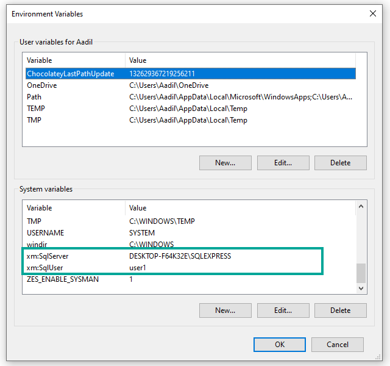

# Manage Variables

Variables are placeholders used to hold and maintain certain values. If you may not know some of the values that you might want to use within an XMPro Object, such as credentials or passwords, you can use Variables where the real value can be substituted in later.&#x20;


It is recommended that you read the article listed below to improve your understanding of Variables.

* [Variable](../concepts/variable.md)


## Adding a new Variable

Variables can be added via the Variables page before being used in any of the Data Streams or Applications.

1. Click on the _Variables_ page from the left-hand menu.
2. Click on _Add_.
3. Enter the details of the new Variable.
4. Choose if the value is encrypted. This determines whether or not the value can be seen by the user.
5. Click on _Save and Close._

## Using Variables

Variables can be used in Data Streams or Applications to authenticate users or to access certain data sources. Consider having the following agents in a stream:

* Azure SQL Listener

When the Azure SQL Listener is configured the user needs to enter the server details and password in order to access the available tables and columns. In this case, variables that already store the passwords and credentials can be used in the input fields. For example:

1. Add an SQL Listener from the list of Agents.
2. Click on Configure.
3. Select the Server and user details from the list of variables (ensure that the 'Use Connection Variables' option is selected).

&#x20;   4\. Select the correct encrypted password variable for the server.

&#x20;   5\. If selected correctly, tables and columns can now be accessed.

## Removing Variables

### **Single Variable**

To remove a single variable, follow the steps below:

1. Open the _Variables_ page from the left-hand menu.
2. Select the variable from the list.
3. Click _Delete_.

&#x20;   4\. Confirm that you would like to delete the variable.

.png>)

### **Multiple Variables**

To remove multiple variables, follow the steps below:

1. Open the _Variables_ page from the left-hand menu.
2. Click _Select_.
3. Select the variables from the list.
4. Click _Delete_.

&#x20;   5\. Confirm that you would like to delete the selected variables.

## Getting Variable Value from System Environment Variables

In addition to creating Local Variables in Data Stream Designer, it is also possible to store the same variable value in System Environment Variables. By default System Environment Variables will be checked first for the value and if the value is not found then the local variable value will be used. &#x20;


Please note to save the variables in System Environment using the following syntax:

**xm:**_**YOURVARIABLENAME**_



The name of your Local Variable and Environment Variable should be the same.


