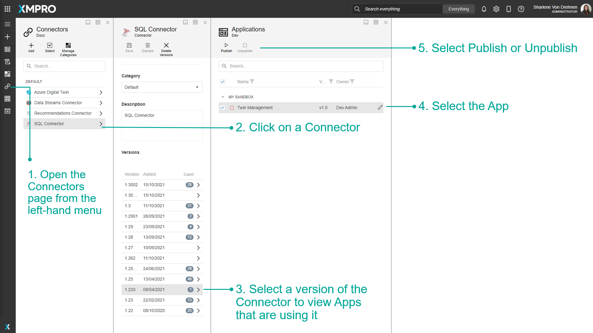

# Admin Unpublish Override

Apps and Data Streams can be published and unpublished in other parts of App Designer and Data Stream Designer

In App Designer, you can publish or unpublish an App via the Connectors page. In Data Stream Designer, you can publish or unpublish a Data Stream via the Agents or Collections page.

Admins are able to see all Apps or Data Streams, whereas users can only see the Apps or Data Streams to which they have access. This can be useful for Admins if they need to unpublish an App or Data Stream if they do not have access to it.


It is recommended that you read the article listed below to improve your understanding of Applications.

* [Application](../../concepts/application/)
* [Data Stream](../../concepts/data-stream/)
* [How to Publish](./)


## Publish or Unpublish an App

### From the Connectors Page

To publish or unpublish an App via the Connectors page, follow the steps below:

1. Open the Connectors page from the left-hand menu.
2. Click on a Connector.
3. Select a version of the Connector to view Apps that are using it.
4. Select the App.
5. Select Publish or Unpublish.


The number of Apps being used will be displayed for each Connector version.


## Publish or Unpublish a Data Stream

### From the Agents page

To publish or unpublish an App via the Agents page, follow the steps below:

1. Open the Agents page from the left-hand menu.
2. Click on an Agent.
3. Select a version of the Agent to view Data Streams that are using it.
4. Select the Data Stream.
5. Select Publish or Unpublish.


The number of Data Streams being used will be displayed for each Agent version.


### From the Collections page

To publish or unpublish an App via the Collections page, follow the steps below:

1. Open the Collections page from the left-hand menu.
2. Click on a Collection.
3. Click on More.
4. Click on Data Streams.
5. Select the Data Stream.
6. Select Publish or Unpublish.

