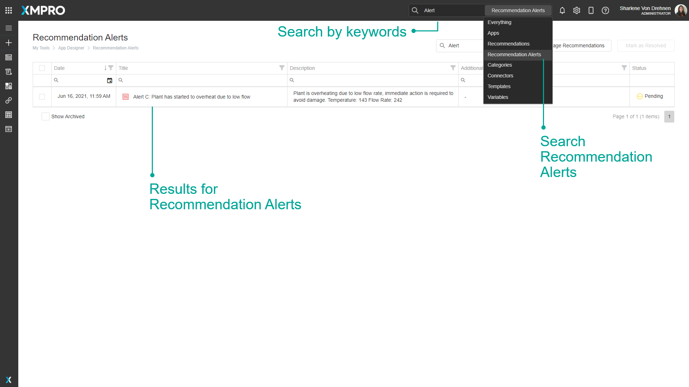

# Manage Alerts

Recommendation Alerts are advanced Alerts that get triggered when real-time data meets the criteria defined in a [Recommendation Rule](../../concepts/recommendation/rule.md). They notify you when certain conditions occur in your data and provide decision support for how to take action.

[Recommendations](../../concepts/recommendation/) create new Recommendation Alerts based on [Business Rules](../../concepts/recommendation/rule.md#rule-logic), and the Alerts recommend the best next actions based on expert suggestions. Recommendation Alerts monitor the actions taken and outcomes to close the loop on event response.&#x20;


It is recommended that you read the article listed below to improve your understanding of Recommendations Alerts.

* [Recommendation Alert](../../concepts/recommendation/recommendation-alert.md)
* [Manage Recommendations](manage-recommendations.md)


## Finding Recommendation Alerts

The search bar can be used to find any specific Recommendation Alerts that you may be looking for. There is a dropdown option where you can specify to search through everything in App Designer, or only for Recommendation Alerts.

## How to Use the Recommendation Alerts Grid

### How to Filter the Grid

1. Open the Recommendation Alerts page.&#x20;
2. Click the filter icon next to the column that you want to filter on.
3. Tick the desired checkbox.
4. Click OK.

The Grid with Alerts will be updated.

.png>)

### How to Search the Grid

1. Open the Recommendation Alerts page.&#x20;
2. Start typing in the search bar.
3. The Grid with Alerts will be automatically updated.

.png>)

### How to Resolve Alerts From the Grid

1. Open the Recommendation Alerts page.&#x20;
2. Tick the checkbox of the Alerts that you want to Resolve.
3. Click the Mark As Resolved button.

.png>)

### How to Show Archived Alerts

1. Open the Recommendation Alerts page.
2. Tick the Show Archived checkbox.

The Grid with Alerts will be updated with archived Alerts.

.png>)

## How to Use the Alert Details Page

The Recommendation Alert page provides details of the alert and allows you to monitor, discuss, and take action.

### How to Add a Notes&#x20;

1. Type in the designated area for Notes.
2. Click Save.

.png>)

### How to Fill Out a Form

1. Click the Form tab.
2. Fill on the form fields.
3. Click the Create Work Request button in the form to save the changes.&#x20;

.png>)

### How to Contribute to a Discussion

1. Click the Discussion tab.
2. Write your message.
3. Click the Send button.

.png>)

### How to Share an Alert

1. Click the Share button.

.png>)

&#x20;   2\. Select Users from the dropdown.\
&#x20;   3\. Add a Note.\
&#x20;   4\. Click the Share button.

.png>)

### How to Save, Resolve, and Mark as False Positive

1. Clicking the Save button - Changes will be saved and Alert Details Page will stay open.
2. Mark as False Positive - Will mark the Alert as False Positive and will close the Alert Details Page.
3. Mark as Resolve - Will resolve the Alert and close the Alert Details Page.

.png>)
