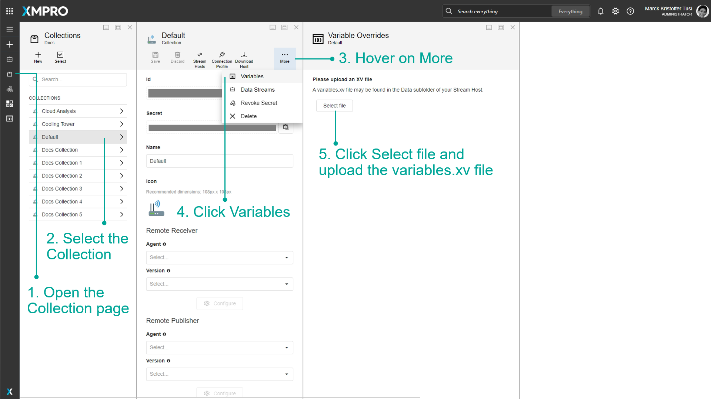
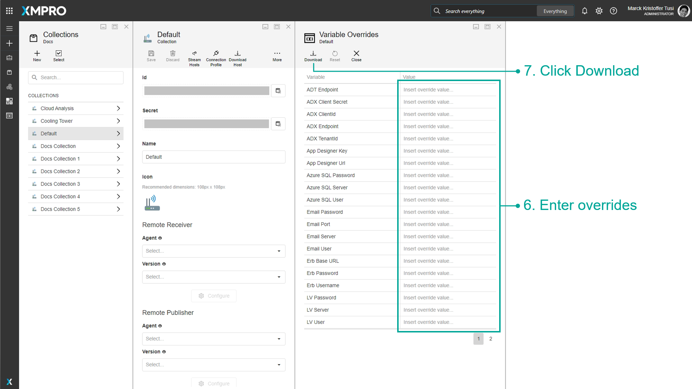

# Stream Host

A Stream Host is an application that can either be installed as a Windows Service or as a Console Application. Stream Hosts enable Data Streams to run and execute actions and are also responsible for getting the configurations of [Non-Virtual Agents](../concepts/agent/virtual-vs-non-virtual-agents.md#non-virtual-agents).


It is recommended that you read the article listed below to improve your understanding of Stream Host.

* [Stream Host](../concepts/collection.md#stream-hosts)


## How to Install a Stream Host

To install a Stream Host, follow the steps below:

1. Open the Collection page.
2. Select the Collection.
3. Click the Connection Profile button.
4. Enter Device Name.
5. Enter File Key.&#x20;
6. Confirm the action.

.png>)

&#x20;   7\. Click the Download Host button.\
&#x20;   8\. Select the Platform.\
&#x20;   9\. Confirm the action.

After the download is finished, follow the installation wizard and use the Connection Profile which was downloaded in Steps 3-6.&#x20;

## Logs

### How to Check Logs

To check the logs for a Steam Host,  follow the steps below:

1. Open the Collection page.
2. Select the Collection.
3. Click the Stream Hosts button.
4. Select the desired Stream Host.

.png>)

### How to Set the Log Level

You can change the Log level to either Info or Trace. To change the Log Level, follow the steps below:&#x20;

1. Open the Collection page.
2. Select the Collection.
3. Click the Stream Hosts button.
4. Select the desired Stream Host.


[See the Collection and Stream Hosts article for more information on the Log Level.](../concepts/collection.md#set-log-level)&#x20;


.png>)

&#x20;   5\. Click on Set Log level.\
&#x20;   6\. From the dropdown, select either Info or Trace.

.png>)

&#x20;   7\. Click on OK.

.png>)

### How to Filter Log Levels

You can filter and narrow down the errors and messages that have already been logged in the table. For example, if you filter for _Info_ errors, only info level errors will be displayed. To filter the log level for a Steam Host,  follow the steps below:

1. Open the Collection page.
2. Select the Collection.
3. Click the Stream Hosts button.
4. Select the desired Stream Host.

.png>)

&#x20;   5\. Click the icon next to the Level column.\
&#x20;   6\. Select the Log Level.\
&#x20;   7\. Click OK.

.png>)

### How to Clean the Logs

To clean the logs for a Steam Host,  follow the steps below:

1. Open the Collection page.
2. Select the Collection.
3. Click the Stream Hosts button.
4. Select the desired Stream Host.

.png>)

&#x20;   5\. Click the Delete Logs button.\
&#x20;   6\. Confirm your action.

.png>)

### How to Export Logs

To export the logs for a Steam Host,  follow the steps below:

1. Open the Collection page.
2. Select the Collection.
3. Click the Stream Hosts button.
4. Select the desired Stream Host.
5. Click the "three dots" button.
6. Click Export all data or Export Selected rows.

.png>)

## How to Find Online Hosts

To find online Stream Hosts, follow the steps below:

1. Open the Collection page.
2. Select the Collection.
3. Click the Stream Hosts button.

.png>)

## How to Override Variables

Although each Stream Host in a given Collection downloads the same definition of a Data Stream, the [Variables](manage-variables.md) defined in Data Stream Designer can be overridden by the individual Stream Host to provide the unique configuration per Asset e.g. OPC IP Address.

To override variables for a Stream Host, follow the steps below:

1. Open the Collection page.
2. Select the Collection.
3. Hover on More.
4. Click Variables.
5. Click Select file and upload the encrypted variables.xv file, found in the Data folder of the Stream Host's installation directory e.g. "_C:\Program Files\XMPro Stream Host\Data_".
6. You can enter overrides for any Variables.
7. Click Download to get the updated file.
8. Replace the original file in your Stream Host folder with the new one.
9. Restart your Stream Host to load the updated variables.

<figure><figcaption></figcaption></figure>

<figure><figcaption></figcaption></figure>
