---
layout:
  title:
    visible: true
  description:
    visible: true
  tableOfContents:
    visible: true
  outline:
    visible: true
  pagination:
    visible: false
---

# AWS

## Architecture

The following deployment diagram shows an example architecture and the necessary resources for the XMPro platform in AWS.

<figure><figcaption>
Fig 1: Example XMPro architecture in AWS
</figcaption></figure>

The solution is deployed as an auto-scaling Elastic Beanstalk Application with 3 environments:

* SM – Subscription Manager
* AD – Application Designer
* DS – Data Stream Designer & API

These environments use Redis for a centralized Cache and RDS for database storage.

All data transfers are done via HTTPS and the SSL certificates are managed in AWS Certificate Manager.

There are two accounts set up: one for production and one for non-production. Both of these environments follow the above architecture and deployment.

## Prerequisites

In order to proceed with the deployment, you are required to complete the steps in the **1. Preparation** guide:

1. Meet the [**hardware** requirements](../install.md#hardware-requirements)
2. Install the [**software** requirements](../install.md#software-requirements)
3. Follow the [certificate and communication steps](../install.md#preparation-steps)&#x20;


**Two SSL Certificates are required**

1. An SSL Certificate in AWS Certificate Manager, used by IIS (See the [Appendix](aws.md#ssl-certificate-in-certificate-manager) guide).\

2. An SSL Certificate, used by the SM instance (added to the [S3 Bucket](aws.md#create-s3-bucket) during the installation).\
   Create or ask your administrator for an SSL certificate with the correct DNS name. A self-signed certificate is good enough. There are many ways to generate this certificate, one of which is described in the above [1. Preparation](../install.md#https-ssl-certificate) guide. Please note the file names **must** be called **ssl.pfx** and **ssl.password.txt**.


**Resources**&#x20;

We are going to be deploying the following resources, please ensure you have the desired domain names ready.

1. SQL RDS
2. Parameter Store
3. Elastic Beanstalk Application
4. Elastic Beanstalk Environment – Subscription Manager
5. Elastic Beanstalk Environment – App Designer
6. Elastic Beanstalk Environment – Data Stream Designer & API

An example of preferred domain names is as follows; each set is for a specific account as per the architecture diagram.

For production:

* https://sm-xmpro․_**domain**_․com
* https://ad-xmpro․_**domain**_․com
* https://ds-xmpro․_**domain**_․com

For non-production:

* https://sm-nonprod-xmpro․_**domain**_․com
* https://ad-nonprod-xmpro․_**domain**_․com
* https://ds-nonprod-xmpro․_**domain**_․com

Log on to the [AWS Management Console](https://console.aws.amazon.com/) and switch to the region you want to deploy the solution in, you will need Administrative rights to the subscription to complete the deployment.

## ElastiCache

Search for **ElastiCache** in the _**Services**_ dropdown and select it.

1. Click the _Get Started Now_ button from the screen that opens.

.png>)

.png>)

2\. Make sure _Redis_ is selected, click create.

.png>)

3\. Provide a name for the cache, select the size and leave the rest of the Redis options as defaults.

.png>)

4\. Provide the _Subnet_ information and select the VPC to deploy Redis in.

.png>)

5\. Click _Create_ to complete the Redis configuration and create the cache.

.png>)

6\. Once created, select **EC2** from _**Services,**_ and under _Network & Security_ click Security Groups.

7\. Edit the default security group and add _Redis Port 6379_ to the Inbound rules.

.png>)

8\. Make a note of the Redis endpoint as it will be used later within the Redis Connection string.

.png>)


Note:

* Currently, SignalR doesn’t support Redis Clusters [https://docs.microsoft.com/en-us/aspnet/signalr/overview/performance/scaleout-with-redis](https://docs.microsoft.com/en-us/aspnet/signalr/overview/performance/scaleout-with-redis)
* Sticky Sessions must be used for SignalR [https://learn.microsoft.com/en-us/aspnet/core/signalr/scale?view=aspnetcore-6.0](https://learn.microsoft.com/en-us/aspnet/core/signalr/scale?view=aspnetcore-6.0)


## Amazon RDS Creation

In the AWS Management Console choose **RDS** under _**Database**_ in the _**Services**_ drop-down.

1. Click _Databases_ and then click _Create database._

.png>)

2\. Select _Easy Create_, _SQL Server,_ and the desired Tier for the database instance.

.png>)

3\. Provide the _DB instance Identifier_, _Username,_ and _Password_ for the RDS database instance.\
&#x20;   Click create.

.png>)

4\. Once created it will appear as below:

.png>)

5\. Click the _DB Identifier_ just created.


Make a note of the following:

* _Endpoint_ - In this example: _aero-sql.cug4m2yk6h94.ap-south-1.rds.amazonaws.com_
* User - as specified earlier
* Password - as specified earlier


.png>)

6\. The security group will need to be modified to allow inbound traffic this is done as follows:

6.1. Click the _VPC security groups_.

.png>)

6.2. Select the _Default_ security group, click _Inbound_ then click _Edit_.

.png>)

6.3. Add a new rule called **MS SQL**, with _Protocol_ as **TCP** and _Port Range_ as **1433**; and click Save.

.png>)

## Parameter Store Identity and Access

1. Click IAM under Security, Identity & Compliance

.png>)

2\. In IAM click policies click Create policy&#x20;

.png>)

3\. Select Import managed policy

.png>)

4\. Search and select AmazonSSMManagedInstanceCore then click Import

.png>)

5\. Click Add additional permission

.png>)

6\. Choose service Systems Manager

.png>)

7\. Select Read and click Review Policy

.png>)

8\. Expand resources and resolve all the warnings by clicking All Resources.

.png>)

9\. Enter a Name and Description for the policy and click Create Policy

.png>)

10\. Search for the Newly created policy, select it, and click Policy Actions

.png>)

11\. Select Attach from Policy actions

.png>)

12\. Attach this new policy to the role aws-elasticbeanstalk-service-role and click Attach Policy

.png>)

####

## Create Elastic Beanstalk Application

The first step in using AWS Elastic Beanstalk is to create an application, which represents your web application in AWS. In Elastic Beanstalk an application serves as a container for the environments that run your web app and for versions of your web app's source code, saved configurations, logs, and other artifacts that you create while using Elastic Beanstalk.

1. Open the **Elastic Beanstalk** console, and then, in the _regions_ drop-down list, select your region.

.png>)

2\. In the navigation pane, choose **Applications**, and then click _Create Application_.

.png>)

3\. Use the on-screen form to provide an _application name_.

.png>)

4\. Click Create.

.png>)


You have successfully created the application. Next, we'll create the application's environments for each product: Subscription Manager, Data Stream Designer, and App Designer.


## Subscription Manager

### Create Environment

1. Select the Application, click on Actions then click Create environment

.png>)

2\. Click Select

.png>)

3\. Provide the _Environment name_ for Subscription Manager.

.png>)

4\. Select the Platform information.&#x20;

5\. Select Sample Application and click Configure more options

.png>)

6\. Click Edit under the Capacity section.

.png>)

7\. Select **Load Balanced** under Environment Type and set the required Instance Min and Max to **1**. (More information can be found [here](https://docs.aws.amazon.com/autoscaling/ec2/userguide/asg-capacity-limits.html))

.png>)

8\. Change the Instance type to the required instance type.

.png>)

9\. Click _Save._

.png>)

10\. Click _Edit_ under the **Network** section.

.png>)

11\. Under the _VPC_ section select the VPC this environment should run in, set the _visibility_ according to your requirements and select the load balancer availability zones.&#x20;

12\. Scroll down and click _Save._

.png>)

13\. Click _Edit_ under the **Load balancer** section.

.png>)

14\. Select _Application Load Balancer_ and scroll down.

15\. Click _Add listener._

.png>)

16\. Enter _**443**_ in _Port_

17\. Select _Protocol_ _**HTTPS**_.

18\. Select the SSL certificate you added in the Certificate Manager earlier on and click _Add_.

19\. Scroll down.

.png>)

20\. Select the _**default**_ Process and under Actions click _Edit._

.png>)

21\. Change the _Port_ to _**443**_ and the _Protocol_ to _**HTTPS**_, then scroll down.

.png>)

22\. Tick the _Stickiness policy enabled_ option and click _Save._

.png>)

23\. Click _Save._

.png>)

24\. Click _Create environment_ to have the defined environment created.

.png>)

### Create S3 Bucket

1. In the AWS Management Console, choose **S3** under _**Storage**_ in the _**Services**_ drop-down.

.png>)

4. In S3 click _Create Bucket_ to create a new bucket.
5. Enter a name for the bucket name and click _Create bucket_.
6. Select the Region for your bucket
7. Remove the checkmark for Block Public Access

.png>)

8. Acknowledge the warning for a public bucket

.png>)

9. Click Create Bucket

.png>)

.png>)

10. Copy the _sign.pfx_ and _sign.password.txt_ files (the signing certificate referenced in the [1. Preparation](../install.md#signing-certificate) guide) into the bucket and ensure the files are publicly accessible.
11. Copy the _ssl.pfx_ and _ssl.password.txt_ files (the SSL certificate referenced in the [1. Preparation](../install.md#https-ssl-certificate) guide) into the bucket and ensure the files are publicly accessible.


The signing certificate is between the end user and the load balancer. The instance SSL certificate is used between the instances and the load balancer.


### Install Subscription Manager

1\. Run the installation wizard for Subscription Manager

.png>)

2\. Run Subscription manager as Administrator

.png>)

3\. Follow the instruction in the installation wizard: click Next.

.png>)

4\. Select the Install option (1) and click Next (2).

.png>)

5\. Tick Database (1), Web Application (2), select AWS Package (3), and click Next (4).

.png>)

6\. Enter the secret store prefix (1), the S3 Bucket name from earlier (2), and click Next (3).

.png>)

7\. Select the installation path (1), the DNS name for the site (2), and click Next (3).

.png>)

8. Enter the SMTP details referenced in the [1. Preparation](../install.md#smtp-account) guide and click Test SMTP settings (1), If successful, click Next (2).

.png>)

9\. Enter the Signing Certificate details:&#x20;

.png>)

9.1. Browse to the certificate created earlier\
9.2. Enter the certificate password\
9.3. Select the subject name\
9.4. Select Local Machine\
9.5. Click Next

10\. Click Next once the installation has completed.

.png>)

11\. Make a note of the Username and password, and click Finish.

.png>)

####

#### AWS Systems Manager – Parameter Store

1. Navigate to Parameter Store in AWS Systems Manager.

.png>)

.png>)

2\. Click **Create parameter**.

.png>)

3\. Create a SecureString parameter.

.png>)

.png>)

4\. Browse to the folder where SM was installed

.png>)

5\. Edit the file called App Secrets.xml: create the parameters as per the line items in the file:

.png>)

6\. Locate the S3 folder in the deployment folder. Copy the contents to the S3 Bucket you created.

.png>)

### Deploy the Subscription Manager

1. Click Environments in Elastic Beanstalk service
2. Click the SM Environment you created earlier

.png>)

3\. Use the on-screen form to upload the zip file.

.png>)

4\. Select the zip file to deploy from the folder where SM was installed. Click Deploy.

.png>)

5\. Navigate to the URL and log in using the following credentials:

* admin@xmpro․onxmpro․com&#x20;
* Pass@word1

.png>)

6\. Reset the administrator password and store it securely in a password vault.

7\. Click SM

.png>)

8\. Click Products

.png>)

9\. Click Installation Profile

.png>)

## Data Stream Designer

### Create Environment

1. In the AWS Management Console choose **Elastic Beanstalk** under _Compute_ in the _**Services**_ drop-down.
2. In the navigation pane, choose _Environments_
3. On the application overview page, choose _Create a new environment_.
4. Follow the same instructions on environment creation as done for the Subscription Manager.

.png>)

5\. Run the Data Stream Designer installer as Administrator. Click Next.

.png>)

6\. Select Install (1) and click Next (2).

.png>)

7\. Select the items as shown below and click Next.

.png>)

8\. Provide a Prefix and the S3 Bucket name

.png>)

9\. Provide the Database Details:

* Provide the SQL endpoint
* Change the SQL user
* Select a new DB and provide a name for the DB

.png>)

10\. Provide the DNS name for the Environment

.png>)

11\. Browse to the downloaded installation profile and select it

.png>)

12\. Login using the credentials for SM

.png>)

13\. Click Next

.png>)

14\. Once the installation completes, click Next

.png>)

15\. Click Finish

.png>)

### Install & Deploy Data Stream Designer

1. Browse to the installation folder, as outlined in [Subscription Manager](aws.md#install-subscription-manager).
2. Edit the App Secrets.xml file and create the Parameters in System Manager.
3. Upload and deploy the package.zip file to the newly created environment using upload and deploy as per SM deployment.

## App Designer

### Create Environment

1. In the AWS Management Console, choose **Elastic Beanstalk** under _Compute_ in the _**Services**_ drop-down.
2. In the navigation pane, choose _Environments_
3. On the application overview page, choose _Create a new environment_.
4. Follow the same instructions on environment creation as done for the Subscription Manager.

.png>)

5\. After installing Application Designer, run the setup as Administrator and click Next.

.png>)

6\. Select Install and click Next.

.png>)

7\. Select the items as below and click Next.

.png>)

8\. Provide the SQL endpoint and click Next.

.png>)

9\. Provide the DNS name for the environment and click Next.

.png>)

10\. Provide the URL for the Data Stream Designer installed earlier, and click Next.

.png>)

11. Enter the SMTP details referenced in the [1. Preparation](../install.md#smtp-account) guide and click Next.&#x20;

.png>)

12. Enter the Twilio details referenced in the [1. Preparation](../install.md#twilio-optional) guide and click Next. If you don't want SMS notifications you can select "None" from the "Select Provider" dropdown.

.png>)

13\. Browse to the downloaded installation profile and select it. Click Next.

.png>)

14\. Login with SM credentials to authenticate.

.png>)

15\. Click Next.

.png>)

16\. Click Next after the installation is complete.

.png>)

17\. Click Finish.

.png>)

### Install & Deploy App Designer

1. Browse to the installation folder, as outlined in [Subscription Manager](aws.md#install-subscription-manager)
2. Edit the App Secrets.xml file and create the Parameters in System Manager.
3. Upload and deploy the package.zip file to the newly created environment using upload and deploy as per SM deployment.

.png>)

## Appendix

### SSL certificate in Certificate Manager

In the AWS console go to the Certificate Manager

* Select the region the SSL Certificate is required in
* The certificate can be either imported or a new certificate can be requested.

#### To request a new certificate

.png>)

1. Click _**Get started**_ under Provision Certificate

.png>)

2\. Click _**Request a certificate**_

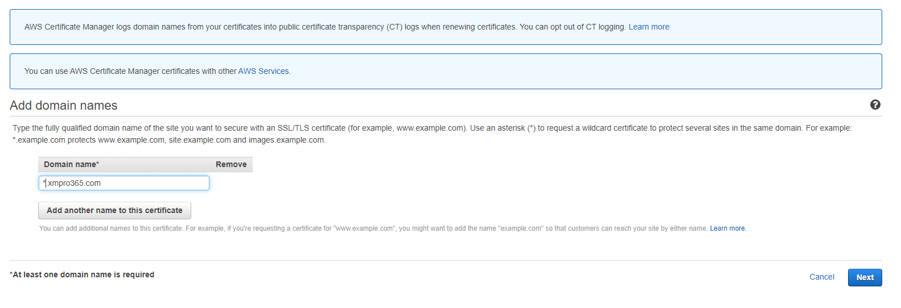

3\. Enter the certificate domain name and click _**Next**_

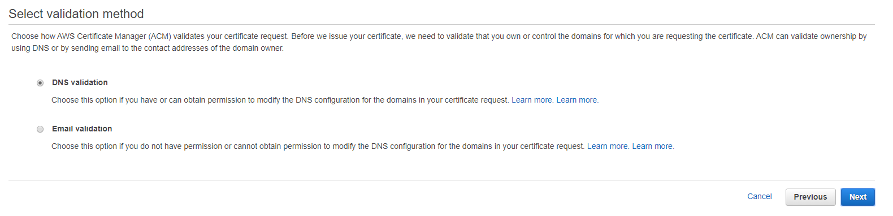

4\. Select the DNS validation method and click _**Next**_

.png>)

5\. Review your settings and click _**Confirm and request**_ if correct

.png>)

6\. Once the DNS configuration file becomes available, click _**Continue**_

.png>)

7\. Contact your IT administrator to complete the DNS verification by adding the CNAME record to your website DNS

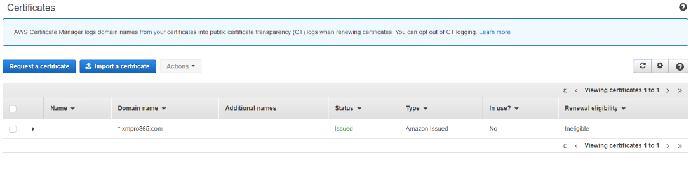

8\. Once the DNS verification is complete the SSL certificate is added to your certificate manager for the specified region

#### To import a certificate

.png>)

1. Click _**Get started**_ under Provision Certificate

.png>)

2\. Click _**Import a certificate**_

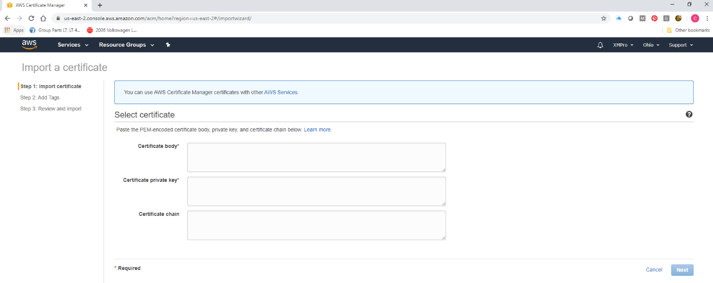

3\. Complete the certificate detail and click _**Next**_ to import the certificate

### Create the EB Application URLs

1. Search for **ElastiCache** in the _**Services**_ dropdown and select it.

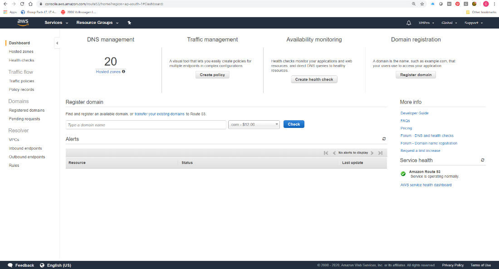

2\. In the left-hand panel, click _Hosted Zones._

3\. Click _Create Hosted Zone._

.png>)

1. In the right-hand panel complete the _Domain Name_ using the domain name you created the SSL certificate for and click _Create_.

.png>)

5\. Click _Create Record Set._

6\. Change _Alias_ to _**Yes**_, then go to EC2 in AWS services and scroll down to Load Balancing and click Load Balancers.

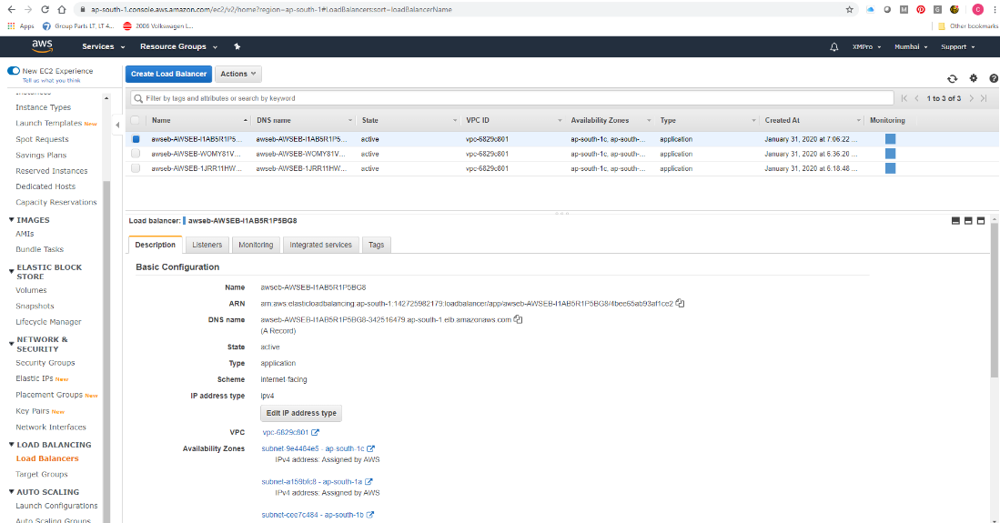

7\. Select a Load Balancer and click _Tags_ to identify what Application is serviced by the selected Load Balancer.

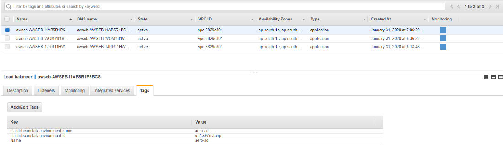

8\. When the correct Load Balancer for the Application is identified, click the _Description_ Tab.

.png>)

9\. Copy the _DNS Name_ for the Load Balancer. Go back to the Record Set you created in Route 53.

.png>)

10\. Paste the Load Balancer DNS address in the Alias Target field and click Create.

This needs to be completed for each ELB Application.

.png>)

11\. The NS values must be provided to you by the DNS Administrator to create the NS records in the Domain DNS records. This needs to be completed for each ELB Application.

### Configure the security groups

1. In the AWS Management Console, choose **EC2** under _Compute_ in the _**Services**_ drop-down.
2. Click _Security Groups_ under the NETWORK & SECURITY option.

.png>)

3\. Click _Create security group._

.png>)

4\. Create the _**RDS\_security\_group**_ and select the _VPC_.

.png>)

5\. Add the following rules and replace the source with the security groups assigned to the environments you created earlier.

6\. Create an additional security group called _**REDIS\_Cache\_security\_group.**_

.png>)

7\. Add these rules again using the security groups for the environments created earlier as the source.

.png>)

8\. In Elastic Beanstalk, select the environment you want to change.

.png>)

9\. Click Configuration in the left pane

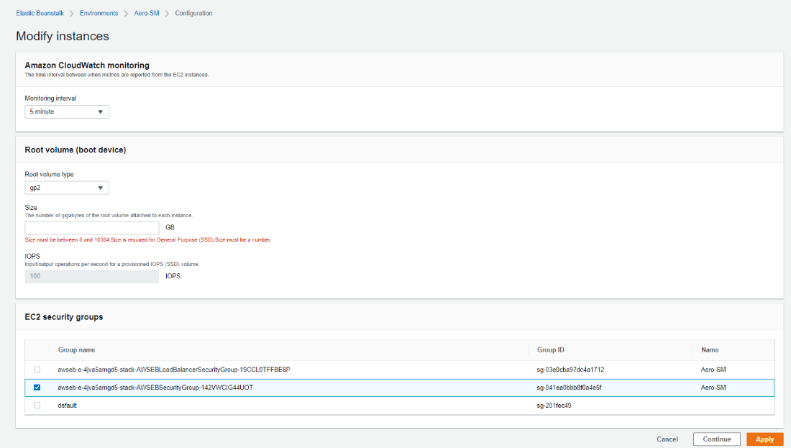

10\. Remove the _default_ security group and click _Apply._ Do this for all the environments.

11\. In Services, selects _**RDS**_ and click _Databases._

.png>)

12\. Select your RDS database and click _Modify._

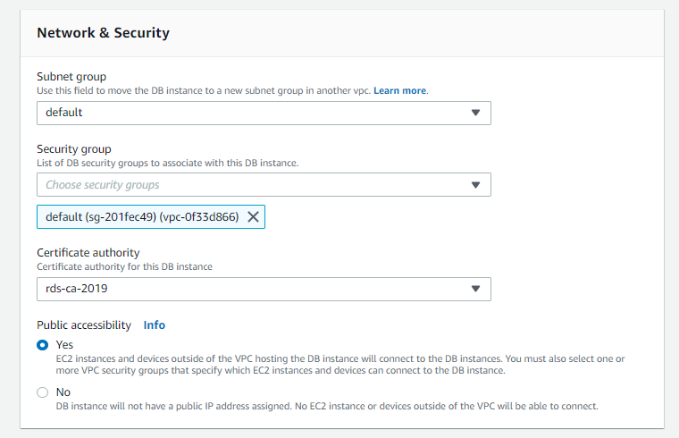

13\. Scroll down to _Network and Security_. Select the RDS security group you created earlier and remove the _default_ security group.

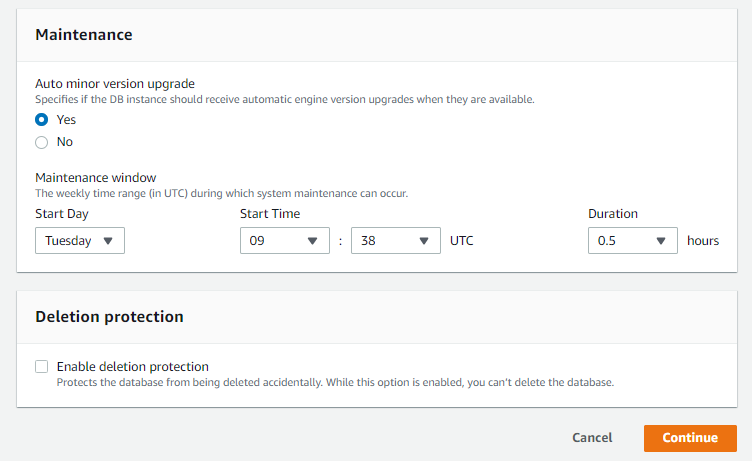

14\. Scroll down and click _Continue._

.png>)

15\. Select _**Apply Immediately**_ and click _Modify DB Instance._

.png>)

16\. Select _**ElastCache**_ from _Services_ and click **Redis.**

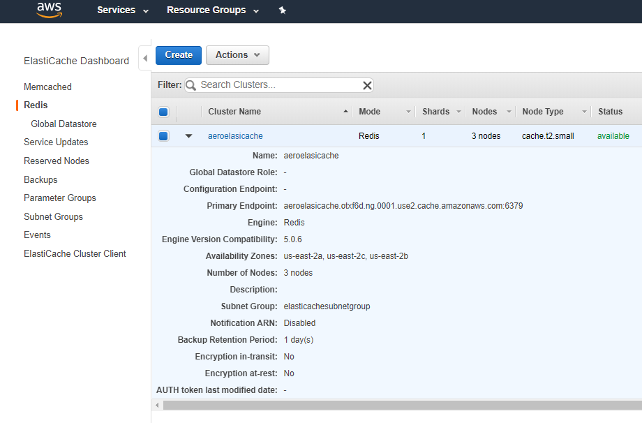

17\. Select the Redis Cache you created earlier and from _Actions_ click _**Modify.**_

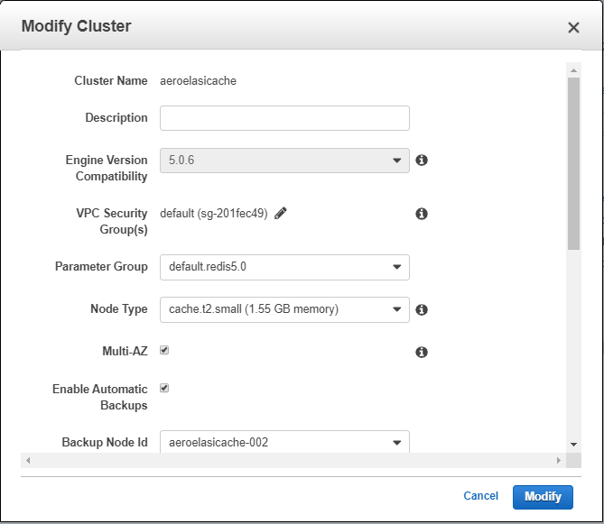

18\. Edit the Security Groups

.png>)

19\. Remove the default security groups and add the Redis Cache security group created earlier. Click save and modify.

## Next Step: Complete Installation

The installation of the XMPro Platform is now complete, but there are some environment setup steps before you can use the platform. Please click the below link for further instructions:


[3.-complete-installation](../3.-complete-installation/)

