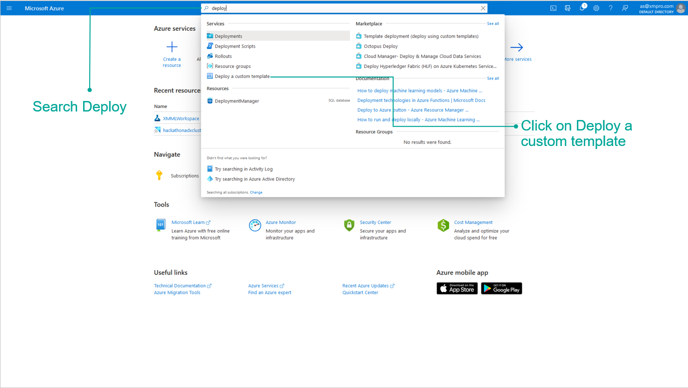
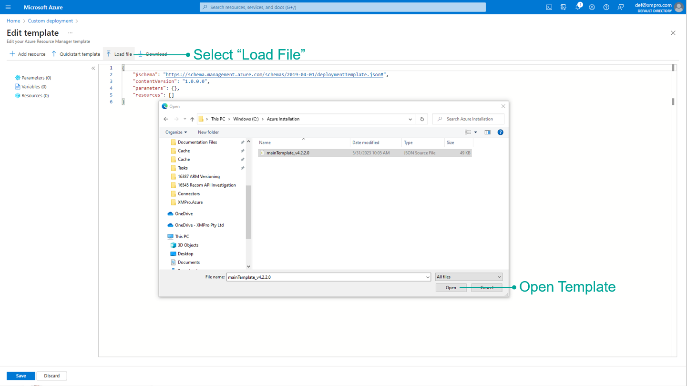
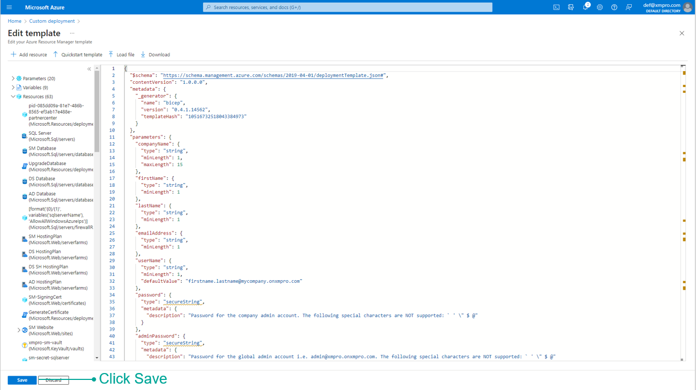
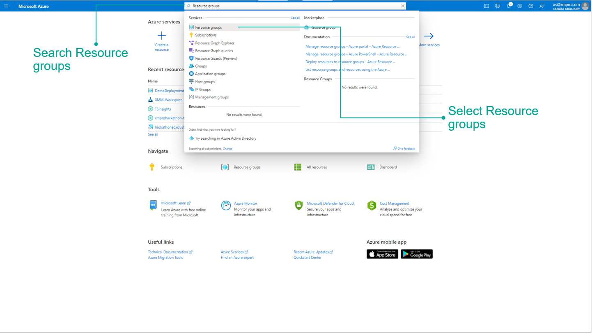
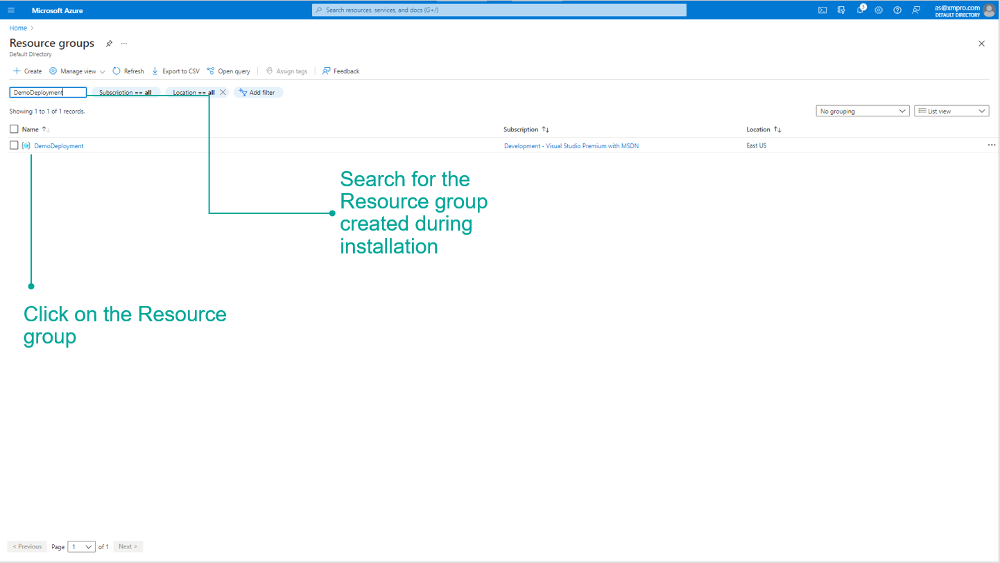
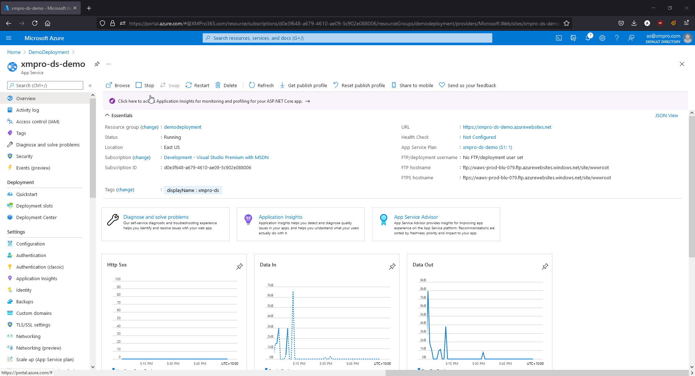
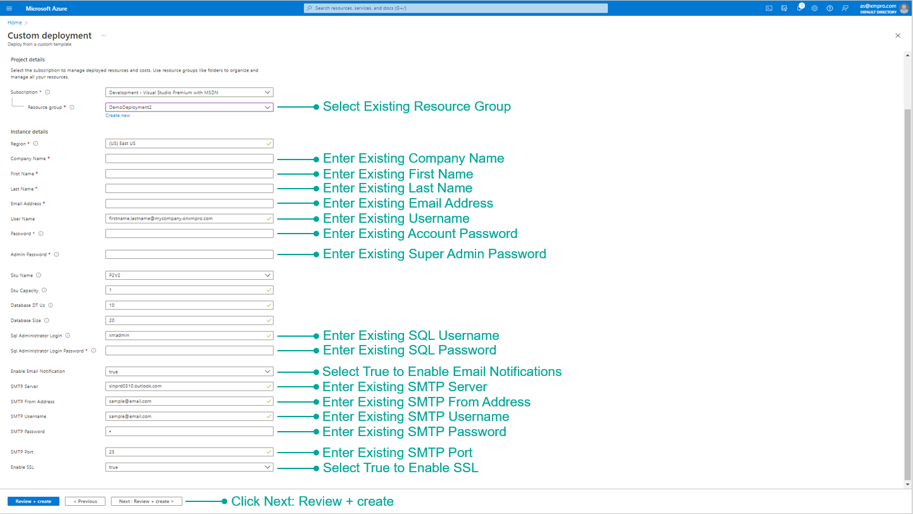
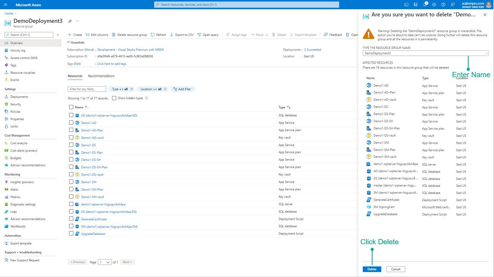

---
layout:
  title:
    visible: true
  description:
    visible: true
  tableOfContents:
    visible: true
  outline:
    visible: true
  pagination:
    visible: false
---

# Azure

This document will guide you through how to set up the Azure infrastructure and deploy the XMPro Platform.

* [Install](azure.md#install)&#x20;
* [Upgrade](azure.md#upgrade)
* [Uninstall](azure.md#uninstall)

## Architecture

The following deployment diagram shows an example architecture and the necessary resources for the XMPro platform in Microsoft Azure.&#x20;

Set up of Cloud Stream Host, Master Data, [Azure Cache](https://docs.microsoft.com/en-us/azure/azure-cache-for-redis/cache-dotnet-how-to-use-azure-redis-cache), or [Twilio](../install.md#twilio-account-optional) is optional and is dependent on client requirements. As a result, these resources will be excluded from this deployment.&#x20;

## Prerequisites

In order to proceed with the deployment, you are required to complete the steps in the **1. Preparation** guide:

1. Select Azure resources that meet the [**hardware** requirements](../install.md#hardware-requirements) and [**software** requirements](../install.md#software-requirements).
2. Follow the [certificate and communication steps](../install.md#preparation-steps) for an [SMTP Account](../install.md#smtp-account) (Recommended).

As well as having:

* Azure portal administrative access
* Access to Subscription and Resource group

## Install

This section provides information about installing the XMPro platform from scratch in Azure.

1. Log on to the Azure Portal [https://portal.azure.com/](https://portal.azure.com/) (with Company Administrator access)
2. In the search bar type “Deploy” and select “Deploy a custom template”

&#x20; 3\. Click "Build your own template in the editor"

.png>)

&#x20; 4\. Download the file from the link provided below:



&#x20; 5\. Select "Load File" and then Open the downloaded "mainTemplate\_\[Version].json"

&#x20; 6\. Once loaded, click Save - do not change the template.

&#x20; 7\. Complete the form.


* Enter the username in the correct format i.e. firstname.lastname@companyname.onxmpro.com
* The following special characters are **not** supported in the passwords:  `` ` ' \ $ @ ``&#x20;
* Take note of the passwords used as this will not be displayed again and they are required later.


&#x20; 8\. Verify the information is correct and click Create.

.png>)

After successful deployment, the following items have been installed:

* Subscription Manager
* Data Stream Designer&#x20;
* App Designer
* Stream Host

Proceed to [Restart the App Services](azure.md#restarting-app-services) after they are all deployed.

### Restarting App Services

This step explains how to restart your app services in the Azure Portal.&#x20;

1. Type “Resource groups” in the search bar and select “Resource groups”.

2\. Search for the Resource Group created during installation and select it.

3\. Select Subscription Manager, Data Stream Designer, and App Designer and restart the applications.&#x20;

4\. The below GIF shows how to restart your app service.

### Logins

<table><thead><tr><th width="426">User</th><th width="133.59649122807014">Type</th><th>Password</th></tr></thead><tbody><tr><td>admin@xmpro.onxmpro.com</td><td>Super Admin</td><td>as entered during setup</td></tr><tr><td>firstname.lastname@companyname.onxmpro.com</td><td>Admin</td><td>as entered during setup</td></tr></tbody></table>

### Request a License

A new company is created as part of the installation process but needs a valid license to work.&#x20;


Login using the Super Admin account **admin@xmpro.onxmpro.com**.


&#x20; 1\. Click Company in the left menu to open the Companies page.\
&#x20; 2\. Click on the Company.\
&#x20; 3\. Click on the Subscriptions gauge to open the Subscriptions page.\
&#x20; 4\. Click on a Subscription.\
&#x20; 5\. Click the Update License button in the command bar.\
&#x20; 6\. Click _Generate a license request_, enter the number of days, and submit.\
&#x20; 7\. When you have received the license from [XMPro support](http://xmpro.com/support/), upload it.\
&#x20; 8\. Click Save.

&#x20;This sends a request to XMPro for an App Designer license for this Company.

.png>)


The _Generate a license request_ link will only work if SMTP was set up during installation.


&#x20; 9\. Change the Product to Data Stream Designer from the list and request another license


Licenses are given on an individual basis by the [XMPro support team](http://xmpro.com/support/).


When you have received a license for each product through an email sent to the email address given during installation, follow the steps below to upload the license for both App Designer and Data Stream Designer.

### Next Step: Complete Installation

The installation of the XMPro Platform is now complete but before you can use the platform, some steps are needed to set up the environment. Further instructions about the configuration can be found below:&#x20;


[install-connectors.md](../3.-complete-installation/install-connectors.md)


## Upgrade


Before beginning the upgrade, back up databases using [this](https://docs.microsoft.com/en-us/azure/azure-sql/database/database-export#the-azure-portal) guide.&#x20;


Follow the same steps as a new [Install](azure.md#install) to upgrade your XMPro platform**.** Make sure to:

* Download and use the latest "mainTemplate\_\[Version].json".
* Use the same Resource Group and credentials used during the **original** Install when completing the Custom deployment form.

<figure><figcaption></figcaption></figure>

## Uninstall

This section provides information about uninstalling the XMPro platform from Azure.

1. Open the resource group where XMPro is installed
2. Click Delete resource group

&#x20;3\. Enter the name of the resource group and click _Delete_

