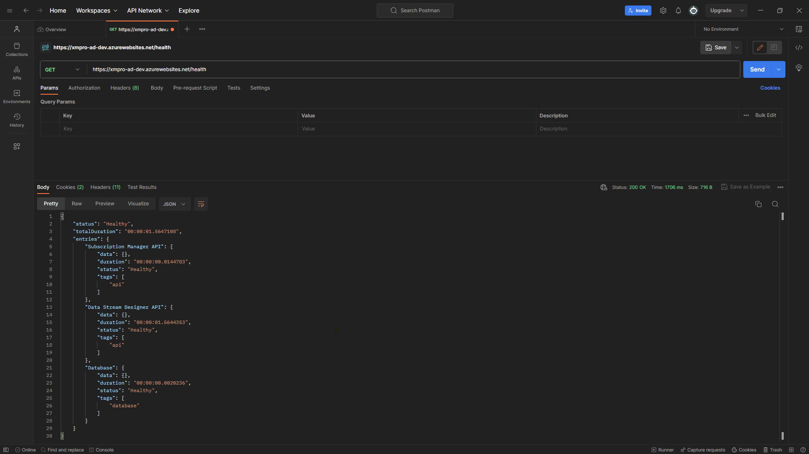
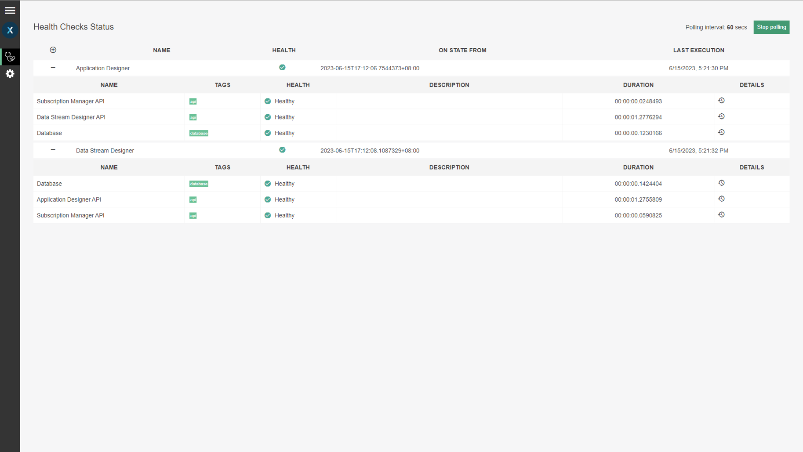

# Configure Health Checks (Optional)



## **Overview**

[Health checks](https://learn.microsoft.com/en-us/aspnet/core/host-and-deploy/health-checks?view=aspnetcore-6.0) are the industry standard for the initial diagnostic step of the troubleshooting process, which provides information about the health and readiness of XMPro services. The health checks achieve this by performing periodic evaluations of connected services - each of which returns a status of healthy or unhealthy.

The health checks are disabled by default. Once the health checks are turned on, you can opt to view them in the [Health UI](configure-health-checks-optional.md#health-ui) or add the [endpoints](configure-health-checks-optional.md#health-endpoints) to your existing business application health monitoring IT solution.  &#x20;


It is also possible to include [third-party endpoints](configure-health-checks-optional.md#adding-third-party-endpoints) - enabling you to monitor all of your health checks in a central location.


## **Health Endpoints**

Each XMPro service has an endpoint that can be accessed to determine its overall health. The following health checks are performed to test different dependencies:

1. Connection to other XMPro services
2. Connection to the databases
3. Connection to Redis Cache

The raw JSON of the results can be accessed through the health path of the service's URL. For example, _https://xmpro-ad-sample.azurewebsites.net/health_&#x20;

<figure><figcaption><p>Fig 1: Healthy JSON output using Postman</p></figcaption></figure>

Below is the description for each entry in the health check:

<table><thead><tr><th width="147.57142857142856">Property</th><th>Description</th></tr></thead><tbody><tr><td>Data</td><td>Additional data provided by the health check. By default, this is <em>empty</em>.</td></tr><tr><td>Description</td><td>An optional explanation of the health check.</td></tr><tr><td>Duration</td><td>The amount of time that the health check took to run.</td></tr><tr><td>Status</td><td><p>The health check status options are:</p><ul><li>Healthy (the connection succeeds)</li><li>Unhealthy (the connection fails or times out)</li></ul></td></tr><tr><td>Tags</td><td>Labels that are used to group or describe the kind of health check being done.</td></tr></tbody></table>

## **Health UI**

The UI provides a user-friendly display of the responses from the health endpoints.

To access the health checks performed, visit the health UI of any of the services using the health-ui path. For example, _https://xmpro-ad-sample.azurewebsites.net/health-ui_

<figure><figcaption><p>Fig 2: The Health Checks interface</p></figcaption></figure>

## Configure Health Checks

The following steps describe how to turn on the health check functionality.

### Application Designer

1. Navigate to the IIS location where Application Designer has been installed.
2. Open the App Designer  _appsettings.json_ file.
3. Set `enableHealthCheck` in the `featureFlags` object to _true_.&#x20;


This feature flag turns on both the `/health` and `/health-ui` endpoints.


<figure><figcaption><p>Fig 3: Step 3</p></figcaption></figure>

4. Configure the URLs you want to include in the health checks within the `healthChecks` object. The standard endpoint for each XMPro service is `/health/ping`.&#x20;

```json
"healthChecks": {
      "urls": [
        {
          "url": "<subscription manager url>/health/ping",
          "name": "Subscription Manager API",
          "tags": [ "api" ]
        },
        {
          "url": "<data stream designer url>/health/ping",
          "name": "Data Stream Designer API",
          "tags": [ "api" ]
        }
      ]
    }
```

5. Configure the `/health` endpoints you want to include in the UI within the `HealthChecksUI` object.&#x20;

```json
"HealthChecksUI": {
  "HealthChecks": [
    {
      "name": "Application Designer",
      "Uri": "<application designer url>/health"
    },
    {
      "name": "Data Stream Designer",
      "Uri": "<data stream designer url>/health"
    }
  ]
}
```

<figure><figcaption><p>Fig 4: Step 4 and 5</p></figcaption></figure>

6. Save the file.
7. Restart the Application Designer service.

### Data Stream Designer

Repeat the above steps for Data Stream Designer, using these values for step 4:

```json
"healthChecks": {
  "urls": [
    {
      "url": "<subscription manager url>/health/ping",
      "name": "Subscription Manager API",
      "tags": [ "api" ]
    },
    {
      "url": "<application designer url>/health/ping",
      "name": "Application Designer API",
      "tags": [ "api" ]
    }
  ]
}
```

## Adding Third-Party Endpoints

Third-party endpoints are supported and can be included as part of the health check. These are added in the same place as the XMPro service health checks.&#x20;


Only endpoints that do not need additional authorization are currently supported for the health checks.


1. Open the _appsettings.json_ file.
2. Add third-party endpoints to the `healthChecks` object.
3. Save the file and restart the XMPro product service.

<figure><figcaption><p>Fig 5: Step 3</p></figcaption></figure>

Below are the properties in this configuration when including other URLs in the health check:

<table><thead><tr><th width="164.57142857142856">Property</th><th>Description</th></tr></thead><tbody><tr><td>url</td><td>Determines the URL to check.</td></tr><tr><td>name</td><td>Determines the name/identifier of the health check to be performed.</td></tr><tr><td>tags</td><td>Determines the tag for the health check. This is useful for tagging/grouping health checks.</td></tr><tr><td>timeout</td><td>The amount of time to wait for a response from the site. The health check will return as <code>Unhealthy</code> if the timeout is reached while waiting for the URL. <br>By default, this is empty and will wait for the URL indefinitely.</td></tr></tbody></table>
