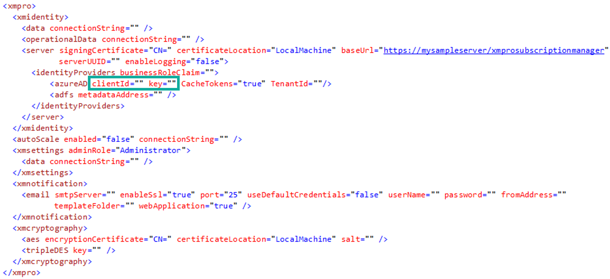
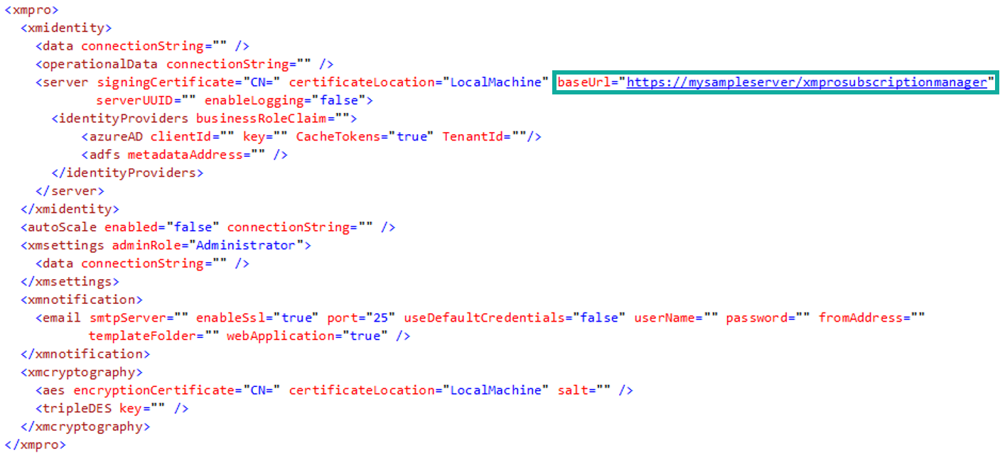
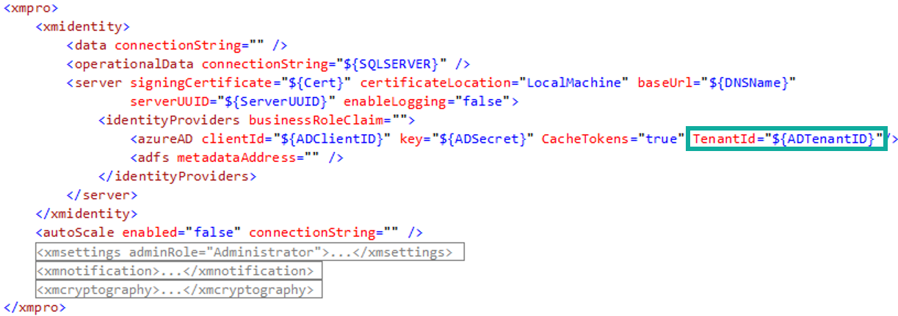

# SSO - Azure AD

In this article, we will look at how to set up Azure AD so that it can be used as an external identity provider for Subscription Manager, allowing single sign-on capability between Azure AD and Subscription Manager.

## Register application

Start by registering a new application in Azure AD by following [these](https://docs.microsoft.com/en-us/azure/active-directory/develop/quickstart-register-app) instructions.

## Copy application (client) ID

Immediately after registering your application, an overview page will be opened for the new application. A unique application (client) ID would have been assigned to the application.&#x20;


**Warning:** Copy this ID. You will add it in Subscription Manager’s _web.config_ file shortly.


## Credentials

Next, create a secret for Subscription Manager. Follow the steps below:

1. On the left, click on _Certificates & secrets._
2. Click on _New client secret._&#x20;
3. Add a description for your new client secret.
4. Choose a duration.
5. Click _Add._


Both the application client ID and the secret need to be added to Subscription Manager’s _web.config_ file.&#x20;


6. Navigate to the IIS location where Subscription Manager has been installed.
7. Open the file _web.config_ file.&#x20;
8. Scroll down to the “_xmpro_” section.&#x20;


This section might have to be decrypted, for which you can find instructions [here](https://docs.xmpro.com/knowledge-base-2/how-to-encrypt-and-decrypt-a-web-config-file/).


9. Add the application (client) ID that you copied earlier to the `clientId` attribute of the `azureAD` element&#x20;
10. Copy the secret and add it to the _web.config_.

<figure><figcaption></figcaption></figure>


If you're using the Azure key store to manage app settings and secrets, use the `${}` syntax for the azureAD attributes in the _web.config_, similar to:\
`<azureAD clientId="${ADClientID}" key="${ADSecret}" />`


11. And define the following secrets in the key store:

| **Name**   | **Value**          |
| ---------- | ------------------ |
| ADClientID | Application Id     |
| ADSecret   | Application Secret |

## Authentication

12. Copy the baseUrl value in the _web.config_ - you will need it later in this guide.&#x20;

<figure><figcaption></figcaption></figure>

13. In Azure Portal, click on _Authentication_ and add the following URL in the space provided:

*   The URL where Subscription Manager is hosted (base URL, which you have just copied), ending in “_identity/signin-azuread_”

    Example: _https://mysampleserver/xmprosubscriptionmanager/identity/signin-azuread_

14. &#x20;On the Authentication page, scroll down until you see “_Advanced Settings_“.&#x20;
15. Select “_ID tokens_” and click _Save_.

## API permissions

16. Select _API permissions_ on the left-hand menu.&#x20;
17. Make sure the permissions set on the application correspond to the image below.&#x20;

## Sync Azure AD Role to SM's Business Role

This optional functionality allows a user's Business Role to be synced to a corresponding Azure AD Claim each time they log in.

1. Get the desired user claim name from Azure AD.
2. Navigate to the IIS location where Subscription Manager has been installed.
3. Open the _web.config_ file.&#x20;
4. Add the claim name to the "businessRoleClaim" attribute in the "identityProviders" tag.\
   `<identityProviders businessRoleClaim="PUT THE CLAIM NAME HERE">`
5. Save the file and restart the Subscription Manager service.

[See the Sync Business Roles from Azure AD article for more information](../../../concepts/manage-access.md#sync-business-roles-with-an-external-identity-provider).

## Guest User access across Tenants

When your Azure AD is in a different Tenant to Subscription Manager and the User has Guest membership in Azure AD, then add the TenantID for Azure AD.

<figure><figcaption></figcaption></figure>
