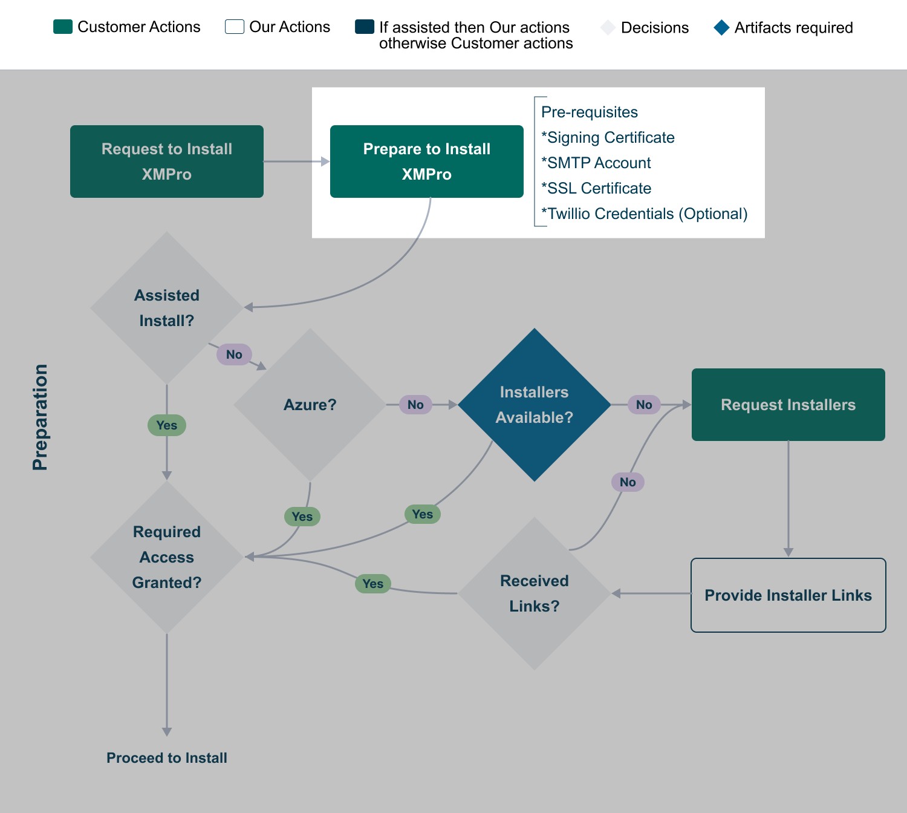

# 1. Preparation

Before attempting any of the supported XMPro deployment options (e.g. Cloud, On-Premise), these are the server prerequisites:

* [Hardware Requirements](install.md#hardware-requirements)&#x20;
* [Software Requirements](install.md#software-requirements)
* [Signing Certificate](install.md#signing-certificate)
* [HTTPS/SSL Certificate](install.md#https-ssl-certificate)
* [SMTP Account](install.md#smtp-account)
* [Twilio Account (Optional)](install.md#twilio-account-optional)


[**Browser Requirements**](../getting-started/browser-requirements.md)

* Supported Browsers
* Supported Operating Systems
* Third-Party Cookies


<figure><figcaption><p>Fig 1: The sequence of the 'Prepare to Install XMPro' step within the overall process. </p></figcaption></figure>

## Hardware and Software Requirements

### Hardware Requirements

For each environment, refer to the [Sizing Guideline](../resources/sizing-guideline.md) guideline to compute resources needed for small, medium, and large deployments:

* Azure
* AWS
* On-Prem

### Software Requirements

This section describes the software that must be installed on the server prior to installing XMPro (refer [2. Install XMPro](2.-deployment/) section), as well as the software required for the post-installation step of installing a Stream Host.

#### Web Application Servers and SQL Database Server

The following software must be installed on the web application server per product:

<table><thead><tr><th width="466">Software Requirements</th><th width="92">Azure 1</th><th width="74">AWS</th><th>On-Prem</th></tr></thead><tbody><tr><td><strong>Subscription Manager (SM) Web Application Server</strong></td><td></td><td></td><td></td></tr><tr><td>Windows Server 2019 or 2022</td><td>Yes</td><td>Yes</td><td>Yes</td></tr><tr><td><a href="https://dotnet.microsoft.com/en-us/download/dotnet/6.0">Microsoft ASP .NET Core Runtime 6.0 (x64)</a></td><td>Yes</td><td>Yes</td><td>No</td></tr><tr><td><a href="https://dotnet.microsoft.com/en-us/download/dotnet/6.0">Microsoft ASP .NET Core Runtime 6.0 (Hosting Bundle)</a></td><td>No</td><td>No</td><td>Yes</td></tr><tr><td><a href="https://support.microsoft.com/en-us/topic/microsoft-net-framework-4-7-2-offline-installer-for-windows-05a72734-2127-a15d-50cf-daf56d5faec2">Microsoft .NET Framework Version 4.7.2</a></td><td>Yes</td><td>Yes</td><td>Yes</td></tr><tr><td>Microsoft Internet Information Services (IIS) 11</td><td>Yes</td><td>Yes</td><td>Yes</td></tr><tr><td><a href="https://www.iis.net/downloads/microsoft/url-rewrite">IIS URL Rewrite 2.1</a></td><td>Yes</td><td>Yes</td><td>Yes</td></tr><tr><td><strong>Application Designer (AD) Web Application Server</strong></td><td></td><td></td><td></td></tr><tr><td>Windows Server 2019 or 2022</td><td>Yes</td><td>Yes</td><td>Yes</td></tr><tr><td><a href="https://dotnet.microsoft.com/en-us/download/dotnet/6.0">Microsoft ASP .NET Core Runtime 6.0 (x64)</a></td><td>Yes</td><td>Yes</td><td>No</td></tr><tr><td><a href="https://dotnet.microsoft.com/en-us/download/dotnet/6.0">Microsoft ASP .NET Core Runtime 6.0 (Hosting Bundle)</a></td><td>No</td><td>No</td><td>Yes</td></tr><tr><td><a href="https://support.microsoft.com/en-us/topic/microsoft-net-framework-4-7-2-offline-installer-for-windows-05a72734-2127-a15d-50cf-daf56d5faec2">Microsoft .NET Framework Version 4.7.2</a></td><td>Yes</td><td>Yes</td><td>Yes</td></tr><tr><td>Microsoft Internet Information Services (IIS) 11</td><td>Yes</td><td>Yes</td><td>Yes</td></tr><tr><td><a href="https://www.iis.net/downloads/microsoft/url-rewrite">IIS URL Rewrite 2.1</a></td><td>Yes</td><td>Yes</td><td>Yes</td></tr><tr><td><strong>Data Stream Designer (DS)</strong> <strong>Web Application Server</strong></td><td></td><td></td><td></td></tr><tr><td>Windows Server 2019 or 2022</td><td>Yes</td><td>Yes</td><td>Yes</td></tr><tr><td><a href="https://dotnet.microsoft.com/en-us/download/dotnet/6.0">Microsoft ASP .NET Core Runtime 6.0 (x64)</a></td><td>Yes</td><td>Yes</td><td>No</td></tr><tr><td><a href="https://dotnet.microsoft.com/en-us/download/dotnet/6.0">Microsoft ASP .NET Core Runtime 6.0 (Hosting Bundle)</a></td><td>No</td><td>No</td><td>Yes</td></tr><tr><td><a href="https://support.microsoft.com/en-us/topic/microsoft-net-framework-4-7-2-offline-installer-for-windows-05a72734-2127-a15d-50cf-daf56d5faec2">Microsoft .NET Framework Version 4.7.2</a></td><td>Yes</td><td>Yes</td><td>Yes</td></tr><tr><td>Microsoft Internet Information Services (IIS) 11</td><td>Yes</td><td>Yes</td><td>Yes</td></tr><tr><td><a href="https://www.iis.net/downloads/microsoft/url-rewrite">IIS URL Rewrite 2.1</a></td><td>Yes</td><td>Yes</td><td>Yes</td></tr><tr><td><strong>SQL Database Server (Combined SM, AD, DS)</strong></td><td></td><td></td><td></td></tr><tr><td>Windows Server 2019 or 2022</td><td>Yes</td><td>Yes</td><td>Yes</td></tr><tr><td>Microsoft SQL Server 2019 or 2022</td><td>Yes</td><td>Yes</td><td>Yes</td></tr></tbody></table>


**Footnotes**

**1** As per the ARM template for your Azure instance.


#### Stream Host Server

The following software must be installed on the Stream Host server:

<table data-full-width="false"><thead><tr><th width="405">Software Requirements</th><th width="106">Windows</th><th width="149">Azure Web Job</th><th width="89">Ubuntu</th></tr></thead><tbody><tr><td><strong>Stream Host Server</strong></td><td>x64</td><td>As per ARM template <strong>1</strong></td><td>20.04 x64</td></tr><tr><td>Windows Server 2019 or 2022</td><td>Yes <strong>2</strong></td><td>Yes <strong>2</strong></td><td>No</td></tr><tr><td>Ubuntu 20.04 (x64)</td><td>No</td><td>No</td><td>Yes <strong>2</strong></td></tr><tr><td><a href="https://dotnet.microsoft.com/en-us/download/dotnet/6.0">Microsoft .NET Core 6.0 (x64)</a></td><td>Yes</td><td>Yes</td><td>Yes <strong>3</strong></td></tr><tr><td><a href="https://support.microsoft.com/en-us/topic/microsoft-net-framework-4-7-2-offline-installer-for-windows-05a72734-2127-a15d-50cf-daf56d5faec2">Microsoft .NET Framework Version 4.7.2</a></td><td>Yes</td><td>Yes</td><td>No</td></tr><tr><td><a href="https://learn.microsoft.com/en-us/cpp/windows/latest-supported-vc-redist?view=msvc-170#visual-studio-2015-2017-2019-and-2022">Microsoft Visual C++ 2015-2022 Redistributable</a></td><td>Yes</td><td>No</td><td>No</td></tr></tbody></table>


**Footnotes**

**1** As per the ARM template for your Azure instance.

**2** Different operating systems may apply for Edge devices.

**3** See the Ubuntu software install commands [here](3.-complete-installation/install-stream-host/ubuntu-16.04+-x64.md#software-install-commands).


## Certificate and Communication Steps

### Signing Certificate

Subscription Manager is responsible for managing Identity and access for the whole XMPro Platform. In order to do this, it regularly issues authentication tokens to the users as they log into the system. The server must sign these tokens to ensure their validity, hence a signing certificate is required.

A PKCS 12 archived certificate .pfx file is required. The minimum length of the accepted private key is 2048. In order to generate a Signing certificate follow the instructions below:

* Download and install [OpenSSL for Windows](http://www.slproweb.com/products/Win32OpenSSL.html)
* Open a command prompt as administrator and navigate to the OpenSSL install directory. The default location is `C:\Program Files\OpenSSL-Win64`&#x20;
* Run the following commands

```
cd C:\Program Files\OpenSSL-Win64
cd bin
openssl genrsa -out sign.pem 2048
openssl req -new -x509 -key sign.pem -out sign.cer -days 1825
openssl pkcs12 -export -out sign.pfx -inkey sign.pem -in sign.cer
```

* Follow the prompts on the screen and complete the certificate request.
* Make a note of the _Common Name_ and Password you choose.
* Create a file called _sign.password.txt_ and add the password to the file.


The resulting _sign.pfx_ and _sign.password.txt_ files will be required during the installation.


### HTTPS/SSL Certificate

The XMPro Platform enforces secure communication using HTTPS/SSL. This means the server it is deployed to must have HTTPS configured. Depending on the deployment option you choose, you may have the following options:

* Order a certificate from a certificate authority (CA)
* Create a certificate in AWS (AWS deployment only)
* Create a self-signed certificate (On-Premise only)


The DNS or hostname that users are expected to use to browse to XMPro Platform must correspond to the SSL Certificate Common Name.


If you need to create a self-signed certificate, open Windows PowerShell as administrator and follow the instructions below:

1. Run the New-SelfSignedCertificate cmdlet as shown below to add a certificate to the local store on your PC, replacing the fully qualified domain name (FQDN).


```
$cert = New-SelfSignedCertificate -certstorelocation cert:\localmachine\my -dnsname <FQDN>
```


2. In this step, we will export the self-signed certificate. We will need to create a password as shown below to accomplish this step.

```
$pwd = ConvertTo-SecureString -String 'Enter Strong Password' -Force -AsPlainText
```

3. We will have to export the self-signed certificate using the Export-PfxCertificate cmdlet as shown below.

```
$path = 'cert:\localMachine\my\' + $cert.thumbprint 
Export-PfxCertificate -cert $path -FilePath c:\cert.pfx -Password $pwd
```


The directory you specify in step 3's `-FilePath` parameter must already exist.&#x20;


4. Create a txt file with the name _cert.password.txt_ and add the certificate password to this file.

### SMTP Account

XMPro components use emails to notify users of certain events, for instance, a new User signed up, or your account is ready. In order for these notifications to work an SMTP account and server details are required.&#x20;

Please set up an account and have the necessary details handy, for example:

| Setting     | Value                  |
| ----------- | ---------------------- |
| Smtp Server | sinprd0310.outlook.com |
| User Name   | noreply@mydomain.com   |
| Password    | \*\*\*\*\*\*\*\*       |
| Port        | 587                    |
| Enable SSL  | true                   |

### Twilio Account (Optional)

App Designer uses SMS, among other means, to notify users of certain events e.g. a recommendation alert was triggered or resolved, etc. An SMS provider is required to send SMS notifications.&#x20;

Please set up an account at Twilio using these [instructions](https://www.twilio.com/docs/usage/tutorials/how-to-use-your-free-trial-account) and have the necessary details handy, i.e. Account ID, Authorization Token, and the Phone Number.
