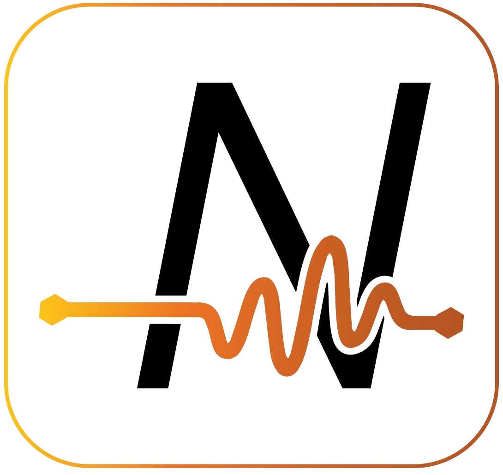

# Integrations

## Agents

An [_Agent_](../concepts/agent/) is a reusable object which forms the building block of a Data Stream. When a number of Agents are connected together, a Data Stream is formed.&#x20;

Each Agent is designed to perform a specific function in the stream. For example, they can be used to retrieve data from a database in real-time, display data, filter, sort the data, or save the data somewhere else, depending on the function of that individual Agent.

Looking for an Agent that is not on the list? Send us a [request](mailto:support@xmpro.com) or check out the [Framework](../how-to-guides/agents/building-agents.md#overview) to create a new Agent yourself.

The following tables group the available Agents by tier:

### Tier 1 - Social & Communication

|  [Email](https://xmpro.gitbook.io/email/)    | Listener, Action Agent |
| ------------------------------------------------------------------------------------------------------------ | ---------------------- |
|  [Twilio](https://xmpro.gitbook.io/twilio/) | Action Agent           |

### Tier 2 - Database & Technology

|  [Azure Data Explorer](https://xmpro.gitbook.io/azure-data-explorer/)              | Listener, Context Provider, Action Agent  |
| ----------------------------------------------------------------------------------------------------------------------------------------------------- | ----------------------------------------- |
|  [Azure Data Factory](https://xmpro.gitbook.io/azure-data-factory/) | Action Agent                              |
|  [Azure Data Lake](https://xmpro.gitbook.io/azure-data-lake/)               | Action Agent                              |
|  [Azure Digital Twin](https://xmpro.gitbook.io/azure-digital-twin/)                                       | Listener, Context Provider, Action Agent  |
|  [Azure Event Hub](https://xmpro.gitbook.io/azure-event-hub/)               | Listener, Action Agent                    |
|  [Azure IoT Hub](https://xmpro.gitbook.io/azure-iot-hub/)                     | Listener                                  |
|  [Azure Time Series](https://xmpro.gitbook.io/azure-time-series/) _(Deprecated)_ | Listener                                  |
|  [Cognite](https://xmpro.gitbook.io/cognite/)                                       | Listener, Context Provider                |
|  [Excel File Reader](https://xmpro.gitbook.io/excel-file-reader/)         | Action Agent                              |
|  [ifm](https://xmpro.gitbook.io/ifm/)                                                   | Listener                                  |
|  [InfluxDB](https://xmpro.gitbook.io/influxdb/)                                   | Listener, Context Provider, Action Agent  |
|     [Litmus Edge OPC UA](https://xmpro.gitbook.io/litmus-edge-opc-ua/)               | Listener, Action Agent                    |
|     [MongoDB](https://xmpro.gitbook.io/mongodb/)                               | Listener, Context Provider, Action Agent  |
|  [MOVUS](https://xmpro.gitbook.io/movus/)                                             | Listener, Context Provider, Action Agent  |
|  [MySQL](https://xmpro.gitbook.io/mysql/)                                             | Listener, Context Provider, Action Agent  |
|  [OData](https://xmpro.gitbook.io/odata/)                                             | Context Provider, Action Agent            |
|  [ODBC](https://xmpro.gitbook.io/odbc/)                                           | Listener, Context Provider                |
| [OPC DA](https://xmpro.gitbook.io/opc-da/)                                          | Listener, Action Agent                    |
|  [OPC UA](https://xmpro.gitbook.io/opc-ua/)                                                                            | Listener, Action Agent                    |
|  [Oracle](https://xmpro.gitbook.io/oracle/)                                          | Action Agent                              |
|  [Snowflake](https://xmpro.gitbook.io/snowflake/)                            | Listener, Context Provider, Action Agent  |

### Tier 3 - ERP & Advanced App

|  [Erbessed](https://xmpro.gitbook.io/erbessd/)                                               | Listener, Context Provider               |
| --------------------------------------------------------------------------------------------------------------------------------------------------------------- | ---------------------------------------- |
|  [iPOS](https://xmpro.gitbook.io/ipos/)                                                          | Action Agent                             |
|  [FinOps](https://xmpro.gitbook.io/finops/)                                                    | Context Provider, Action Agent           |
|  [Nanoprecise](https://xmpro.gitbook.io/nanoprecise/)                                     | Listener, Context Provider, Action Agent |
|  [OSIsoft PI](https://xmpro.gitbook.io/osisoft-pi/)                                           | Listener, Context Provider, Action Agent |
|  [Tango](https://xmpro.gitbook.io/tango/)                                                       | Listener, Context Provider               |
|  [Telit deviceWise](https://xmpro.gitbook.io/telit-devicewise/)            | Listener, Context Provider, Action Agent |
|  [Telit MQTT](https://xmpro.gitbook.io/telit-mqtt)                                              | Listener, Action Agent                   |
|  [Telit OPC UA](https://xmpro.gitbook.io/telit-opc-ua/)                                     | Listener, Action Agent                   |
|  [Salesforce](https://xmpro.gitbook.io/salesforce/)                                        | Listener, Context Provider, Action Agent |
|  [SAP](https://xmpro.gitbook.io/sap/)                                                             | Context Provider, Action Agent           |
|  [SAP HANA](https://xmpro.gitbook.io/sap-hana/)                                               | Context Provider, Action Agent           |
|  [Streaming Data Platform](https://xmpro.gitbook.io/streaming-data-platform/) | Listener, Context Provider               |

### Tier 4 - Data Science & Custom

|  [Boon Amber](https://xmpro.gitbook.io/boon-amber/)              | AI & Machine Learning |
| -------------------------------------------------------------------------------------------------------------------------------- | --------------------- |
|  [FFT](https://xmpro.gitbook.io/fft/)                              | Function              |
|  [Signal Filter](https://xmpro.gitbook.io/signal-filter/) | Function              |
|  [WebScraper](https://xmpro.gitbook.io/webscraper/)    | Context Provider      |

### Tier 5 - Free & Open Source


Download the tier 5 files [here](https://xmappstore.blob.core.windows.net/tier5/Tier%205%20-%20Agents.zip).&#x20;

Use these individual files if you are not on v4.1.13 or higher:&#x20;

* [Action Agents](https://xmappstore.blob.core.windows.net/tier5/Tier%205%20-%20Action%20Agents.zip)
* [AI & ML](https://xmappstore.blob.core.windows.net/tier5/Tier%205%20-%20AI\_ML.zip)
* [Context Providers](https://xmappstore.blob.core.windows.net/tier5/Tier%205%20-%20Context%20Providers.zip)
* [Functions](https://xmappstore.blob.core.windows.net/tier5/Tier%205%20-%20Functions.zip)
* [Listeners](https://xmappstore.blob.core.windows.net/tier5/Tier%205%20-%20Listeners.zip)

\
Links for the larger AI & ML Agents\* are on their individual documentation pages.


|  [Anomaly Detection](https://xmpro.gitbook.io/anomaly-detection/)               | AI & Machine Learning\*                  |
| ----------------------------------------------------------------------------------------------------------------------------------------------------------- | ---------------------------------------- |
|  [Azure ML](https://xmpro.gitbook.io/azure-ml/)                                          | AI & Machine Learning                    |
|  [Azure SQL](https://xmpro.gitbook.io/azure-sql/)                                        | Listener, Context Provider, Action Agent |
|  [Binary Classification](https://xmpro.gitbook.io/binary-classification/)   | AI & Machine Learning\*                  |
|  [Convert Flow Units](https://xmpro.gitbook.io/convert-flow-units/)                                                          | Function                                 |
|  [CRC16](https://xmpro.gitbook.io/crc16/)                                                    | Function                                 |
|  [CSV](https://xmpro.gitbook.io/csv/)                                                         | Listener, Context Provider, Action Agent |
|  [Fixed Width File Reader](https://xmpro.gitbook.io/fixed-width-file-reader/)         | Action Agent                             |
|  [Forecasting](https://xmpro.gitbook.io/forecasting-agent/)                           | AI & Machine Learning\*                  |
|  [Goal Seek](https://xmpro.gitbook.io/goal-seek/)                                        | Function                                 |
|  [JSON](https://xmpro.gitbook.io/json/)                                | Context Provider, Transformation         |
|  [Kmeans Clustering](https://xmpro.gitbook.io/kmeans-clustering/)               | AI & Machine Learning\*                  |
| [Linear Interpolation](https://xmpro.gitbook.io/linear-interpolation/)       | Function                                 |
|  [Min Max](https://xmpro.gitbook.io/min-max/)                                             | Function                                 |
|  [MLflow](https://xmpro.gitbook.io/mlflow/)                                           | AI & Machine Learning                    |
|  [MQTT](https://xmpro.gitbook.io/mqtt-listener/)                                             | Listener, Action Agent                   |
|  [Multi Class Classification](https://xmpro.gitbook.io/multi-class-classification/) | AI & Machine Learning\*                  |
|  [PDF Converter](https://xmpro.gitbook.io/pdf-converter/)                           | Action Agent                             |
|  [Python](https://xmpro.gitbook.io/python/)                                               | AI & Machine Learning                    |
|  [Regression](https://xmpro.gitbook.io/regression/)                                    | AI & Machine Learning\*                  |
|  [REST API](https://xmpro.gitbook.io/rest-api/)                                              | Context Provider, Action Agent           |
|  [Rounding](https://xmpro.gitbook.io/rounding/)                                          | Function                                 |
|   [RScript](https://xmpro.gitbook.io/rscript/)                                                  | AI & Machine Learning                    |
|  [SQL Server](https://xmpro.gitbook.io/sql-server/)                                    | Listener, Context Provider, Action Agent |
|  [XML File Reader](https://xmpro.gitbook.io/xml-file-reader/)                          | Action Agent                             |

### Tier 6 - XMPro Internal


Download the tier 6 files [here](https://xmappstore.blob.core.windows.net/tier6/Tier%206%20-%20Agents.zip).

Use these individual files if you are not on v4.1.13 or higher:&#x20;

* [Action Agents](https://xmappstore.blob.core.windows.net/tier6/Tier%206%20-%20Action%20Agents.zip)
* [Functions](https://xmappstore.blob.core.windows.net/tier6/Tier%206%20-%20Functions.zip)
* [Listeners](https://xmappstore.blob.core.windows.net/tier6/Tier%206%20-%20Listeners.zip)
* [Recommendations](https://xmappstore.blob.core.windows.net/tier6/Tier%206%20-%20Recommendations.zip)
* [Transformations](https://xmappstore.blob.core.windows.net/tier6/Tier%206%20-%20Transformations.zip)


<table data-header-hidden><thead><tr><th width="150">Agent</th><th>Type</th></tr></thead><tbody><tr><td> <a href="https://xmpro.gitbook.io/aggregate/">Aggregate</a></td><td>Transformation</td></tr><tr><td> <a href="https://xmpro.gitbook.io/alter-attributes/">Alter Attributes</a></td><td>Transformation</td></tr><tr><td> <a href="https://xmpro.gitbook.io/area-under-the-curve/">Area Under the Curve</a></td><td>Function</td></tr><tr><td> <a href="https://xmpro.gitbook.io/batch-identifier/">Batch Identifier</a></td><td>Transformation</td></tr><tr><td> <a href="https://xmpro.gitbook.io/broadcast/">Broadcast</a></td><td>Transformation</td></tr><tr><td> <a href="https://xmpro.gitbook.io/calculated-field/">Calculated Field</a></td><td>Transformation</td></tr><tr><td> <a href="https://xmpro.gitbook.io/action-request-agents/">Close Action Request</a></td><td>Recommendation</td></tr><tr><td><a href="https://xmpro.gitbook.io/concatenate-row-values/">Concatenate Row Values</a></td><td>Transformation</td></tr><tr><td> <a href="https://xmpro.gitbook.io/data-conversion">Data Conversion</a></td><td>Transformation</td></tr><tr><td> <a href="https://xmpro.gitbook.io/edge-analysis/">Edge Analysis</a></td><td>Transformation</td></tr><tr><td> <a href="https://xmpro.gitbook.io/event-printer/">Event Printer</a></td><td>Action Agent</td></tr><tr><td> <a href="https://xmpro.gitbook.io/event-simulator/">Event Simulator</a></td><td>Listener</td></tr><tr><td> <a href="https://xmpro.gitbook.io/file/">File Listener</a></td><td>Listener</td></tr><tr><td> <a href="https://xmpro.gitbook.io/filter/">Filter</a></td><td>Transformation</td></tr><tr><td> <a href="https://xmpro.gitbook.io/geofence/">Geofence</a></td><td>Function</td></tr><tr><td> <a href="https://xmpro.gitbook.io/group-and-merge/">Group &#x26; Merge</a></td><td>Transformation</td></tr><tr><td> <a href="https://xmpro.gitbook.io/join/">Join</a></td><td>Transformation</td></tr><tr><td> <a href="https://xmpro.gitbook.io/missing-values-detector/">Missing Value Detector</a></td><td>Transformation</td></tr><tr><td> <a href="https://xmpro.gitbook.io/missing-value-substitutor/">Missing Value Substitutor</a></td><td>Transformation</td></tr><tr><td> <a href="https://xmpro.gitbook.io/normalize-fields/">Normalize Fields</a></td><td>Transformation</td></tr><tr><td> <a href="https://xmpro.gitbook.io/pass-through/">Pass Through</a></td><td>Transformation</td></tr><tr><td> <a href="https://xmpro.gitbook.io/pivot-table/">Pivot Table</a></td><td>Transformation</td></tr><tr><td> <a href="https://xmpro.gitbook.io/random-numbers/">Random Number</a></td><td>Transformation</td></tr><tr><td> <a href="https://xmpro.gitbook.io/action-request-agents/">Read Action Request</a></td><td>Recommendation</td></tr><tr><td> <a href="https://xmpro.gitbook.io/read-recommendation/">Read Recommendation </a></td><td>Recommendation</td></tr><tr><td> <a href="https://xmpro.gitbook.io/resolve-recommendation/">Resolve Recommendation</a></td><td>Recommendation</td></tr><tr><td> <a href="https://xmpro.gitbook.io/row-count/">Row Count</a></td><td>Transformation</td></tr><tr><td> <a href="https://xmpro.gitbook.io/row-padding/">Row Padding</a></td><td>Transformation</td></tr><tr><td> <a href="https://xmpro.gitbook.io/run-recommendation">Run Recommendation</a></td><td>Recommendation</td></tr><tr><td> <a href="https://xmpro.gitbook.io/sort/">Sort</a></td><td>Transformation</td></tr><tr><td> <a href="https://xmpro.gitbook.io/threshold-monitor/">Threshold Monitor</a></td><td>Transformation</td></tr><tr><td><a href="https://xmpro.gitbook.io/transpose/">Transpose</a></td><td>Transformation</td></tr><tr><td> <a href="https://xmpro.gitbook.io/trim/">Trim</a></td><td>Transformation</td></tr><tr><td> <a href="https://xmpro.gitbook.io/union/">Union</a></td><td>Transformation</td></tr><tr><td> <a href="https://xmpro.gitbook.io/unzip/">Unzip</a></td><td>Action Agent</td></tr><tr><td> <a href="https://xmpro.gitbook.io/update-recommendation/">Update Recommendation</a></td><td>Recommendation</td></tr><tr><td> <a href="https://xmpro.gitbook.io/window/">Window </a></td><td>Transformation</td></tr><tr><td> <a href="https://xmpro.gitbook.io/xmpro-app/">XMPro App</a></td><td>Action Agent</td></tr></tbody></table>

## Connectors

A [_Connector_](../concepts/connector.md) is a pre-built integration plug-in for the XMPro App Designer that allows you to connect to third-party data sources without having to code.

Whereas the Agents in a published Data Stream continuously poll for data, the Connectors in a published App retrieve data on an ad-hoc basis.


Download the tier 5 & 6 files [here](https://xmappstore.blob.core.windows.net/tier5/Tier%205%20%26%206%20-%20Connectors.zip).


The following tables group the available Connectors by tier:

### Tier 2 - Database & Technology

|  [Azure Data Explorer Connector](https://xmpro.gitbook.io/azure-data-explorer-connector/) |
| ------------------------------------------------------------------------------------------------------------------------------------------------------------ |
|  [Azure Digital Twin Connector](https://xmpro.gitbook.io/azure-digital-twin-connector/)                          |
|  [Snowflake Connector](https://xmpro.gitbook.io/snowflake-connector/)               |

### Tier 3 - ERP & Advanced App

|  [Erbessd Connector](https://xmpro.gitbook.io/erbessd-connector/)                     |
| ------------------------------------------------------------------------------------------------------------------------------------------------------------ |
|  [Nanoprecise Connector](https://xmpro.gitbook.io/nanoprecise-connector/)              |
|  [OSIsoft PI Connector](https://xmpro.gitbook.io/osisoft-pi-connector/)                    |
|  [OSIsoftPI Histogram Connector](https://xmpro.gitbook.io/osisoft-pi-histogram-connector/) |

### Tier 5 - Free & Open Source

| [Azure SQL Connector](https://xmpro.gitbook.io/azure-sql-connector/)               |
| ----------------------------------------------------------------------------------------------------------------------------------------------------- |
| [JSON Connector](https://xmpro.gitbook.io/json-connector/)                             |
|  [SQL Server Connector](https://xmpro.gitbook.io/sql-server-connector/)          |
|  [TSC SQL Server Connector](https://xmpro.gitbook.io/tsc-sql-server-connector/)  |

### Tier 6 - XMPro Internal Connectors

|  [Data Streams Connector](https://xmpro.gitbook.io/data-streams-connector/) |
| --------------------------------------------------------------------------------------------------------------------------------------------- |

## Visualization Blocks

An App Designer [_visualization block_](../blocks/visualizations/) allows a no-code way to integrate with third-party systems and create rich user experiences. Listed below are some of the integration blocks found in the App Designer toolbox:&#x20;

<table data-header-hidden><thead><tr><th width="383">Name</th></tr></thead><tbody><tr><td> <a href="../blocks/visualizations/autodesk-forge.md">Autodesk Forge</a></td></tr><tr><td> <a href="../blocks/visualizations/d3-visualization.md">D3 Visualization</a></td></tr><tr><td> <a href="../blocks/visualizations/esri-map.md">Esri Map</a></td></tr><tr><td> <a href="../blocks/visualizations/pivot-grid.md">Pivot Grid</a></td></tr><tr><td> <a href="../blocks/visualizations/power-bi.md">Power BI</a></td></tr><tr><td> <a href="../blocks/visualizations/time-series-chart.md">Time Series Chart</a></td></tr><tr><td> <a href="../blocks/visualizations/unity-1.md">Unity</a></td></tr></tbody></table>
