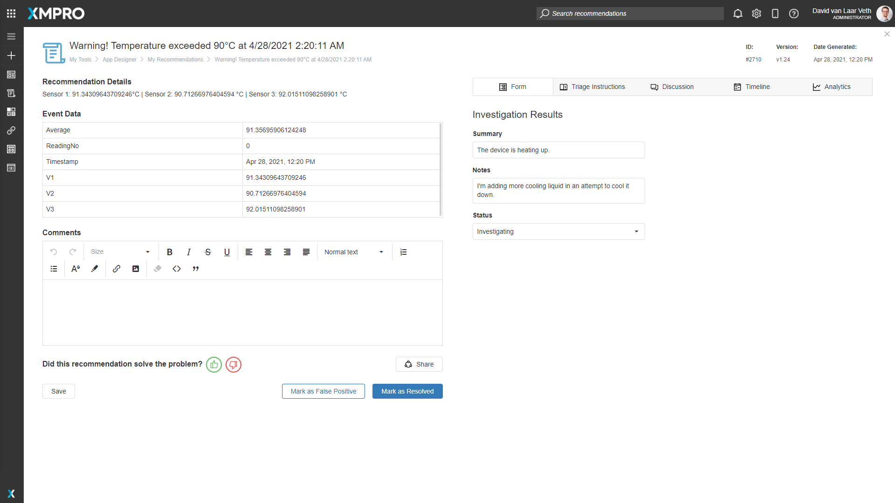
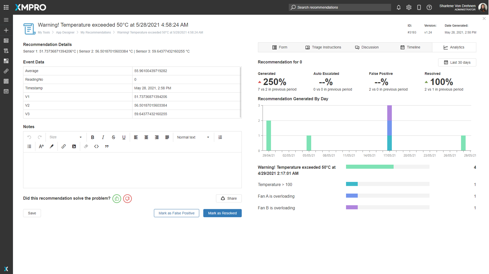
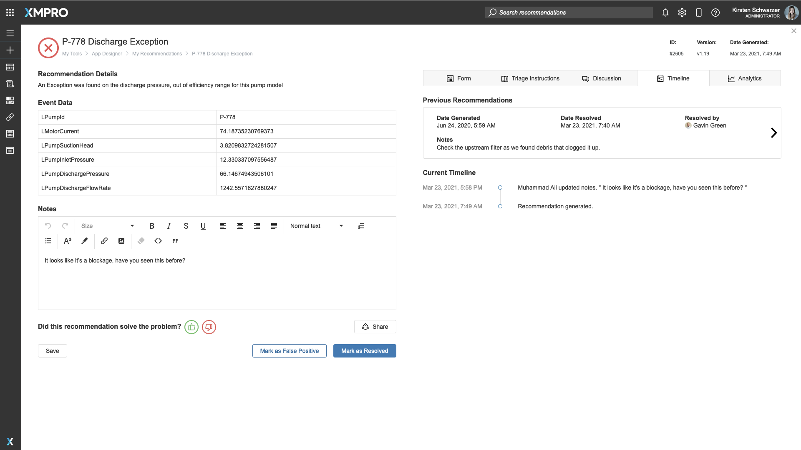
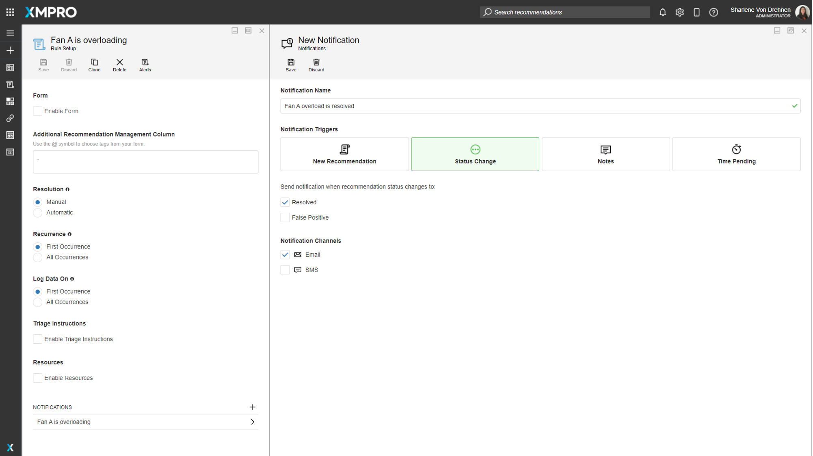
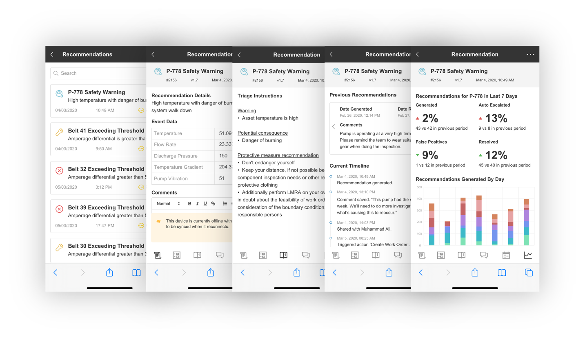
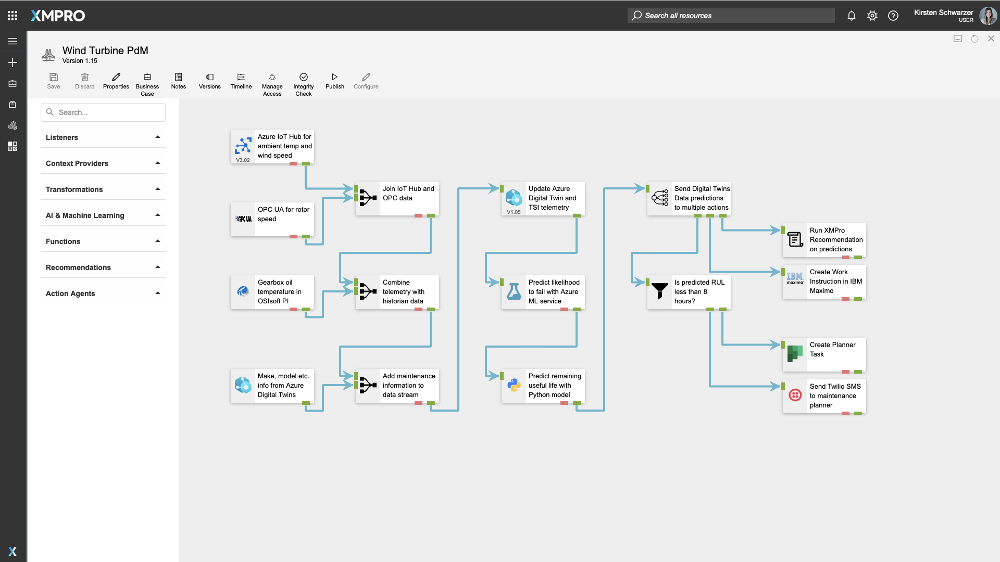

# What's New in 4.0

## Overview

This page shows a curated selection of features we’ve released in XMPro version 4. For more details on what's in the latest version, please read the [Release Notes](../../release-notes/archived/release-notes.md).&#x20;

## Recommendations

### Forms

Create forms for your recommendations to help your team send requests, complete on-site inspections and create work orders in other systems like SAP EAM.

<figure><figcaption></figcaption></figure>

### Discussions

Discussions provide a space to collaborate with colleagues while keeping the conversation part of the recommendation alert audit trail.

<figure><figcaption></figcaption></figure>

### Analytics

See which recommendations get triggered most often for a specific asset or entity to help you identify recurring issues.

<figure><figcaption></figcaption></figure>

### Alert Timeline

Get full visibility into the timeline of a recommendation and who has interacted with it.

<figure><figcaption></figcaption></figure>

### Notifications

Set up rule-based notifications to trigger when an alert gets generated, if it has been pending for a period of time, or if a team member leaves a note. Users can also manage their own notification settings to decide which alerts they would like to receive.

<figure><figcaption></figcaption></figure>

### Mobile Experience

Whether your team works underground or out in the field, they can use XMPRO in the browser on their mobile device to get access to the recommendation alerts they need to respond to critical events. This update also provides offline capability and is available on both iOS and Android devices.

<figure><figcaption></figcaption></figure>

## Azure Digital Twins

XMPro version 4 includes two new Agents and a Connector to help you make the most of Azure Digital Twins without coding.

<figure><figcaption></figcaption></figure>

#### Azure DT Context Provider

The new Context Provider allows you to fetch contextual data like the asset make and model from Azure Digital Twins.&#x20;

#### Azure DT Action Agent

The Action Agent enables you to create instances in Azure Digital Twins, upload DTDL models and set up new resources without having to leave the XMPro interface.&#x20;

You can also automatically send data to Time Series Insights when the Azure Digital Twin receives new real-time data.

#### Azure DT App Designer Connector

This addition to the toolbox makes it easy to integrate Azure Digital Twins with your XMPro applications. You can use Azure DT as a data source or even create custom XMPro Apps with forms that update your digital twins in Microsoft Azure DT. &#x20;

## Recurring Data Streams

This functionality allows you to run recurring Data Streams on a customizable schedule, for instance, once a day at 12 am.&#x20;

This may be useful if you only want to read data or perform an action with the data at certain points during the day, or if you want to perform actions on the data once a week, month or year.&#x20;

## App Designer Toolbox

We're constantly adding new blocks to the App Designer toolbox to provide you with more no-code functionality for your real-time apps. Here are some of the latest additions to the toolbox:

* **Unity** - leverage the powerful gaming engine for real-time 3D visualizations and simulations
* **D3** - produce custom interactive data visualizations with fast loading times
* **Esri Maps** - display maps with geographical, terrain, or topographical overlays
* **PowerBI** - embed reports and historical data analytics visualizations into your applications&#x20;
* **Autodesk Forge** - embed 2D and 3D engineering designs in your apps

<figure><figcaption>
Example of the a 3D Unity model embedded in an XMPro app
</figcaption></figure>
